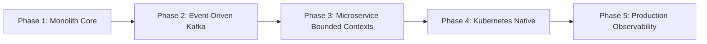

# StreamForge — Distributed Media Processing & Streaming Platform

StreamForge is a high-performance backend engineering platform designed to simulate the core media processing and delivery infrastructure of modern streaming giants like Netflix, YouTube, and Twitch. 

Rather than a simple front-end video sharing clone, StreamForge focuses on **systems engineering challenges**: asynchronous multi-rendition HLS transcoding, chunked resumable upload protocols, direct object storage integrations, local streaming proxies, and a robust event-driven roadmap.

---

## 🚀 Key Features (Current Implementation)

* **Resumable Upload Protocol**: High-performance upload session management that streams multipart file chunks directly to MinIO object storage.
* **FFmpeg/FFprobe Processing Pipeline**: Automated media metadata extraction (codecs, framerates, bitrates, audio channels) and poster-frame thumbnail keyframe extraction.
* **Multi-Resolution HLS Transcoding**: Asynchronous transcoding of source media into standard adaptive bitrate (ABR) streams ($1080p$ @ 5 Mbps, $720p$ @ 2.5 Mbps, $480p$ @ 1 Mbps) using concurrent FFmpeg pipelines.
* **HLS Playback Proxy**: Resolves relative path resolution failures and CORS/signature errors of S3 presigned URLs by proxying HLS playlist files (`master.m3u8`, variant `playlist.m3u8`) and `.ts` media segments through the Spring Boot application using memory-efficient `StreamingResponseBody` buffers.
* **Interactive Media Console**: A premium, dark-mode glassmorphic player page incorporating `hls.js` for seamless playback, manual/auto quality selection, real-time status tracking, and database reprocessing controls.

---

## 🛠 Tech Stack

* **Core Platform**: Java 21 / Spring Boot 3.4.5
* **Build System**: Maven
* **Database**: PostgreSQL 16 (for catalog, upload sessions, and variant metadata)
* **Object Storage**: MinIO (S3-compatible bucket storage for raw and processed assets)
* **Media Processing**: FFmpeg & FFprobe (packaged inside a multi-stage Docker build)
* **Database Migrations**: Flyway
* **Testing**: JUnit 5, Mockito, Testcontainers

---

## 📂 Project Structure

```text
streamForage/
├── Dockerfile                  # Multi-stage Alpine container build with FFmpeg & JDK
├── docker-compose.yml          # Local infra services (Postgres, MinIO, application)
├── pom.xml                     # Maven build specifications & dependency configuration
├── src/
│   ├── main/
│   │   ├── java/com/streamforge/
│   │   │   ├── config/         # System settings (Async, FFmpeg, MinIO, WebMvc)
│   │   │   ├── controller/     # REST Controllers (Upload, Video browsing, Stream Proxy)
│   │   │   ├── dto/            # REST API Request/Response record schemas
│   │   │   ├── exception/      # Global exceptional handlers & types
│   │   │   ├── model/          # JPA Entities (Video, UploadSession, VideoVariant)
│   │   │   ├── repository/     # Spring Data JPA repositories
│   │   │   └── service/        # Processing, Transcoding, Metadata, Storage, and Upload services
│   │   └── resources/          # application.yml and Flyway migrations (db/migration/)
│   └── test/                   # Integration, unit, and API controller tests
├── TESTING_GUIDE.md            # Detailed cURL, Postman, and API validation manual
├── overview.md                 # Technical design diagrams & state machine details
└── walkthrough.md              # Reusable project developer log
```

---

## 🚦 Quick Start

### 1. Run the Entire Infrastructure
Ensure Docker Desktop is running locally, then execute:
```bash
docker compose up --build -d
```

This spins up the following local services:
* 🌐 **StreamForge App**: `http://localhost:8080`
* 📑 **Interactive Playback Console**: `http://localhost:8080/static/player.html`
* 📖 **Swagger Open-API Documentation**: `http://localhost:8080/swagger-ui/index.html`
* 🗄️ **PostgreSQL Database**: Port `5433` (DB: `streamforge`, User: `streamforge`, Pass: `streamforge_dev`)
* 🪣 **MinIO Console**: `http://localhost:9001` (User: `minioadmin`, Pass: `minioadmin123`)

---

## 🗺 Implementation Roadmap

StreamForge is structured as an **evolutionary architecture**, evolving from a monolith to a distributed, production-grade microservices stack:



### 🔹 Phase 1: Foundation Monolith (Current State)
* Scaffolding the core relational database schema and S3 bucket storage structure.
* Direct upload chunking and metadata extraction.
* Monolithic CPU-bound FFmpeg transcoding.
* Backend proxy endpoints serving adaptive manifests.

### 🔹 Phase 2: Decoupled Kafka Architecture (Next Steps)
* Decompose the monolithic app into two executable modules:
  * **Upload Service**: Handles API requests, maps upload sessions, and publishes `media.uploaded` events.
  * **Worker Service**: Subscribes to events, performs CPU-intensive media extraction/transcoding asynchronously.
* Introduce an Apache Kafka cluster inside `docker-compose.yml`.
* Implement messaging resilience: **idempotent consumer processing**, **exponential backoff retries**, and **Dead Letter Queues (DLQ)**.

### 🔹 Phase 3: Bounded Contexts & Microservice Decomposition
* Introduce a dedicated **API Gateway** (Spring Cloud Gateway) for rate limiting (Redis token bucket) and routing.
* Completely isolate database instances per service to achieve database-per-service isolation.
* Build a state-machine based **Processing Orchestrator** leveraging the Saga pattern.
* Implement Redis distributed locks to prevent parallel duplicate processing of the same asset.
* Introduce a WebSocket-based **Notification Service** for active push notifications to clients.

### 🔹 Phase 4: Kubernetes Native Deployment
* Author Helm charts and Kubernetes manifest descriptors.
* Deploy StatefulSets for Postgres, Redis, Kafka, and MinIO.
* Configure **Horizontal Pod Autoscaling (HPA)** using custom CPU threshold metrics to autoscale transcoding workers dynamically under heavy load.

### 🔹 Phase 5: Observability, Resilience & Production Hardening
* Expose Micrometer Prometheus metrics on all endpoints.
* Deploy a Prometheus + Grafana dashboard stack for system resource monitoring, Kafka consumer lag tracking, and transcode throughput graphs.
* Integrate distributed tracing using OpenTelemetry, instrumenting trace propagation headers across Gateway $\rightarrow$ Kafka $\rightarrow$ Workers $\rightarrow$ Storage.
* Perform high-load stress testing using `k6` to measure platform performance limits.

---

## 📝 Related Documentation

* **[walkthrough.md](walkthrough.md)**: Logs recent changes made to support local HLS stream proxying and successful playback.
* **[overview.md](overview.md)**: Contains full architectural details, sequence charts, and schema relationships.
* **[TESTING_GUIDE.md](TESTING_GUIDE.md)**: Step-by-step guidance for testing uploads, checking database statuses, and debugging files.
