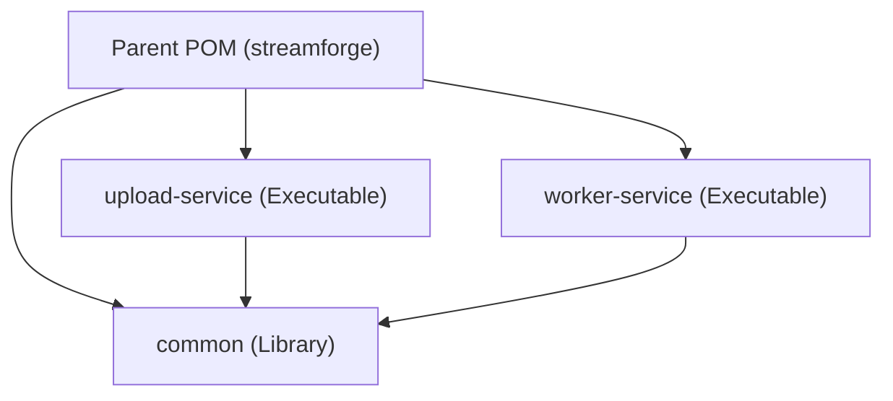

# StreamForge — Phase 2: Introduce Kafka & Async Processing

This document outlines the proposed changes, architecture updates, and verification plan for **Phase 2 (Decoupled Kafka Architecture)** of the StreamForge distributed media platform.

---

## 🎯 Goal Description

The goal of Phase 2 is to decouple the video upload process from the heavy media processing tasks (metadata extraction, transcoding, and thumbnail generation) using an event-driven architecture powered by **Apache Kafka**. 

We will refactor our monolith into a **multi-module Maven project** consisting of:
1. `common` module: Entities, repositories, DTOs, configurations, and shared utilities.
2. `upload-service`: Handles HTTP requests for upload sessions, saves chunked files, and publishes `media.uploaded` events to Kafka.
3. `worker-service`: Listens to Kafka topics, runs FFmpeg/FFprobe operations asynchronously, and publishes completion/failure events.

Additionally, we will implement resilient messaging patterns: **Idempotent processing**, **Exponential backoff retries**, and **Dead Letter Queues (DLQ)**.

---

## ⚠️ User Review Required

> [!IMPORTANT]
> **Maven Multi-Module Restructuring:**
> This phase transforms the project file hierarchy. Files currently under `src/main/java/` will be moved into respective submodules (`common`, `upload-service`, `worker-service`).
>
> **Shared Database Schema for Phase 2:**
> Both the `upload-service` and `worker-service` will initially share the same PostgreSQL database to maintain simple transactional updates on video statuses. This will be fully separated into individual database instances per service in Phase 3.

---

## 🛠 Proposed Changes

We will introduce a Maven parent POM in the root and create three Maven submodules:



### 1. Infrastructure & Parent Configuration

#### [MODIFY] [pom.xml](file:///Users/shreyanand/dev_proj/streamForage/pom.xml)
* Re-scope the root `pom.xml` to be a parent POM with `<packaging>pom</packaging>`.
* Declare submodules: `<modules><module>common</module><module>upload-service</module><module>worker-service</module></modules>`.
* Centralize dependency management (Spring Boot dependencies, Lombok, MapStruct, MinIO, Spring Kafka).

#### [MODIFY] [docker-compose.yml](file:///Users/shreyanand/dev_proj/streamForage/docker-compose.yml)
* Add a single-node Kafka broker using KRaft (no ZooKeeper needed for simplicity) such as `confluentinc/cp-kafka:7.5.0`.
* Add environment variables for Kafka connection details.
* Add healthcheck configurations for Kafka.
* Update `streamforge-app` to deploy two separate services: `upload-service` and `worker-service`.

---

### 2. Common Submodule (`common`)

A library module containing core JPA entities, Spring Data repositories, shared exceptions, and database migrations.

#### [NEW] [pom.xml](file:///Users/shreyanand/dev_proj/streamForage/common/pom.xml)
* Configure dependencies: Spring Boot Starter Data JPA, PostgreSQL driver, Flyway, Validation, MinIO SDK, Lombok, MapStruct.

#### [NEW] Flyway Migration `src/main/resources/db/migration/V4__create_processing_jobs_table.sql`
* Create a table `processing_jobs` to track status of asynchronous workers:
  ```sql
  CREATE TABLE processing_jobs (
      id UUID PRIMARY KEY,
      video_id UUID NOT NULL REFERENCES videos(id) ON DELETE CASCADE,
      job_type VARCHAR(50) NOT NULL, -- METADATA, TRANSCODE, THUMBNAIL
      status VARCHAR(20) NOT NULL,    -- PENDING, RUNNING, COMPLETED, FAILED
      retry_count INT DEFAULT 0,
      idempotency_key VARCHAR(255) UNIQUE NOT NULL,
      error_message TEXT,
      created_at TIMESTAMP NOT NULL,
      updated_at TIMESTAMP NOT NULL
  );
  CREATE INDEX idx_processing_jobs_video ON processing_jobs(video_id);
  ```

#### [MOVE] Core Classes
* Move all JPA Entities (`Video`, `UploadSession`, `VideoVariant`), Enums, and Repository interfaces into `common` under `com.streamforge.model` and `com.streamforge.repository`.
* Move generic configurations: `MinioConfig`, `MinioConfigProperties`, and `StorageService` to share storage capabilities.

---

### 3. Upload Service Submodule (`upload-service`)

Exposes REST endpoints to create upload sessions, upload media files, and publish initial upload events to Kafka.

#### [NEW] [pom.xml](file:///Users/shreyanand/dev_proj/streamForage/upload-service/pom.xml)
* Configure dependencies: `common` module, Spring Boot Starter Web, Spring Kafka, SpringDoc OpenAPI.

#### [NEW] `UploadEventProducer.java`
* Implement Spring Kafka-based event publisher to emit events to `media.uploaded`.
* Event model: `VideoUploadedEvent(UUID videoId, String title, String originalFilename, String storagePath, long fileSizeBytes)`.

#### [MOVE] API Controllers
* Move `UploadController`, `VideoController` (listing/playback read endpoints only), `GlobalExceptionHandler`, and related DTO classes to `upload-service`.
* Modify `UploadService.java` to save the raw file to MinIO and then publish the `VideoUploadedEvent` to Kafka instead of triggering processing synchronously.

---

### 4. Worker Service Submodule (`worker-service`)

Asynchronous media processing worker subscribing to Kafka topics, running FFmpeg, and executing status updates.

#### [NEW] [pom.xml](file:///Users/shreyanand/dev_proj/streamForage/worker-service/pom.xml)
* Configure dependencies: `common` module, Spring Kafka, Spring Boot Starter Validation.

#### [NEW] `MediaEventConsumers.java`
* Subscribes to `media.uploaded` (or sub-topics like `media.transcode.requested`).
* Orchestrates:
  1. Checks idempotency using `processing_jobs` table.
  2. Spawns processing pipelines: Metadata extraction $\rightarrow$ Transcoding $\rightarrow$ Thumbnail generation.
  3. Updates database entities status.
  4. Implements Kafka error recovery: Retrying transient errors and routing terminal failures to `media.failed.dlq`.

#### [MOVE] Processing Components
* Move `ProcessingService`, `MetadataService`, `TranscodeService`, `ThumbnailService`, and `FFmpegUtil` to `worker-service`.

---

## 🔍 Verification Plan (Phase 2)

### Manual E2E Flow
1. **Infrastructure bootup:**
   ```bash
   docker compose up --build -d
   ```
2. **Kafka Event inspection:**
   Monitor events being sent through the topics:
   ```bash
   docker compose exec kafka kafka-console-consumer --bootstrap-server localhost:9092 --topic media.uploaded --from-beginning
   ```
3. **E2E Postman flows:**
   Follow the sequence in `TESTING_GUIDE.md`:
   * Post a session creation request.
   * Upload an MP4 video file.
   * Verify that the worker service picks up the Kafka event and begins transcoding asynchronously in the background.
   * Query `http://localhost:8080/api/videos/{id}/status` until status is `SUCCEEDED`.
   * Verify generated variants (`1080p`, `720p`, `480p`) in MinIO console (`http://localhost:9001`).
   
4. **Resilience Verification:**
   * Run the worker container without FFmpeg configurations or send an invalid file format $\rightarrow$ Verify that the event is retried with backoff and eventually routes to the Dead Letter Queue (DLQ).

---

## 🚦 Operational Guide — Docker Compose Operations (Phase 2 Stack)

### 1. Starting the Application Stack
To build the Docker images and run all services in the background:
```bash
docker compose up --build -d
```

### 2. Verifying and Running Queries
To check container status and monitor logs:
```bash
# Check container status
docker compose ps

# Follow logs from the Upload Service application
docker compose logs -f upload-service

# Follow logs from the Worker Service application
docker compose logs -f worker-service
```

### 3. Closing and Stopping the Application
To stop running services:

* **Stop services (retaining database volumes):**
  ```bash
  docker compose down
  ```

* **Stop services and purge all databases/object storage buckets:**
  ```bash
  docker compose down -v
  ```
