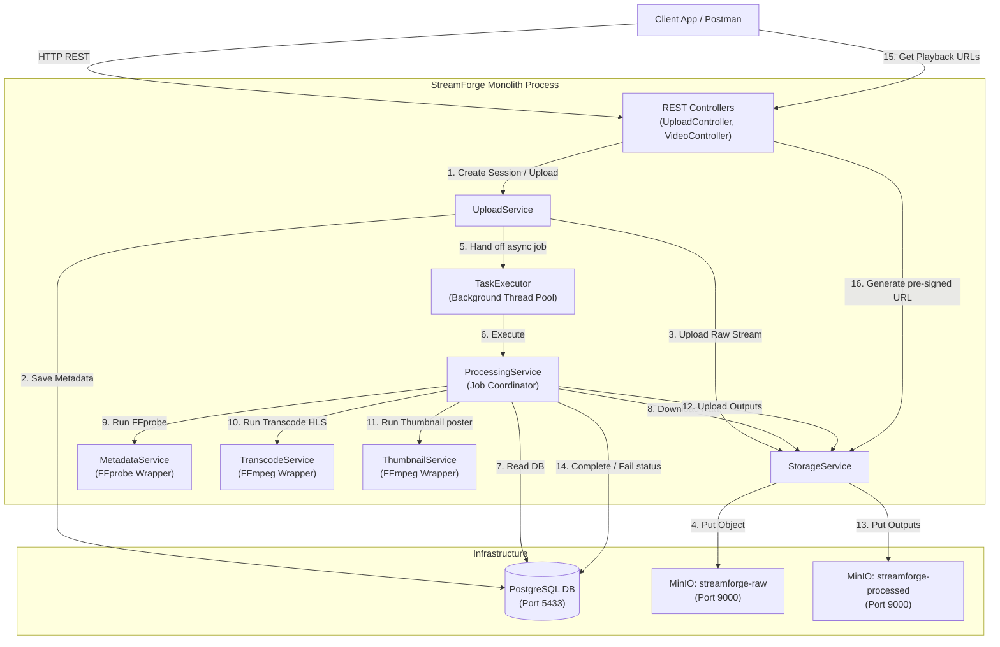
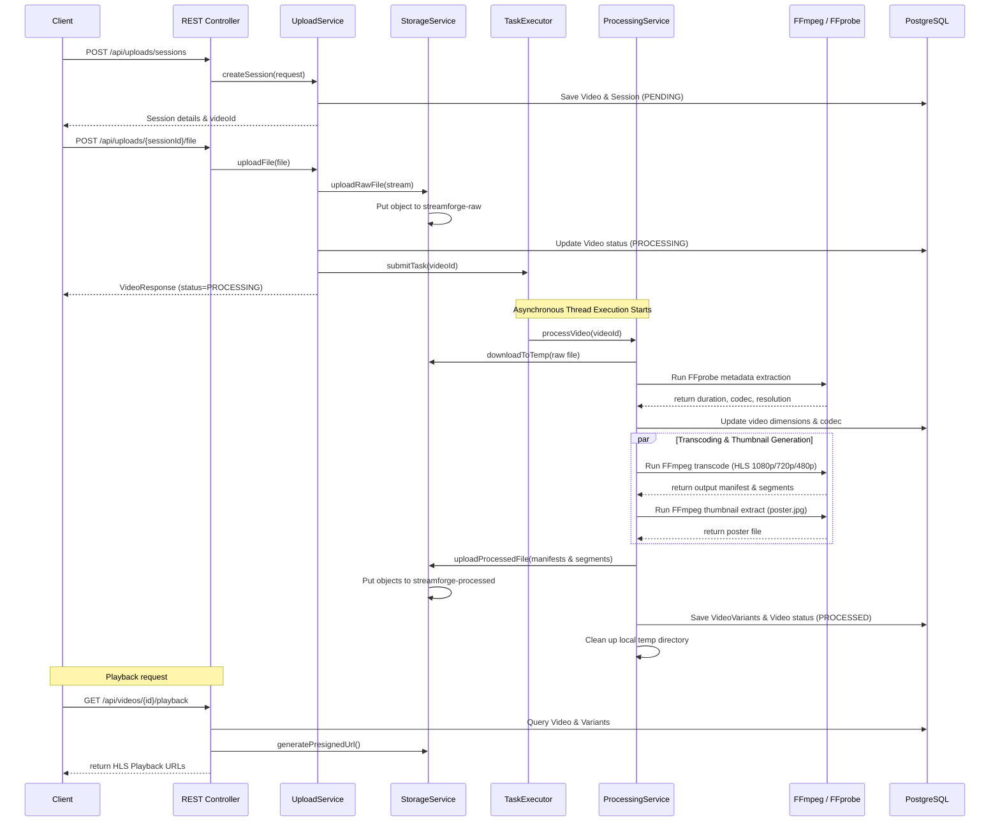

# StreamForge — Phase 1: Foundation Monolith (Detailed Plan & Log)

This document provides the detailed step-by-step implementation log, code design, schemas, and configurations for **Phase 1: Foundation Monolith**.

---

## 1. Project Scaffolding & Maven Dependencies

### 1.1 Project Structure
The initial structure was set up as a standard monolithic Spring Boot application:
```text
src/
├── main/
│   ├── java/com/streamforge/
│   │   ├── config/             # Configuration classes (Async, MinIO)
│   │   ├── controller/         # REST Controllers
│   │   ├── dto/                # Request/Response payloads
│   │   ├── exception/          # Custom exceptions & Global handler
│   │   ├── model/              # JPA Entities & Enums
│   │   ├── repository/         # JPA Repositories
│   │   ├── service/            # Core business services
│   │   └── util/               # File validators & execution utilities
│   └── resources/
│       ├── application.yml     # Local configuration
│       ├── application-docker.yml # Containerized configuration
│       └── db/migration/       # Flyway SQL migrations
```

### 1.2 `pom.xml` Dependencies
Managed dependencies for the project:
* **Spring Boot Starter Web & Starter Data JPA:** REST APIs and Hibernate ORM.
* **Spring Boot Starter Validation:** Binding validations for incoming request bodies.
* **PostgreSQL Driver & Flyway:** Database connection and version-controlled migrations.
* **MinIO Java SDK (8.5.13):** Client interaction with S3-compatible storage.
* **SpringDoc OpenAPI (2.8.7):** Automatic API metadata and Swagger UI rendering.

---

## 2. Infrastructure Setup (Docker Compose)

The local development infrastructure was configured in [docker-compose.yml](file:///Users/shreyanand/dev_proj/streamForage/docker-compose.yml):

```yaml
version: '3.8'

services:
  postgres:
    image: postgres:16-alpine
    container_name: streamforge-postgres
    environment:
      POSTGRES_DB: streamforge
      POSTGRES_USER: streamforge
      POSTGRES_PASSWORD: streamforge_dev
    ports:
      - "5433:5432"
    volumes:
      - postgres_data:/var/lib/postgresql/data
    healthcheck:
      test: ["CMD-SHELL", "pg_isready -U streamforge"]
      interval: 10s
      timeout: 5s
      retries: 5

  minio:
    image: minio/minio:latest
    container_name: streamforge-minio
    command: server /data --console-address ":9001"
    environment:
      MINIO_ROOT_USER: minioadmin
      MINIO_ROOT_PASSWORD: minioadmin123
    ports:
      - "9000:9000"
      - "9001:9001"
    volumes:
      - minio_data:/data
    healthcheck:
      test: ["CMD", "mc", "ready", "local"]
      interval: 10s
      timeout: 5s
      retries: 5

  minio-init:
    image: minio/mc:latest
    container_name: streamforge-minio-init
    depends_on:
      minio:
        condition: service_healthy
    entrypoint: >
      /bin/sh -c "
      mc alias set local http://minio:9000 minioadmin minioadmin123;
      mc mb local/streamforge-raw --ignore-existing;
      mc mb local/streamforge-processed --ignore-existing;
      echo 'Buckets created successfully';
      "
```

---

## 3. Monolithic Architecture & Data Flow

Phase 1 runs as a single process (monolith) with concurrent task processing managed by Spring's `ThreadPoolTaskExecutor`. 

### 3.1 Block Diagram

```text
  +-----------------------+
  | Client App / Postman  |
  +-----------+-----------+
              |
              | 1. HTTP REST (Create Session / Upload File)
              v
  +-------------------------------------------------------------+
  |                   StreamForge Monolith                      |
  |                                                             |
  |  +-------------------+        2. Call       +------------+  |
  |  |  REST Controllers  +-------------------->|   Upload   |  |
  |  | (Upload & Video)   |                     |  Service   |  |
  |  +---------+---------+                      +-----+------+  |
  |            |                                      |         |
  |            | 15. Get Playbacks                    | 5. Handoff
  |            |                                      v         |
  |            |                                +-----+------+  |
  |            |                                |Background  |  |
  |            |                                |Executor    |  |
  |            |                                +-----+------+  |
  |            |                                      |         |
  |            |                                      | 6. Run  |
  |            |                                      v         |
  |            |                                +-----+------+  |
  |            |                                | Processing |  |
  |            |                                |  Service   |  |
  |            |                                +--+--+---+--+  |
  |            |                                   |  |   |     |
  |            |          +------------------------+  |   +--+  |
  |            |          | 9. Extract               | 10. |11. |
  |            |          v                          v     v    |
  |            |     +----+-----+                +----+----+ +---+  |
  |            |     | Metadata |                |Transcode| |T. |  |
  |            |     | Service  |                | Service | |H. |  |
  |            |     +----+-----+                +----+----+ +---+  |
  |            |          |                           |      |  |
  |            v          v                           v      v  |
  |      +-----+----------+---------------------------+------+  |
  |      |                    StorageService                     |  |
  |      +-----+--------------------------------------+------+  |
  +------------|--------------------------------------|---------+
               |                                      |
               | 3,4. Raw upload                      | 12,13. Processed write
               v                                      v
  +------------+------------+            +------------+------------+
  |  MinIO: streamforge-raw |            | MinIO: streamforge-proc |
  +-------------------------+            +-------------------------+
```

Or as a Mermaid graph (requires Mermaid compatible viewer):



### 3.2 Sequence Diagram

```text
  Client             REST Controller       UploadSvc        StorageSvc       TaskExecutor        ProcessingService      FFmpeg/FFprobe          PostgreSQL
    |                       |                  |                |                 |                      |                    |                 |
    +---1. POST session---->|                  |                |                 |                      |                    |                 |
    |                       +---2. create----->|                |                 |                      |                    |                 |
    |                       |                  +--------------------------------------------------------------------------------------------->| Save Video/Session (PENDING)
    |                       |<--3. session ID--+                |                 |                      |                    |                 |
    |<--4. returns ID-------+                  |                |                 |                      |                    |                 |
    |                       |                  |                |                 |                      |                    |                 |
    +---5. POST chunk/file->|                  |                |                 |                      |                    |                 |
    |                       +---6. uploadFile->|                |                 |                      |                    |                 |
    |                       |                  +---7. upload--->|                 |                      |                    |                 |
    |                       |                  |      raw file  +---8. Put object------------------------+------------------->|                 |
    |                       |                  |                |   to MinIO raw  |                      |                    |                 |
    |                       |                  +--------------------------------------------------------------------------------------------->| Update status (PROCESSING)
    |                       |                  +---9. submitAsyncJob------------->|                      |                    |                 |
    |                       |<--10. Accepted---+                                  +---11. execute-------->|                    |                 |
    |<--11. return 202------+                                                                             |                    |                 |
    |                                                                                                    +---12. Download---->|                 |
    |                                                                                                    |       raw file     |                 |
    |                                                                                                    +---13. Run FFprobe------------------->| Extract codec/dim/FPS
    |                                                                                                    |                                      |<-- return info
    |                                                                                                    +------------------------------------->| Update Video specs
    |                                                                                                    |                    |                 |
    |                                                                                                    +---14. Transcode HLS----------------->| Run FFmpeg encoder
    |                                                                                                    |                                      |<-- return m3u8 & segments
    |                                                                                                    +---15. Thumbnail--------------------->| Run FFmpeg poster JPG
    |                                                                                                    |                                      |<-- return image file
    |                                                                                                    |                    |                 |
    |                                                                                                    +---16. Upload------>|                 |
    |                                                                                                    |       processed    +---17. Put objects---------------+
    |                                                                                                    |       outputs      |   to MinIO processed            |
    |                                                                                                    +------------------------------------->| Save VideoVariants & status (PROCESSED)
    |                                                                                                    +---18. Sweep temp files               |
```

Or as a Mermaid sequence chart (requires Mermaid compatible viewer):



---

## 4. Database Schema Design & Migrations

Database tables were built using three versioned SQL files under `src/main/resources/db/migration/`:

### 3.1 `V1__create_videos_table.sql`
Stores core metadata and overall processing statuses for the video catalog:
```sql
CREATE TABLE videos (
    id UUID PRIMARY KEY,
    title VARCHAR(500) NOT NULL,
    description TEXT,
    original_filename VARCHAR(500) NOT NULL,
    content_type VARCHAR(100) NOT NULL,
    file_size_bytes BIGINT NOT NULL DEFAULT 0,
    status VARCHAR(20) NOT NULL,
    storage_path VARCHAR(1000),
    duration_seconds DOUBLE PRECISION,
    width INT,
    height INT,
    fps DOUBLE PRECISION,
    codec VARCHAR(50),
    bitrate_kbps INT,
    audio_codec VARCHAR(50),
    thumbnail_path VARCHAR(1000),
    error_message TEXT,
    created_at TIMESTAMP NOT NULL,
    updated_at TIMESTAMP NOT NULL
);
```

### 3.2 `V2__create_upload_sessions_table.sql`
Manages upload sessions, matching them against raw video records and session expirations:
```sql
CREATE TABLE upload_sessions (
    session_id UUID PRIMARY KEY,
    video_id UUID NOT NULL REFERENCES videos(id) ON DELETE CASCADE,
    status VARCHAR(20) NOT NULL,
    expires_at TIMESTAMP NOT NULL,
    created_at TIMESTAMP NOT NULL,
    updated_at TIMESTAMP NOT NULL
);
```

### 3.3 `V3__create_video_variants_table.sql`
Persists transcoded variant playlists produced by FFmpeg (e.g. 1080p, 720p, 480p):
```sql
CREATE TABLE video_variants (
    id UUID PRIMARY KEY,
    video_id UUID NOT NULL REFERENCES videos(id) ON DELETE CASCADE,
    resolution VARCHAR(20) NOT NULL,
    width INT NOT NULL,
    height INT NOT NULL,
    bitrate_kbps INT NOT NULL,
    manifest_path VARCHAR(1000) NOT NULL,
    created_at TIMESTAMP NOT NULL
);
```

---

## 4. Application Configuration

### 4.1 `application.yml` (Common Setup)
Specifies parameters for file limits, local paths, and database bindings:
```yaml
spring:
  datasource:
    url: jdbc:postgresql://localhost:5433/streamforge
    username: streamforge
    password: streamforge_dev
    driver-class-name: org.postgresql.Driver
  jpa:
    hibernate:
      ddl-auto: validate
    show-sql: false
    properties:
      hibernate:
        dialect: org.hibernate.dialect.PostgreSQLDialect
  servlet:
    multipart:
      max-file-size: 2GB
      max-request-size: 2GB

minio:
  endpoint: http://localhost:9000
  access-key: minioadmin
  secret-key: minioadmin123
  raw-bucket: streamforge-raw
  processed-bucket: streamforge-processed

ffmpeg:
  path: ffmpeg
  ffprobe-path: ffprobe

processing:
  temp-dir: /tmp/streamforge/processing
```

### 4.2 Java Configurations
* **`MinioConfig.java`:** Configures and registers the singleton bean `MinioClient` used by the storage system.
* **`AsyncConfig.java`:** Declares an asynchronous executor pool configuration (threads: core 5, max 10, queue 100) to safely execute background transcoding and metadata processes.

---

## 5. Core Services Implementation

### 5.1 StorageService
Leverages `MinioClient` to upload original uploads, write transcoded variant chunks, download raw files to temp worker storage, and generate pre-signed read URLs.

### 5.2 UploadService
1. **Session Creation:** Creates a new database `UploadSession` record corresponding to a new `Video` registry.
2. **File Assembly:** Handles incoming file streams, validates MIME type and size constraints via `FileValidator`, writes files to the raw object storage bucket, updates the video status to `PROCESSING`, and schedules the asynchronous processing job.

### 5.3 MetadataService (FFprobe wrapper)
Executes local `ffprobe` operations against downloaded media files. Parses streams to capture structural dimensions: duration, resolution width/height, framerate, video codec, audio codec, and file bitrates.

### 5.4 TranscodeService (FFmpeg engine)
Invokes system `ffmpeg` command arrays to transcode inputs into three target resolution profiles:
* **1080p:** 1920x1080, 5000 kbps
* **720p:** 1280x720, 2500 kbps
* **480p:** 854x480, 1000 kbps

Output streams are packetized into 6-second segments (`.ts` files) alongside a master index HLS manifest (`master.m3u8`).

### 5.5 ThumbnailService
Invokes `ffmpeg` to extract a single poster keyframe at the 5.0-second timestamp (or the midpoint if the video is shorter than 5 seconds), exporting it to a JPG file.

### 5.6 ProcessingService (Coordinator)
Orchestrates the synchronous worker pipeline execution inside a background thread:
1. Downloads the raw file from MinIO to the local scratch disk.
2. Runs metadata extraction $\rightarrow$ Updates video specs in PostgreSQL.
3. Runs parallel/sequential transcode and thumbnail pipelines $\rightarrow$ Uploads outputs to the processed bucket.
4. Updates overall status to `PROCESSED` (or `FAILED` with detailed errors) and sweeps away local temp files.

---

## 6. REST API Controllers

API entry points are mapped inside two classes:

### 6.1 `UploadController`
* `POST /api/uploads/sessions` — Registers a new upload task, returns allocated session ID.
* `GET /api/uploads/sessions/{id}` — Queries active upload session states.
* `POST /api/uploads/{sessionId}/file` — Receives multipart binary media payloads.

### 6.2 `VideoController`
* `GET /api/videos` — Browse catalog via paginated index.
* `GET /api/videos/{id}` — Fetch absolute parameters of a specific video record.
* `GET /api/videos/{id}/status` — Returns overall status (PROCESSING, PROCESSED, FAILED).
* `GET /api/videos/{id}/playback` — Exposes pre-signed read URLs for the master HLS manifest and sub-renditions.
* `GET /api/videos/{id}/thumbnail` — Redirects (`302 Found`) directly to a pre-signed poster image URL.
* `DELETE /api/videos/{id}` — Deletes metadata and cascading variants from MinIO and Postgres.

---

## 7. Multi-stage Dockerization

The container runtime is packaged using the multi-stage [Dockerfile](file:///Users/shreyanand/dev_proj/streamForage/Dockerfile):

```dockerfile
# Stage 1: Build Java application
FROM maven:3.9-eclipse-temurin-21-alpine AS builder
WORKDIR /app
COPY pom.xml .
RUN mvn dependency:go-offline
COPY src ./src
RUN mvn clean package -DskipTests

# Stage 2: Final minimal runtime
FROM eclipse-temurin:21-jre-alpine
RUN apk add --no-cache ffmpeg
WORKDIR /app
COPY --from-builder /app/target/streamforge-*.jar app.jar
EXPOSE 8080
ENTRYPOINT ["java", "-jar", "app.jar"]
```

---

## 8. Manual Verification Flow

The end-to-end monolith behavior was validated manually using the following flow:
1. Spin up the infrastructure using `docker compose up --build -d`.
2. Access the OpenAPI specs at `http://localhost:8080/swagger-ui/index.html`.
3. Submit a new session, upload a standard MP4 file, monitor background logs of `streamforge-app` to verify active FFmpeg encoding scripts, and ensure variant objects are written to the MinIO processed bucket.
4. Verify the HLS streams play correctly in a player (like VLC or Safari) using the generated pre-signed URLs from the playback endpoint.

---

## 🚦 Operational Guide — How to Start, Run, and Close the Monolith Application

Below are the exact terminal commands to manage the Phase 1 application stack.

### 1. Starting the Application
Build all custom images and start the PostgreSQL database, MinIO object storage, and the monolithic Spring Boot application in background (detached) mode:
```bash
docker compose up --build -d
```

### 2. Running and Monitoring the Application
To verify that everything is up and monitor execution:

* **Check container health:**
  ```bash
  docker compose ps
  ```

* **Tail live logs of the Spring Boot application:**
  ```bash
  docker compose logs -f streamforge-app
  ```

* **Access the Interactive API console:**
  Open [http://localhost:8080/swagger-ui/index.html](http://localhost:8080/swagger-ui/index.html) in your browser.

* **Browse Object Storage buckets:**
  Open [http://localhost:9001](http://localhost:9001) in your browser.
  * **Access Key:** `minioadmin`
  * **Secret Key:** `minioadmin123`

* **Query DB records directly via psql command:**
  ```bash
  docker exec -it streamforge-postgres psql -U streamforge -d streamforge -c "SELECT title, status FROM videos;"
  ```

### 3. Closing the Application
To shut down the application and free up ports and memory:

* **Stop services (preserving database and object storage volume state):**
  ```bash
  docker compose down
  ```

* **Stop services and completely wipe databases & file buckets (clean reset):**
  ```bash
  docker compose down -v
  ```
