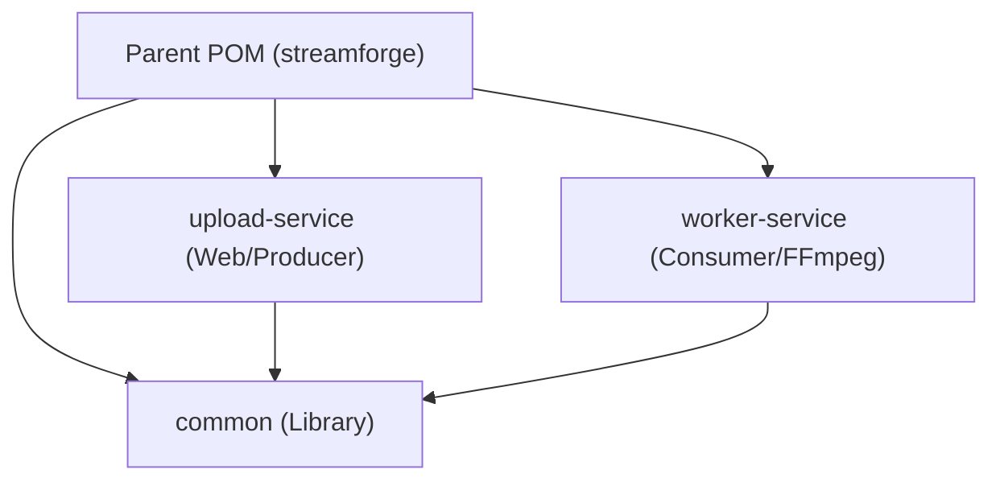
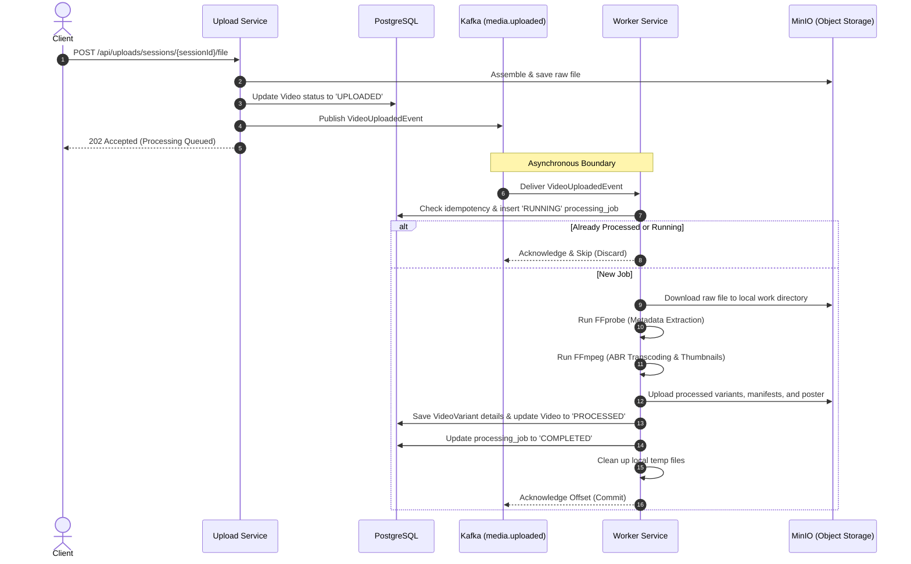

# StreamForge — Phase 2: Introduce Kafka & Async Processing

This document outlines the detailed system architecture, file changes, and verification plan for **Phase 2 (Decoupled Kafka Architecture)** of the StreamForge distributed media platform.

---

## 🎯 Goal Description

The goal of Phase 2 is to decouple the video upload flow from the heavy media processing tasks (metadata extraction, transcoding, and thumbnail generation) using an event-driven architecture powered by **Apache Kafka**.

We will refactor the existing monolith codebase into a **Maven Multi-Module Project**:
1. **`common`**: Shared libraries containing JPA entities, repositories, configurations (MinIO/S3 connection, database), exceptions, and Flyway database migrations.
2. **`upload-service`**: Exposes HTTP endpoints for resumable upload sessions, file assembly, video listings, HLS streaming proxy, and publishes processing request events to Kafka.
3. **`worker-service`**: Headless runner subscribing to Kafka topics. Downloads raw files from MinIO, executes FFmpeg/FFprobe operations in local temp space, uploads processed manifests/segments, updates the database, and supports retry/DLQ patterns.

---

## ⚠️ User Review Required

> [!IMPORTANT]
> **Maven Multi-Module Restructuring:**
> This phase completely alters the project directory. All current source files under `src/main/java/` will be moved into their respective modules.
>
> **Shared Database & Object Storage:**
> In Phase 2, both `upload-service` and `worker-service` will connect to the same PostgreSQL database (`streamforge`) and MinIO instance. They will communicate status changes transactionally via database updates.
>
> **Single-Node KRaft Kafka:**
> We will add a single-node Kafka broker using KRaft mode to our local Docker Compose stack, eliminating Zookeeper dependency for simplicity.

---

## 🙋 Open Questions

> [!IMPORTANT]
> **1. Topic Partitions & Replication:**
> For the local development stack, we will use a partition count of **3** and a replication factor of **1** for all topics. Let me know if you would prefer different numbers for scaling tests.
>
> **2. Sequential vs. Parallel Worker Execution:**
> Currently, the worker performs: **Metadata Extraction $\rightarrow$ Transcoding $\rightarrow$ Thumbnail Generation** sequentially inside a single consumer callback. In Phase 3, this will be decomposed into individual microservices communicating via distinct Kafka topics (saga choreography). For Phase 2, we will orchestrate this sequentially in the `worker-service` consumer to keep Kafka topology simple.

---

## 🛠 Proposed Changes

### 1. Project Hierarchy & Parent POM

We will transform the root directory into a Maven parent POM.



#### [MODIFY] [pom.xml](file:///Users/shreyanand/dev_proj/streamForage/pom.xml)
* Set packaging type to `<packaging>pom</packaging>`.
* Define submodules:
  ```xml
  <modules>
      <module>common</module>
      <module>upload-service</module>
      <module>worker-service</module>
  </modules>
  ```
* Move dependencies into `<dependencyManagement>` to enforce version consistency (Spring Boot starters, Lombok, MapStruct, MinIO SDK, Spring Kafka).

#### [MODIFY] [docker-compose.yml](file:///Users/shreyanand/dev_proj/streamForage/docker-compose.yml)
* Add Apache Kafka broker service with KRaft setup:
  ```yaml
  kafka:
    image: confluentinc/cp-kafka:7.5.0
    container_name: streamforge-kafka
    ports:
      - "9092:9092"
    environment:
      KAFKA_NODE_ID: 1
      KAFKA_LISTENER_SECURITY_PROTOCOL_MAP: 'CONTROLLER:PLAINTEXT,PLAINTEXT:PLAINTEXT,PLAINTEXT_HOST:PLAINTEXT'
      KAFKA_ADVERTISED_LISTENERS: 'PLAINTEXT://kafka:29092,PLAINTEXT_HOST://localhost:9092'
      KAFKA_OFFSETS_TOPIC_REPLICATION_FACTOR: 1
      KAFKA_GROUP_INITIAL_REBALANCE_DELAY_MS: 0
      KAFKA_TRANSACTION_STATE_LOG_MIN_ISR: 1
      KAFKA_TRANSACTION_STATE_LOG_REREPLICATION_FACTOR: 1
      KAFKA_PROCESS_ROLES: 'broker,controller'
      KAFKA_LATEST_METHOD: 'kraft'
      KAFKA_CONTROLLER_QUORUM_VOTERS: '1@kafka:29093'
      KAFKA_LISTENERS: 'PLAINTEXT://0.0.0.0:29092,CONTROLLER://0.0.0.0:29093,PLAINTEXT_HOST://0.0.0.0:9092'
      KAFKA_INTER_BROKER_LISTENER_NAME: 'PLAINTEXT'
      KAFKA_CONTROLLER_LISTENER_NAMES: 'CONTROLLER'
      KAFKA_LOG_DIRS: '/tmp/kraft-combined-logs'
      CLUSTER_ID: 'MkU3OEVBNTcwNTJENDM2Qk'
    healthcheck:
      test: ["CMD-SHELL", "kafka-topics.sh --bootstrap-server localhost:9092 --list"]
      interval: 10s
      timeout: 5s
      retries: 5
  ```
* Update `streamforge-app` to deploy two independent containers:
  * `upload-service` (exposing port `8080`)
  * `worker-service` (exposing port `8081` for Actuator metrics)

---

### 2. Common Submodule (`common`)

A library containing database definitions, entities, repository interfaces, shared configurations, and migrations.

#### [NEW] [pom.xml](file:///Users/shreyanand/dev_proj/streamForage/common/pom.xml)
* Configure build package dependencies: Spring Boot Starter Data JPA, PostgreSQL driver, Flyway, Validation, MinIO SDK, Lombok.

#### [NEW] Flyway Migration `common/src/main/resources/db/migration/V4__create_processing_jobs_table.sql`
* Create a tracking table `processing_jobs` to enforce idempotent processing and keep track of consumer job states:
  ```sql
  CREATE TABLE processing_jobs (
      id UUID PRIMARY KEY,
      video_id UUID NOT NULL REFERENCES videos(id) ON DELETE CASCADE,
      job_type VARCHAR(50) NOT NULL, -- METADATA, TRANSCODE, THUMBNAIL
      status VARCHAR(20) NOT NULL,    -- PENDING, RUNNING, COMPLETED, FAILED
      retry_count INT DEFAULT 0,
      idempotency_key VARCHAR(255) UNIQUE NOT NULL,
      error_message TEXT,
      created_at TIMESTAMP NOT NULL,
      updated_at TIMESTAMP NOT NULL
  );
  CREATE INDEX idx_processing_jobs_video ON processing_jobs(video_id);
  ```

#### [MOVE] Core Shared Files
* Move files from existing codebase into `common` under package `com.streamforge`:
  * **Model Entities**: `Video`, `UploadSession`, `VideoVariant`
  * **Repositories**: `VideoRepository`, `UploadSessionRepository`, `VideoVariantRepository`
  * **Enums**: `VideoStatus`, `UploadStatus`
  * **Config**: `MinioConfig`, `MinioConfigProperties` (renamed from `MinioConfig` if properties separated)
  * **Services**: `StorageService` (handles direct MinIO bucket access)
  * **Exceptions**: `ProcessingException`, `VideoNotFoundException`, `UploadSessionExpiredException`, `InvalidFileTypeException`

---

### 3. Upload Service (`upload-service`)

Handles client ingestion operations, serves playback configs, and publishes events to Kafka.

#### [NEW] [pom.xml](file:///Users/shreyanand/dev_proj/streamForage/upload-service/pom.xml)
* Include dependency on the `common` project module, Spring Boot Starter Web, Spring Kafka, SpringDoc OpenAPI, and Spring Boot Actuator.

#### [NEW] `com.streamforge.upload.kafka.UploadEventProducer`
* Handles publishing messages to the `media.uploaded` topic.
* Provision topics automatically using Spring's `NewTopic` beans:
  ```java
  @Bean
  public NewTopic mediaUploadedTopic() {
      return TopicBuilder.name("media.uploaded")
              .partitions(3)
              .replicas(1)
              .build();
  }
  ```
* Publishes serialization-friendly record payloads:
  ```java
  public record VideoUploadedEvent(
      UUID videoId,
      String title,
      String description,
      String originalFilename,
      String storagePath,
      long fileSizeBytes
  ) {}
  ```

#### [MOVE] Ingestion Components
* Move these files into `upload-service` under package `com.streamforge`:
  * **Controllers**: `UploadController`, `VideoController`, `StreamController`
  * **DTOs**: All Request and Response DTO records
  * **Services**: `UploadService`, `VideoService` (modified to omit processing trigger logic)
* **Modify `UploadService.completeSession()`**: After raw file assembly inside `StorageService`, publish a `VideoUploadedEvent` to the `media.uploaded` Kafka topic instead of calling `processingService.processVideoAsync()` directly.

---

### 4. Worker Service (`worker-service`)

Headless, message-driven media pipeline worker.

#### [NEW] [pom.xml](file:///Users/shreyanand/dev_proj/streamForage/worker-service/pom.xml)
* Include dependency on the `common` project module, Spring Kafka, Spring Boot Starter Actuator, and validation.

#### [NEW] `com.streamforge.worker.kafka.MediaEventConsumer`
* Subscribes to the `media.uploaded` topic using `@KafkaListener`.
* Handles processing in a transaction-bound wrapper:
  1. Enforces **Idempotency**: Generates an idempotency key `videoId + ":" + jobType`. Searches `processing_jobs` table. If the job status is `RUNNING` or `COMPLETED`, discards the message to prevent duplicate work.
  2. Orchestrates media extraction, transcoding, and thumbnail rendering via wrapped FFmpeg execution.
  3. Updates database status on completion.

#### [NEW] Error Handling & DLQ Configuration
* Configure Spring's `DefaultErrorHandler` to catch exceptions thrown during processing:
  * **Retry Policy**: Retry on transient failures (e.g. storage connection timeouts) up to **3 times** with an **exponential backoff** (initial interval of 2 seconds, multiplier of 2.0).
  * **DLQ Recovery**: If retries are exhausted (or if a non-retryable exception like `InvalidFileTypeException` occurs), route the message to the Dead Letter Queue topic `media.uploaded.dlq` using Spring's `DeadLetterPublishingRecoverer`.
  * **DLQ Consumer**: A simple consumer logging DLQ failures for administrative review.

#### [MOVE] Media Utilities
* Move processing files into `worker-service` under package `com.streamforge`:
  * **Services**: `ProcessingService`, `MetadataService`, `TranscodeService`, `ThumbnailService`
  * **Utils**: `FFmpegUtil`
  * **Config**: `FFmpegProperties`, `ProcessingProperties`

---

## 🔄 Detailed Event Flow



---

## 🔍 Verification Plan (Phase 2)

### 1. Integration Testing (Automated)
We will introduce integration tests inside `worker-service` using **Testcontainers**:
* **`MediaProcessingKafkaIT`**:
  * Spins up a PostgreSQL container and a Kafka broker container.
  * Configures properties dynamically.
  * Injects a `VideoUploadedEvent` to the `media.uploaded` topic.
  * Verifies that the consumer executes successfully, updates the database, and uploads output files to MinIO.
  * Verifies that duplicate events are discarded (idempotency checks).

### 2. Manual E2E Verification
1. **Boot Environment**:
   ```bash
   docker compose down -v
   docker compose up --build -d
   ```
2. **Listen to Event Stream**:
   Open a separate shell to monitor published events:
   ```bash
   docker compose exec kafka kafka-console-consumer --bootstrap-server localhost:9092 --topic media.uploaded --from-beginning
   ```
3. **Run Ingestion Scenario**:
   * Send the Postman/cURL sequences to create a session, upload a file, and complete the upload.
   * Verify that the HTTP response returns **`202 Accepted`** instantly, and the `media.uploaded` event is displayed in the monitoring terminal.
   * Monitor `worker-service` logs to observe the transcoding progress.
   * Refresh `http://localhost:8080/static/player.html` and verify the video transitions to `Ready` status and streams correctly through the quality selector.

### 3. Resilience & Failure Verification
* **DLQ Validation**: 
  * Inject a payload with an invalid file reference or trigger a mock processing error.
  * Verify the consumer retries exactly 3 times before pushing the event to `media.uploaded.dlq`.
