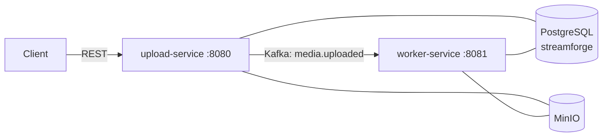
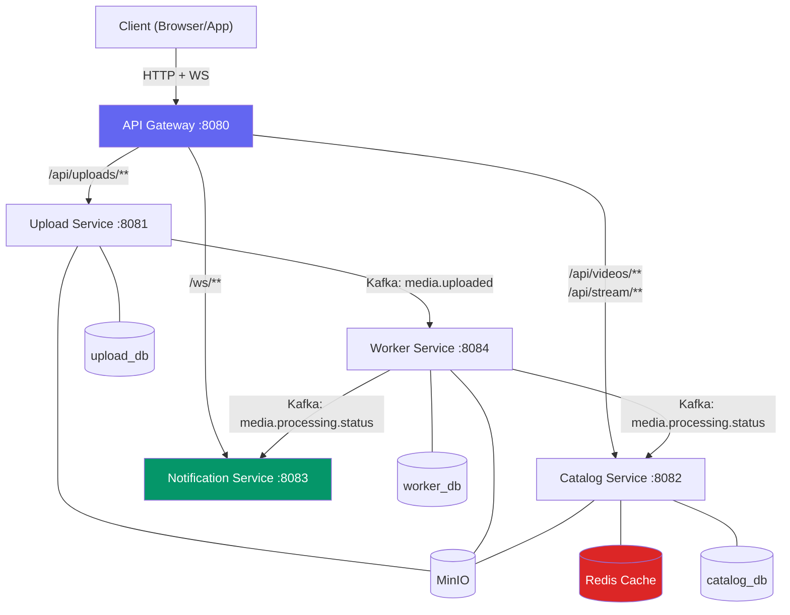

# StreamForge — Phase 3: Full Microservice Decomposition

Phase 3 transforms StreamForge from a shared-database, two-service system into a true microservices architecture with **independent databases**, an **API Gateway**, a **Catalog Service** (with Redis cache), and a **Notification Service** (WebSocket push).

---

## Current State (Phase 2)



**Key coupling points to break:**
- Both services share **one PostgreSQL database** (`streamforge`) with a single Flyway migration history.
- `upload-service` directly queries `videos`, `video_variants`, and `upload_sessions` tables.
- `worker-service` directly writes to `videos`, `video_variants`, and `processing_jobs`.
- The `common` module bundles all JPA entities, repos, and Flyway migrations together.
- No central entry point — clients must know individual service ports.
- No real-time status updates — clients poll `GET /api/videos/{id}/status`.

---

## Target State (Phase 3)



---

## User Review Required

> [!IMPORTANT]
> **Database Split Strategy:**
> We will create **3 separate PostgreSQL databases** inside the same Postgres container (not 3 containers):
> - `upload_db` — owns `upload_sessions` table
> - `catalog_db` — owns `videos` and `video_variants` tables
> - `worker_db` — owns `processing_jobs` table
>
> Each service runs its own independent Flyway migrations. The `common` module will be trimmed down to only hold shared DTOs (event contracts, API response records) — no more JPA entities or repositories.

> [!IMPORTANT]
> **Port Reassignment:**
> The API Gateway takes over port `8080` (the current upload-service port). All downstream services shift:
> | Service | New Port |
> |---------|----------|
> | API Gateway | 8080 |
> | Upload Service | 8081 |
> | Catalog Service | 8082 |
> | Notification Service | 8083 |
> | Worker Service | 8084 |
>
> Clients will **only** interact with `localhost:8080` (the gateway). Internal ports are never exposed externally.

> [!WARNING]
> **Breaking Change — Video lifecycle ownership moves to Catalog Service:**
> Currently, `upload-service` owns the `Video` entity (creates it during upload, queries it for listings/playback/status). In Phase 3, the **Catalog Service** becomes the single owner of the `videos` table. The upload-service will call the Catalog Service via a synchronous REST call (through the gateway or direct) to create the video record during upload session creation.

---

## Open Questions

> [!IMPORTANT]
> **Q1: Service-to-service communication for video creation**
> When a user creates an upload session, the upload-service needs to create a `Video` record. Two options:
> - **(A) Synchronous REST call** from upload-service → catalog-service to create the video, then upload-service stores only the returned `videoId` in its `upload_sessions` table. *(Recommended — simpler, transactional consistency is clearer)*
> - **(B) Async Kafka event** — upload-service emits a `video.create.requested` event, catalog-service creates the record, and emits `video.created` back. Upload-service waits or polls. *(More complex, eventual consistency)*
>
> **The plan assumes Option A.** Let me know if you prefer B.

> [!IMPORTANT]
> **Q2: Redis — should we add it to docker-compose now?**
> The Catalog Service uses Redis to cache frequently accessed video metadata (hot cache for listings and playback). This adds a Redis container to `docker-compose.yml`. Are you okay with adding Redis as a new infra dependency?

---

## Proposed Changes

### 1. New Maven Modules

We add 3 new submodules to the parent POM:

```
streamForage/
├── common/                   ← Trimmed: only DTOs + event contracts
├── api-gateway/              ← [NEW] Spring Cloud Gateway
├── upload-service/           ← Refactored: owns only upload_sessions
├── catalog-service/          ← [NEW] Owns videos + variants + Redis cache
├── notification-service/     ← [NEW] WebSocket push for processing status
├── worker-service/           ← Refactored: owns only processing_jobs
└── pom.xml
```

---

### Component 1: API Gateway (`api-gateway`)

The single entry point for all client traffic. Routes requests to downstream services based on URL path prefixes.

#### [NEW] [pom.xml](file:///Users/shreyanand/dev_proj/streamForage/api-gateway/pom.xml)
- Spring Cloud Gateway (reactive, `spring-cloud-starter-gateway`)
- Spring Boot Actuator for health checks
- Spring Cloud BOM for dependency management

#### [NEW] [ApiGatewayApplication.java](file:///Users/shreyanand/dev_proj/streamForage/api-gateway/src/main/java/com/streamforge/ApiGatewayApplication.java)
- Standard Spring Boot main class

#### [NEW] [application.yml](file:///Users/shreyanand/dev_proj/streamForage/api-gateway/src/main/resources/application.yml)
- Route definitions:
  ```yaml
  spring:
    cloud:
      gateway:
        routes:
          - id: upload-service
            uri: http://localhost:8081
            predicates:
              - Path=/api/uploads/**
          - id: catalog-service
            uri: http://localhost:8082
            predicates:
              - Path=/api/videos/**,/api/stream/**
          - id: notification-ws
            uri: ws://localhost:8083
            predicates:
              - Path=/ws/**
  ```
- Global CORS configuration
- Request/response logging filter
- Server port: `8080`

---

### Component 2: Common Module (Refactored)

The `common` module will be **stripped down** to only contain shared contracts — no JPA entities, no repositories, no Flyway migrations.

#### [MODIFY] [common/pom.xml](file:///Users/shreyanand/dev_proj/streamForage/common/pom.xml)
- Remove: `spring-boot-starter-data-jpa`, `postgresql`, `flyway-core`
- Keep: basic Spring framework, Jackson annotations, Lombok

#### [DELETE] All JPA entities from `common`
- `Video.java`, `UploadSession.java`, `VideoVariant.java`, `ProcessingJob.java` → each moves to its owning service
- Delete `common/src/main/java/com/streamforge/model/`
- Delete `common/src/main/java/com/streamforge/repository/`

#### [DELETE] All Flyway migrations from `common`
- `V1__create_videos_table.sql` → moves to `catalog-service`
- `V2__create_upload_sessions_table.sql` → moves to `upload-service`
- `V3__create_video_variants_table.sql` → moves to `catalog-service`
- `V4__create_processing_jobs_table.sql` → moves to `worker-service`

#### [NEW] Shared Kafka event records in `common`
Keep and expand the event contracts that all services depend on:
```
common/src/main/java/com/streamforge/dto/event/
├── VideoUploadedEvent.java          (existing)
├── ProcessingStatusEvent.java       (NEW — worker → catalog + notification)
├── VideoCreatedEvent.java           (NEW — catalog → upload after video creation)
└── VideoMetadataUpdate.java         (NEW — worker → catalog with extracted metadata)
```

#### [NEW] Shared API response DTOs in `common`
Move response records that the gateway/catalog serve:
```
common/src/main/java/com/streamforge/dto/response/
├── VideoResponse.java
├── VideoDetailResponse.java
├── PlaybackResponse.java
├── StatusResponse.java
└── VariantResponse.java
```

#### [KEEP] `MinioConfig.java` and `StorageService.java` in `common`
- Multiple services (upload, catalog, worker) need MinIO access — this stays shared.

---

### Component 3: Upload Service (Refactored)

Becomes a focused ingestion service. Owns **only** the `upload_sessions` table in its own database.

#### [MODIFY] [application.yml](file:///Users/shreyanand/dev_proj/streamForage/upload-service/src/main/resources/application.yml)
- Datasource URL → `jdbc:postgresql://localhost:5433/upload_db`
- Server port → `8081`
- New config for catalog-service base URL: `services.catalog-url: http://localhost:8082`

#### [NEW] `upload-service/src/main/resources/db/migration/V1__create_upload_sessions_table.sql`
- Own copy of the upload_sessions DDL (no FK to videos since that's in a different DB)
- Add `video_id UUID NOT NULL` column (logical reference, not a DB-level FK)

#### [MODIFY] [UploadService.java](file:///Users/shreyanand/dev_proj/streamForage/upload-service/src/main/java/com/streamforge/service/UploadService.java)
- On session creation: make a synchronous REST call to Catalog Service (`POST /api/internal/videos`) to create the video record and obtain `videoId`
- Store `videoId` in `upload_sessions` as a logical foreign key

#### [NEW] `CatalogClient.java`
- REST client (using `RestClient` or `WebClient`) to call Catalog Service internal APIs
- Methods: `createVideo(...)`, `getVideoStatus(...)` 

#### [DELETE] `VideoService.java` from upload-service
- All video read endpoints (list, detail, playback, status, thumbnail, delete) move to Catalog Service

#### [DELETE] `VideoController.java` from upload-service
- Moves entirely to Catalog Service

#### [DELETE] `StreamController.java` from upload-service
- Moves entirely to Catalog Service

#### [KEEP] `UploadController.java` — only upload session endpoints remain

#### [NEW] Own JPA entity: `UploadSession.java`
- Copy from common, remove FK constraint on `video_id` (it's now a logical UUID reference)
- Own `UploadSessionRepository.java`

---

### Component 4: Catalog Service (`catalog-service`) — [NEW]

The **single source of truth** for video metadata, variants, and streaming URLs. Serves all read-heavy APIs.

#### [NEW] [pom.xml](file:///Users/shreyanand/dev_proj/streamForage/catalog-service/pom.xml)
- Dependencies: `common`, Spring Web, Spring Data JPA, PostgreSQL, Flyway, Spring Kafka (consumer), Spring Data Redis, SpringDoc OpenAPI, Lombok

#### [NEW] [CatalogServiceApplication.java](file:///Users/shreyanand/dev_proj/streamForage/catalog-service/src/main/java/com/streamforge/CatalogServiceApplication.java)

#### [NEW] [application.yml](file:///Users/shreyanand/dev_proj/streamForage/catalog-service/src/main/resources/application.yml)
- Datasource URL → `jdbc:postgresql://localhost:5433/catalog_db`
- Redis connection: `spring.data.redis.host: localhost`, `port: 6379`
- Kafka consumer config for `media.processing.status` topic
- Server port → `8082`

#### [NEW] Flyway migrations (own database)
```
catalog-service/src/main/resources/db/migration/
├── V1__create_videos_table.sql
└── V2__create_video_variants_table.sql
```

#### [NEW] JPA entities — `Video.java`, `VideoVariant.java`
- Copies from current `common/model/` — these are now **owned** by catalog-service
- `VideoRepository.java`, `VideoVariantRepository.java`

#### [NEW] `VideoController.java` — moved from upload-service
- `GET /api/videos` — paginated listing
- `GET /api/videos/{id}` — detail with variants
- `GET /api/videos/{id}/playback` — HLS playback URLs
- `GET /api/videos/{id}/status` — processing status
- `GET /api/videos/{id}/thumbnail` — thumbnail URL
- `DELETE /api/videos/{id}` — delete video + storage objects

#### [NEW] `InternalVideoController.java`
- `POST /api/internal/videos` — called by upload-service to create a video record
- Not exposed through the API Gateway (internal-only path)

#### [NEW] `StreamController.java` — moved from upload-service
- HLS streaming proxy endpoints (master manifest, variant playlist, segments)

#### [NEW] `VideoService.java`
- Core business logic for video CRUD
- Redis caching with `@Cacheable` / `@CacheEvict` on read-heavy methods (listings, detail)
- Cache TTL: 5 minutes for listings, 15 minutes for individual video details

#### [NEW] `CatalogEventConsumer.java`
- Listens to `media.processing.status` Kafka topic
- Updates video status (`PROCESSING` → `PROCESSED` / `FAILED`)
- Updates video metadata fields (duration, width, height, fps, codec, etc.)
- Updates/creates `VideoVariant` records
- Evicts Redis cache on any video state change

#### [NEW] `RedisCacheConfig.java`
- Cache manager configuration with TTL policies
- Cache names: `videos-list`, `video-detail`, `video-playback`

---

### Component 5: Notification Service (`notification-service`) — [NEW]

Real-time push notifications via WebSocket. Clients subscribe to a video ID and receive status updates as they happen.

#### [NEW] [pom.xml](file:///Users/shreyanand/dev_proj/streamForage/notification-service/pom.xml)
- Dependencies: `common`, Spring WebSocket (STOMP), Spring Kafka (consumer), Lombok

#### [NEW] [NotificationServiceApplication.java](file:///Users/shreyanand/dev_proj/streamForage/notification-service/src/main/java/com/streamforge/NotificationServiceApplication.java)

#### [NEW] [application.yml](file:///Users/shreyanand/dev_proj/streamForage/notification-service/src/main/resources/application.yml)
- Kafka consumer config for `media.processing.status` topic (separate consumer group)
- Server port → `8083`
- No database required — this service is stateless

#### [NEW] `WebSocketConfig.java`
- STOMP over WebSocket configuration
- Endpoint: `/ws/connect`
- Message broker prefix: `/topic`
- Application destination prefix: `/app`

#### [NEW] `NotificationConsumer.java`
- Listens to `media.processing.status` Kafka topic
- On receiving a status event, pushes to WebSocket topic: `/topic/video/{videoId}/status`
- Payload: `{ videoId, status, progress, message, timestamp }`

#### Client usage:
```javascript
const socket = new SockJS('http://localhost:8080/ws/connect');
const client = Stomp.over(socket);
client.subscribe('/topic/video/<videoId>/status', (msg) => {
    console.log('Status update:', JSON.parse(msg.body));
});
```

---

### Component 6: Worker Service (Refactored)

Owns **only** the `processing_jobs` table. No longer directly updates the `videos` table — instead emits events.

#### [MODIFY] [application.yml](file:///Users/shreyanand/dev_proj/streamForage/worker-service/src/main/resources/application.yml)
- Datasource URL → `jdbc:postgresql://localhost:5433/worker_db`
- Server port → `8084`
- New Kafka producer topic: `media.processing.status`

#### [NEW] `worker-service/src/main/resources/db/migration/V1__create_processing_jobs_table.sql`
- Own copy of the processing_jobs DDL (no FK to videos — logical reference)

#### [NEW] Own JPA entity: `ProcessingJob.java`
- Copy from common, remove FK constraint on `video_id`
- Own `ProcessingJobRepository.java`

#### [MODIFY] [ProcessingService.java](file:///Users/shreyanand/dev_proj/streamForage/worker-service/src/main/java/com/streamforge/service/ProcessingService.java)
- **Remove**: Direct `Video` entity updates (`video.setStatus(...)`, `videoRepository.save(video)`)
- **Add**: Emit `ProcessingStatusEvent` to `media.processing.status` topic at each stage:
  - `PROCESSING` — when pipeline starts
  - `METADATA_EXTRACTED` — after FFprobe, includes extracted metadata payload
  - `TRANSCODE_COMPLETED` — after HLS transcoding, includes variant details
  - `THUMBNAIL_COMPLETED` — after thumbnail generation
  - `PROCESSED` — final success
  - `FAILED` — on error, includes error message
- Worker now operates **purely** on the raw file from MinIO and its local `processing_jobs` table

#### [MODIFY] [MediaEventConsumer.java](file:///Users/shreyanand/dev_proj/streamForage/worker-service/src/main/java/com/streamforge/kafka/MediaEventConsumer.java)
- Remove `VideoRepository` dependency
- Idempotency check remains on local `processing_jobs` table
- ProcessingService no longer needs `Video` entity — works with event payload data

#### [NEW] `WorkerEventProducer.java`
- Kafka producer for `media.processing.status` topic
- Serializes `ProcessingStatusEvent` as JSON

---

### Component 7: Infrastructure

#### [MODIFY] [docker-compose.yml](file:///Users/shreyanand/dev_proj/streamForage/docker-compose.yml)
- **PostgreSQL init**: Add an init script to create 3 databases:
  ```sql
  CREATE DATABASE upload_db;
  CREATE DATABASE catalog_db;
  CREATE DATABASE worker_db;
  ```
- **Add Redis** container:
  ```yaml
  redis:
    image: redis:7-alpine
    ports:
      - "6379:6379"
    healthcheck:
      test: ["CMD", "redis-cli", "ping"]
  ```
- Remove the single `streamforge-app` service
- (Application services run locally as JVM processes, matching your preference from Phase 2)

#### [MODIFY] [pom.xml](file:///Users/shreyanand/dev_proj/streamForage/pom.xml) (Parent)
- Add new modules: `api-gateway`, `catalog-service`, `notification-service`
- Add Spring Cloud BOM to `dependencyManagement`:
  ```xml
  <spring-cloud.version>2024.0.1</spring-cloud.version>
  ```

---

## New Kafka Topic Map

| Topic | Producer | Consumer(s) | Payload |
|-------|----------|-------------|---------|
| `media.uploaded` | upload-service | worker-service | `VideoUploadedEvent` |
| `media.uploaded.DLT` | spring-kafka (auto) | worker-service (DLT listener) | `VideoUploadedEvent` |
| `media.processing.status` | worker-service | catalog-service, notification-service | `ProcessingStatusEvent` |

### `ProcessingStatusEvent` Schema
```java
public record ProcessingStatusEvent(
    UUID videoId,
    String status,          // PROCESSING, METADATA_EXTRACTED, TRANSCODE_COMPLETED, etc.
    String message,         // Human-readable progress message
    VideoMetadata metadata, // Nullable — populated on METADATA_EXTRACTED
    List<VariantInfo> variants, // Nullable — populated on TRANSCODE_COMPLETED
    String thumbnailPath,   // Nullable — populated on THUMBNAIL_COMPLETED
    String errorMessage,    // Nullable — populated on FAILED
    Instant timestamp
) {}
```

---

## Execution Order

The implementation should proceed in this order due to dependencies:

1. **Infrastructure** — docker-compose (multi-DB + Redis), parent POM updates
2. **Common module refactor** — strip down to DTOs only
3. **Catalog Service** — new service, owns Video entity, serves read APIs
4. **Upload Service refactor** — remove video queries, add CatalogClient
5. **Worker Service refactor** — emit events instead of direct DB writes
6. **API Gateway** — route configuration
7. **Notification Service** — WebSocket push
8. **Integration testing** — full E2E verification

---

## Verification Plan

### Automated Tests (E2E curl)

1. **Upload flow through gateway:**
   ```bash
   # Create session (gateway → upload-service → catalog-service)
   curl -X POST http://localhost:8080/api/uploads/sessions \
     -H "Content-Type: application/json" \
     -d '{"title":"Phase3 Test","description":"Testing","contentType":"video/mp4"}'

   # Upload file
   curl -X POST http://localhost:8080/api/uploads/sessions/{sessionId}/file \
     -F "file=@test.mp4;type=video/mp4"
   ```

2. **Video queries through gateway → catalog-service:**
   ```bash
   curl http://localhost:8080/api/videos
   curl http://localhost:8080/api/videos/{id}
   curl http://localhost:8080/api/videos/{id}/playback
   curl http://localhost:8080/api/videos/{id}/status
   ```

3. **HLS streaming through gateway → catalog-service:**
   ```bash
   curl http://localhost:8080/api/stream/{videoId}/master.m3u8
   ```

### WebSocket Verification
- Connect a STOMP client to `ws://localhost:8080/ws/connect`
- Subscribe to `/topic/video/{videoId}/status`
- Upload a video and verify real-time status transitions arrive:
  `PROCESSING → METADATA_EXTRACTED → TRANSCODE_COMPLETED → THUMBNAIL_COMPLETED → PROCESSED`

### Redis Cache Verification
- Query `GET /api/videos` twice — second call should be served from Redis cache
- Upload a new video → verify cache is evicted and fresh data appears

### Database Isolation Verification
- Connect to each database independently and verify tables exist only in the correct database:
  ```bash
  psql -h localhost -p 5433 -U streamforge -d upload_db -c "\dt"
  psql -h localhost -p 5433 -U streamforge -d catalog_db -c "\dt"
  psql -h localhost -p 5433 -U streamforge -d worker_db -c "\dt"
  ```
