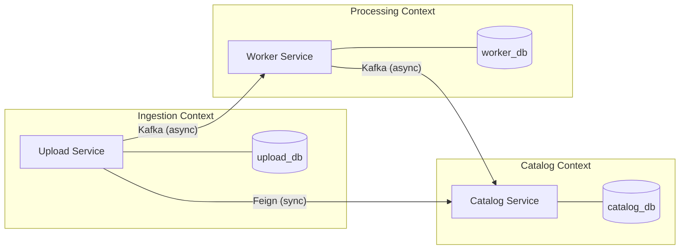
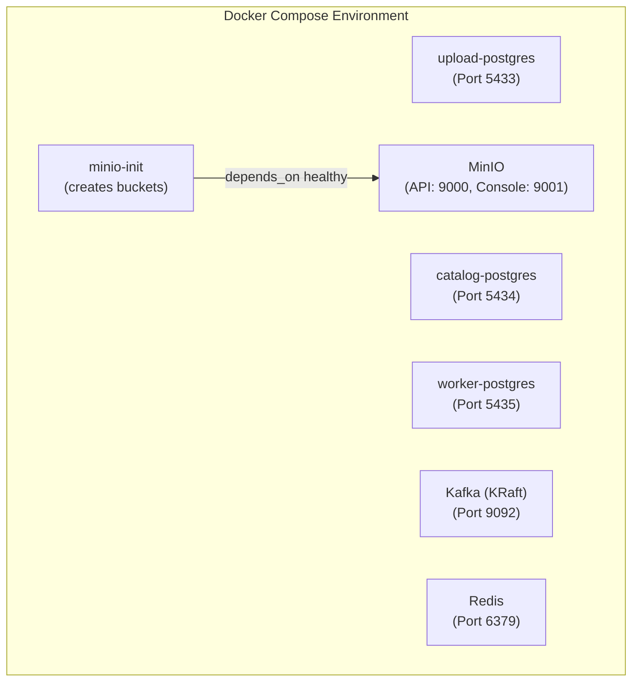
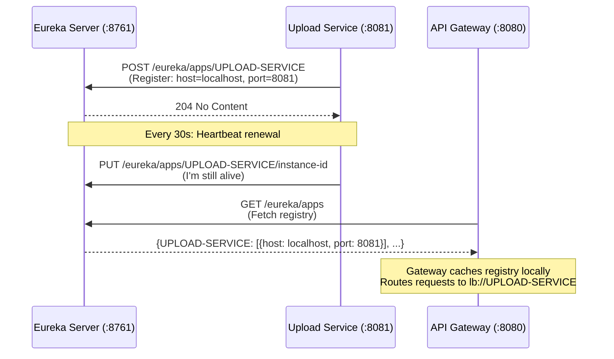
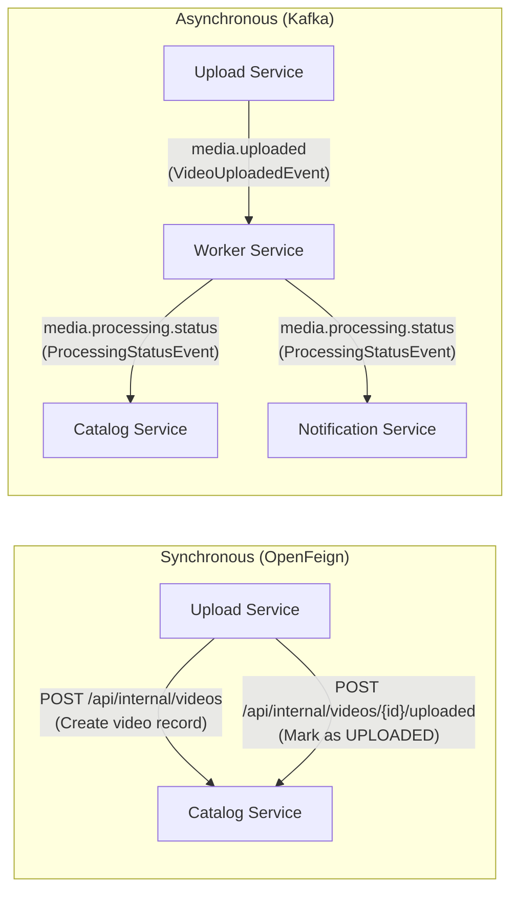
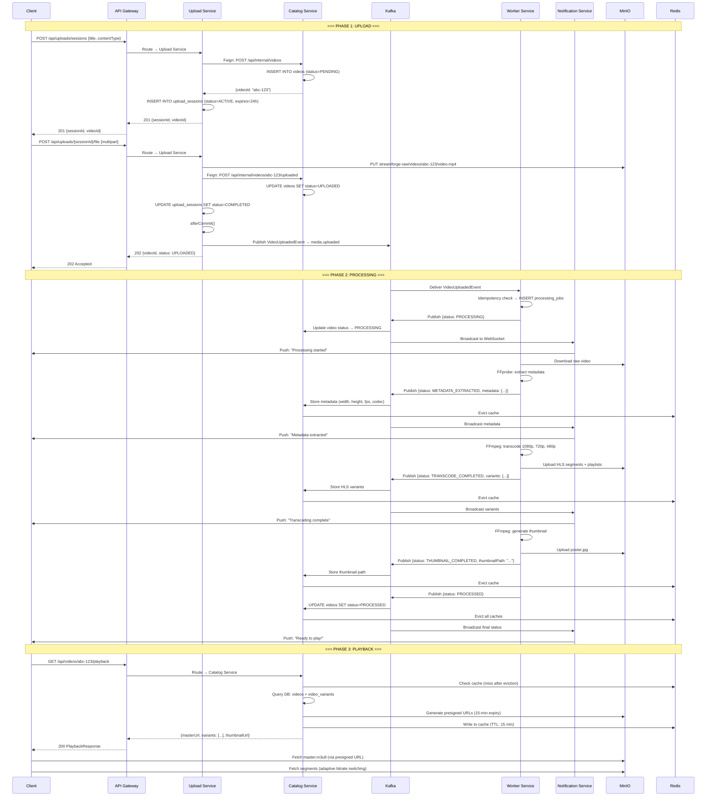
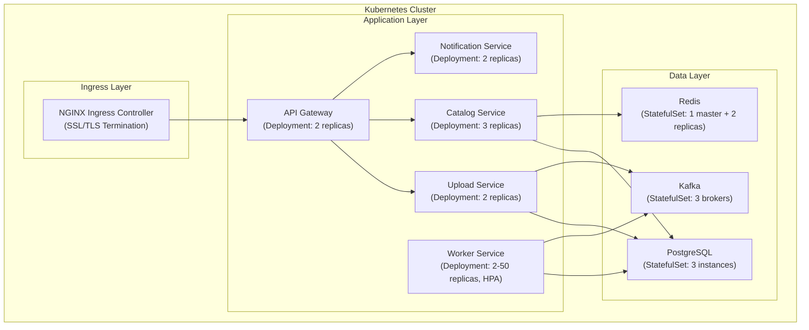
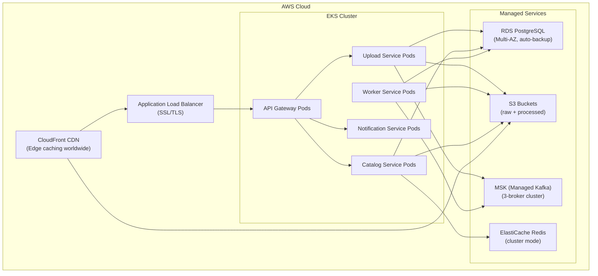

# StreamForge — The Complete System Design & Engineering Course

> **A 100% self-contained, interview-ready deep dive into every architectural decision, technology choice, design pattern, and line of code in the StreamForge distributed video processing and streaming platform.**

---

## Table of Contents

| # | Module | What You'll Learn |
|---|--------|-------------------|
| 1 | [Project Vision & Problem Statement](#1-project-vision--problem-statement) | Why this project exists and what problem it solves |
| 2 | [Technology Stack — The Full Inventory](#2-technology-stack--the-full-inventory) | Every tool, framework, and library with *why* it was chosen |
| 3 | [Multi-Module Maven Architecture](#3-multi-module-maven-architecture) | How the codebase is organized and why |
| 4 | [Infrastructure Layer (Docker Compose)](#4-infrastructure-layer-docker-compose) | Every container, port, and volume — explained |
| 5 | [Service Discovery — Eureka Server](#5-service-discovery--eureka-server) | What it is, why it exists, and how services register |
| 6 | [API Gateway — The Front Door](#6-api-gateway--the-front-door) | Path-based routing, load balancing, CORS, WebSocket upgrade |
| 7 | [The Common Module — Shared Contracts](#7-the-common-module--shared-contracts) | DTOs, Feign clients, events — the glue between services |
| 8 | [Upload Service — Deep Dive](#8-upload-service--deep-dive) | Session management, file ingestion, Feign calls, Kafka publishing |
| 9 | [Catalog Service — Deep Dive](#9-catalog-service--deep-dive) | Video CRUD, Redis caching, Kafka consumption, HLS streaming proxy |
| 10 | [Worker Service — Deep Dive](#10-worker-service--deep-dive) | FFmpeg pipeline, transcoding, idempotency, DLQ |
| 11 | [Notification Service — Deep Dive](#11-notification-service--deep-dive) | WebSockets, STOMP, real-time push |
| 12 | [Inter-Service Communication Patterns](#12-inter-service-communication-patterns) | Synchronous (Feign) vs Asynchronous (Kafka) — when and why |
| 13 | [System Design Patterns & Mitigations](#13-system-design-patterns--mitigations) | Dual-write, idempotency, cache invalidation, DLQ |
| 14 | [The Complete Event Lifecycle](#14-the-complete-event-lifecycle) | Step-by-step trace of a video from upload to playback |
| 15 | [Database Design & Flyway Migrations](#15-database-design--flyway-migrations) | Schema design, indexes, and versioned migrations |
| 16 | [Error Handling Strategy](#16-error-handling-strategy) | Global exception handlers, error codes, and resilience |
| 17 | [Phase 4 — Kubernetes Orchestration](#17-phase-4--kubernetes-orchestration) | Containerization, K8s deployments, HPA, Ingress |
| 18 | [Phase 5 — Production Hardening & AWS](#18-phase-5--production-hardening--aws) | Managed cloud services, CDN, security, observability |
| 19 | [Interview Cheat Sheet](#19-interview-cheat-sheet) | Ready-made answers to the hardest architecture questions |

---

## 1. Project Vision & Problem Statement

### The Problem

Video platforms like YouTube, Netflix, and Twitch need to solve a deceptively hard engineering problem: **a user uploads a single raw video file, but the system must deliver adaptive, multi-resolution streams to millions of viewers on different devices and network speeds.**

A naive approach (serving the raw MP4 directly) fails because:
- A 1080p video at 5 Mbps will **buffer endlessly** on a 2 Mbps mobile connection
- A single file serves only one resolution — no adaptivity
- Large files cannot be seeked efficiently — the entire file must download before playback
- A monolithic architecture cannot scale upload handling independently of transcoding

### The Solution: StreamForge

StreamForge is a **distributed, event-driven microservices platform** that:

1. **Ingests** raw video files through managed upload sessions
2. **Transcodes** them into multiple resolutions (1080p, 720p, 480p) using **HLS (HTTP Live Streaming)**
3. **Splits** each resolution into 6-second `.ts` segments for instant seek and adaptive bitrate switching
4. **Streams** processed content through presigned URLs and a server-side proxy
5. **Notifies** clients in real-time via WebSockets as processing progresses

### Domain Decomposition (Domain-Driven Design)

Rather than building a monolith, the system is decomposed into **three bounded contexts** — each owning its own database, runtime, and deployment lifecycle:



**Why DDD?** In interviews, you explain: *"Each bounded context has complete data sovereignty. The Upload Service can scale independently during peak upload hours. The Worker Service can scale independently during heavy transcoding. Schema changes in one service never break another."*

---

## 2. Technology Stack — The Full Inventory

### Core Framework

| Technology | Version | What Is It? | Why We Use It Here |
|---|---|---|---|
| **Java** | 21 (LTS) | The programming language | Latest LTS release with virtual threads support, pattern matching, records, and sealed classes. Industry standard for enterprise microservices |
| **Spring Boot** | 3.4.5 | Opinionated application framework | Auto-configuration, dependency injection, embedded server. Eliminates boilerplate — you write business logic, not infrastructure plumbing |
| **Spring Cloud** | 2024.0.1 | Microservices toolkit | Provides service discovery (Eureka), API gateway, Feign clients, and load balancing out of the box |

### Why Java + Spring Boot?

Java is the **#1 language in enterprise backend systems** (used by Netflix, LinkedIn, Uber). Spring Boot is the de-facto standard for building production microservices in Java. Combined with Spring Cloud, you get an entire microservices ecosystem — service discovery, gateway, inter-service communication, config management — with minimal configuration.

**Interview Answer**: *"I chose Java 21 with Spring Boot 3.4 because it provides the most mature microservices ecosystem (Spring Cloud) with battle-tested solutions for service discovery, gateway routing, and distributed configuration. Java 21's records and virtual threads make the code more concise and efficient."*

---

### Build & Dependency Management

| Technology | What Is It? | Why We Use It Here |
|---|---|---|
| **Maven** | Build automation & dependency management tool | Manages all Java dependencies, compilation, and packaging. The multi-module POM structure lets us share dependency versions across all 7 modules |
| **Lombok** | Compile-time code generation library | Generates getters, setters, constructors, builders, and loggers via annotations (`@Data`, `@Builder`, `@Slf4j`). Reduces boilerplate by ~60% |
| **MapStruct** | Compile-time bean mapper | Generates type-safe mapping code between DTOs and entities at compile time — zero runtime reflection overhead |

### Why Maven Multi-Module?

The parent `pom.xml` at the root defines shared settings:

```xml
<modules>
    <module>common</module>       <!-- Shared DTOs, Feign clients, events -->
    <module>eureka-server</module>
    <module>api-gateway</module>
    <module>upload-service</module>
    <module>catalog-service</module>
    <module>notification-service</module>
    <module>worker-service</module>
</modules>
```

**What this gives us**:
- **Single version control**: All modules share the same Spring Boot 3.4.5 parent, Java 21, and Spring Cloud 2024.0.1 versions — no version drift
- **Shared dependency management**: Libraries like MinIO SDK (`8.5.13`) and SpringDoc (`2.8.7`) are declared once in `<dependencyManagement>` and inherited by child modules
- **One build command**: `./mvnw clean package -DskipTests` compiles all 7 modules in dependency order

---

### Infrastructure Components

| Technology | Version | What Is It? | Why We Use It Here | Port |
|---|---|---|---|---|
| **PostgreSQL** | 16 (Alpine) | Relational database (RDBMS) | ACID-compliant transactional storage for structured data. Each service gets its own isolated database instance for data sovereignty | `5433`, `5434`, `5435` |
| **Apache Kafka** | 7.5.0 (Confluent, KRaft mode) | Distributed event streaming platform | Decouples services via asynchronous pub/sub. Provides at-least-once delivery, message ordering within partitions, and fault tolerance via persistent logs | `9092` |
| **MinIO** | Latest | S3-compatible object storage | Stores large binary files (raw videos, HLS segments, thumbnails). API-compatible with AWS S3, making migration to production S3 seamless | `9000` (API), `9001` (Console) |
| **Redis** | 7 (Alpine) | In-memory key-value cache | Caches frequently-accessed video metadata and playback URLs. Sub-millisecond read latency reduces database load by ~90% for read-heavy catalog queries | `6379` |

---

### Why These Specific Technologies?

#### Why Kafka Over RabbitMQ?

| Feature | Kafka | RabbitMQ |
|---|---|---|
| **Message persistence** | Messages are stored on disk in an append-only log | Messages are deleted after consumption |
| **Replay capability** | Consumers can re-read old messages by resetting offsets | Once consumed, messages are gone |
| **Throughput** | Millions of messages/second | Tens of thousands/second |
| **Consumer groups** | Multiple independent consumer groups read the same topic | Each queue has one consumer group |

**Our use case**: The `media.processing.status` topic is consumed by **two independent consumer groups** simultaneously — `catalog-group` (updates the database) and `notification-group` (pushes WebSocket updates). With RabbitMQ, we'd need to duplicate messages across multiple queues. Kafka's consumer group model handles this natively.

**Interview Answer**: *"Kafka was chosen because our processing status events need to be consumed by multiple independent services (Catalog and Notification) simultaneously. Kafka's consumer group model allows this without message duplication. Additionally, Kafka's persistent log allows us to replay events if a consumer fails, which is critical for data consistency."*

#### Why Kafka KRaft Mode (No ZooKeeper)?

Traditional Kafka requires Apache ZooKeeper for cluster metadata management. KRaft (Kafka Raft) mode eliminates ZooKeeper by embedding the metadata consensus protocol directly into Kafka brokers. This:
- Reduces infrastructure complexity (one less container to manage)
- Improves startup time
- Simplifies deployment for development environments

Our `docker-compose.yml` configures this:
```yaml
KAFKA_PROCESS_ROLES: 'broker,controller'  # Single node acts as both
KAFKA_CONTROLLER_QUORUM_VOTERS: '1@kafka:29093'
CLUSTER_ID: 'MkU3OEVBNTcwNTJENDM2Qk'   # Static cluster ID
```

#### Why MinIO Over Local Filesystem?

Video files are **large binary blobs** (hundreds of MB to GB). Storing them in PostgreSQL (as BLOBs) would:
- Bloat the database size and destroy query performance
- Make backups extremely slow
- Not support range-based HTTP streaming

MinIO provides:
- **S3-compatible API**: Code written for MinIO works with AWS S3 with zero changes
- **Presigned URLs**: Generate time-limited download links without exposing storage credentials
- **Bucket isolation**: `streamforge-raw` for unprocessed uploads, `streamforge-processed` for HLS output
- **Web console** at `localhost:9001` for visual debugging

#### Why Redis Over Application-Level Caching?

Application-level caches (e.g., `HashMap` in memory) die when the JVM restarts and can't be shared across instances. Redis:
- **Survives restarts**: Data is persisted to disk via RDB/AOF
- **Shared across instances**: When we scale catalog-service to 3 pods, all pods read/write the same Redis cache
- **TTL support**: Automatic expiration (5 min for listings, 15 min for details) prevents stale data
- **Atomic operations**: Cache eviction is atomic — no race conditions

#### Why 3 Separate PostgreSQL Instances?

This is the **Database-per-Service** pattern. Each service owns its database:

| Service | Database | Port | Purpose |
|---|---|---|---|
| upload-service | `upload_db` | `5433` | Upload session state only |
| catalog-service | `catalog_db` | `5434` | Video metadata, variants |
| worker-service | `worker_db` | `5435` | Processing job tracking, idempotency |

**Why not one database?** A shared database creates a "distributed monolith" — services become coupled through shared tables. If the worker-service adds a column to the videos table, the catalog-service must be redeployed. With database-per-service, each team can evolve their schema independently.

**Interview Answer**: *"Sharing a database is a microservices anti-pattern. Schema changes in one service break others, creating a distributed monolith. Database-per-Service gives each service complete data sovereignty — they can choose different database technologies, scale independently, and change schemas without coordinated deployment cycles."*

---

## 3. Multi-Module Maven Architecture

### Project Structure

```
streamforge/                          # Root (parent POM)
├── pom.xml                          # Parent POM — shared dependencies & plugins
├── common/                          # Shared library (no runnable main class)
│   └── src/main/java/com/streamforge/
│       ├── client/                  # Feign client interfaces
│       │   └── CatalogServiceClient.java
│       ├── config/                  # Shared config classes (MinIO, etc.)
│       ├── dto/                     # Data Transfer Objects
│       │   ├── event/              # Kafka event records
│       │   │   ├── VideoUploadedEvent.java
│       │   │   └── ProcessingStatusEvent.java
│       │   ├── request/            # API request DTOs
│       │   └── response/           # API response DTOs
│       ├── exception/              # Shared exception classes
│       └── service/                # Shared services (e.g., MinIO StorageService)
├── eureka-server/                   # Service Registry (Spring Cloud Netflix)
├── api-gateway/                     # API Gateway (Spring Cloud Gateway)
├── upload-service/                  # Video upload & session management
├── catalog-service/                 # Video catalog, caching, streaming
├── worker-service/                  # FFmpeg transcoding pipeline
├── notification-service/            # WebSocket real-time notifications
└── docker-compose.yml               # Infrastructure containers
```

### Why a `common` Module?

The `common` module contains **shared contracts** — DTOs, event records, and Feign client interfaces. Without it:
- The `VideoUploadedEvent` record would need to be duplicated in both `upload-service` (publisher) and `worker-service` (consumer)
- The `CatalogServiceClient` Feign interface would need to be duplicated in every service that calls the catalog
- Any change to an event's structure would require updating multiple modules independently (error-prone)

With `common`, all services import a single dependency:
```xml
<dependency>
    <groupId>com.streamforge</groupId>
    <artifactId>common</artifactId>
    <version>${project.version}</version>
</dependency>
```

---

## 4. Infrastructure Layer (Docker Compose)

### What is Docker Compose?

Docker Compose is a tool that lets you define and run **multi-container Docker applications** using a single YAML file. Instead of manually starting 7 containers with individual `docker run` commands, you run `docker compose up -d` once.

### Container Inventory



### Every Container Explained

#### 1. `upload-postgres` (Port 5433)

```yaml
upload-postgres:
  image: postgres:16-alpine      # Alpine = minimal Linux (5MB vs 200MB)
  environment:
    POSTGRES_DB: upload_db        # Auto-creates this database on first boot
    POSTGRES_USER: streamforge
    POSTGRES_PASSWORD: streamforge_dev
  ports:
    - "5433:5432"                 # Host port 5433 → Container port 5432
  volumes:
    - upload_postgres_data:/var/lib/postgresql/data  # Persistent named volume
  healthcheck:
    test: ["CMD-SHELL", "pg_isready -U streamforge -d upload_db"]
    interval: 10s                 # Check every 10 seconds
```

**What**: PostgreSQL 16 database instance dedicated to the upload-service.

**Why Alpine?** The Alpine variant is ~5MB vs ~200MB for the standard Debian image. Same PostgreSQL, smaller footprint.

**Why port 5433?** The standard PostgreSQL port is 5432. Since we run 3 separate instances on the same host, each maps to a unique host port (5433, 5434, 5435) to avoid port conflicts.

**Why volumes?** Without a volume, all data is lost when the container is recreated. The named volume `upload_postgres_data` persists data on the host filesystem.

**Why healthcheck?** Other containers can use `depends_on: condition: service_healthy` to wait until PostgreSQL is fully accepting connections before starting. Without healthchecks, a container might start before the database is ready, causing connection failures.

#### 2. `catalog-postgres` (Port 5434)

```yaml
catalog-postgres:
  image: postgres:16-alpine
  environment:
    POSTGRES_DB: catalog_db
    POSTGRES_USER: streamforge
    POSTGRES_PASSWORD: streamforge_dev
  ports:
    - "5434:5432"                 # Host port 5434 → Container port 5432
  volumes:
    - catalog_postgres_data:/var/lib/postgresql/data
  healthcheck:
    test: ["CMD-SHELL", "pg_isready -U streamforge -d catalog_db"]
    interval: 10s
```

**What**: PostgreSQL 16 database instance dedicated to the **catalog-service**. This is the most data-rich database in the system.

**What it stores**: The `videos` table (title, description, status, metadata like width/height/fps/codec, storage paths, error messages) and the `video_variants` table (one row per HLS resolution — 1080p, 720p, 480p — with manifest paths and bitrate info).

**Why its own instance?** The catalog-service is the **most read-heavy** service — every video listing, detail view, and playback request queries this database. Isolating it means upload spikes or worker job tracking don't compete for the same database connections or CPU.

#### 3. `worker-postgres` (Port 5435)

```yaml
worker-postgres:
  image: postgres:16-alpine
  environment:
    POSTGRES_DB: worker_db
    POSTGRES_USER: streamforge
    POSTGRES_PASSWORD: streamforge_dev
  ports:
    - "5435:5432"                 # Host port 5435 → Container port 5432
  volumes:
    - worker_postgres_data:/var/lib/postgresql/data
  healthcheck:
    test: ["CMD-SHELL", "pg_isready -U streamforge -d worker_db"]
    interval: 10s
```

**What**: PostgreSQL 16 database instance dedicated to the **worker-service**.

**What it stores**: The `processing_jobs` table — which tracks every transcoding job with its status (`RUNNING`, `COMPLETED`, `FAILED`), retry count, and most importantly, the `idempotency_key` (a `UNIQUE` constraint column that prevents duplicate processing when Kafka redelivers a message).

**Why its own instance?** The worker-service's database access pattern is very different from catalog or upload. It does frequent `SELECT` + `UPDATE` cycles on the `processing_jobs` table during processing. Isolating this prevents lock contention from affecting user-facing catalog queries.

#### 4. `kafka` (Port 9092) — KRaft Mode

```yaml
kafka:
  image: confluentinc/cp-kafka:7.5.0
  environment:
    KAFKA_NODE_ID: 1
    KAFKA_PROCESS_ROLES: 'broker,controller'    # KRaft: combined mode
    KAFKA_LISTENER_SECURITY_PROTOCOL_MAP: 'CONTROLLER:PLAINTEXT,PLAINTEXT:PLAINTEXT,PLAINTEXT_HOST:PLAINTEXT'
    KAFKA_ADVERTISED_LISTENERS: 'PLAINTEXT://kafka:29092,PLAINTEXT_HOST://localhost:9092'
    KAFKA_LISTENERS: 'PLAINTEXT://0.0.0.0:29092,CONTROLLER://0.0.0.0:29093,PLAINTEXT_HOST://0.0.0.0:9092'
```

**What**: Apache Kafka message broker in KRaft mode (no ZooKeeper dependency).

**Why dual listeners?**
- `PLAINTEXT://kafka:29092` — Used by containers within the Docker network (e.g., if services were also containerized)
- `PLAINTEXT_HOST://localhost:9092` — Used by Java services running on the host machine (our current setup)

**Why 3 partitions per topic?** Our producers (UploadEventProducer, WorkerEventProducer) create topics with 3 partitions:
```java
TopicBuilder.name("media.uploaded").partitions(3).replicas(1).build();
```
Partitions enable **parallelism** — 3 worker-service instances could each consume from a different partition, tripling throughput. The message key (`videoId.toString()`) ensures all events for the same video go to the same partition, maintaining ordering.

#### 5. `minio` (Ports 9000, 9001)

```yaml
minio:
  command: server /data --console-address ":9001"
  environment:
    MINIO_ROOT_USER: minioadmin
    MINIO_ROOT_PASSWORD: minioadmin123
```

**What**: S3-compatible object storage server. Stores video files and HLS segments.

**Why two ports?**
- `9000` — The S3-compatible API endpoint (used by Java SDK)
- `9001` — The MinIO web console (for visual debugging — browse buckets, download files)

#### 6. `minio-init` (Bucket Initialization)

```yaml
minio-init:
  image: minio/mc:latest
  depends_on:
    minio:
      condition: service_healthy
  entrypoint: >
    /bin/sh -c "
    mc alias set local http://minio:9000 minioadmin minioadmin123;
    mc mb local/streamforge-raw --ignore-existing;
    mc mb local/streamforge-processed --ignore-existing;
    "
```

**What**: A one-shot init container that creates two storage buckets:
- `streamforge-raw` — Stores original uploaded video files
- `streamforge-processed` — Stores transcoded HLS segments, playlists, and thumbnails

**Why a separate container?** MinIO doesn't auto-create buckets. The `mc` (MinIO Client) CLI is used to pre-create them. The `--ignore-existing` flag makes it idempotent — re-running `docker compose up` won't fail if buckets already exist.

#### 7. `redis` (Port 6379)

```yaml
redis:
  image: redis:7-alpine
  healthcheck:
    test: ["CMD", "redis-cli", "ping"]
```

**What**: In-memory key-value store used as a distributed cache.

**Why Redis 7?** Redis 7 introduces Redis Functions and improved ACLs. The Alpine variant is ~5MB.

---

## 5. Service Discovery — Eureka Server

### What is Service Discovery?

In a microservices architecture, services need to find each other. Hardcoding IP addresses (`http://192.168.1.5:8081`) is fragile — IPs change when containers restart, and you can't scale dynamically.

**Service Discovery** solves this: services register themselves at startup, and other services look them up by **logical name** (e.g., `UPLOAD-SERVICE`) rather than IP.

### How Eureka Works



### The Eureka Server Code

The entire Eureka Server is **one file** with **two annotations**:

```java
@SpringBootApplication
@EnableEurekaServer  // This single annotation starts a full Eureka registry server
public class EurekaServerApplication {
    public static void main(String[] args) {
        SpringApplication.run(EurekaServerApplication.class, args);
    }
}
```

**Why is it this simple?** Spring Boot auto-configuration does the heavy lifting. The `@EnableEurekaServer` annotation triggers auto-configuration that:
1. Starts an embedded web server on port 8761
2. Initializes the Eureka registry data structure
3. Exposes REST endpoints for registration, heartbeats, and queries
4. Provides a web dashboard at `http://localhost:8761`

### How Services Register

Each microservice adds Eureka client configuration in its `application.yml`:

```yaml
eureka:
  client:
    service-url:
      defaultZone: http://localhost:8761/eureka/
```

When the service starts, Spring Cloud's `EurekaAutoConfiguration` automatically:
1. Sends a POST request to register the service name and port
2. Starts a heartbeat thread that sends periodic renewal requests (every 30s)
3. If the heartbeat stops, Eureka evicts the service after 90s

**Interview Answer**: *"Eureka provides dynamic service discovery. Services register on startup and renew via heartbeats every 30 seconds. The API Gateway resolves logical names like `lb://UPLOAD-SERVICE` to actual host:port pairs from the registry, enabling seamless scaling — I can start 3 instances of upload-service and the gateway automatically load-balances across them."*

---

## 6. API Gateway — The Front Door

### What is an API Gateway?

An API Gateway is a **reverse proxy** that sits between clients and backend microservices. Instead of clients knowing about 4 different service URLs, they talk to a single entry point (`http://localhost:8080`).

### Why Do We Need It?

Without a gateway:
- The client needs to know URLs for every service: `http://localhost:8081/api/uploads`, `http://localhost:8082/api/videos`, `http://localhost:8083/ws/connect`
- Each service must implement its own CORS, authentication, rate limiting
- Service URLs change when ports change or services are scaled

With a gateway:
- The client talks to **one URL**: `http://localhost:8080`
- The gateway handles CORS, routing, and load balancing centrally
- Backend services can change ports freely — the gateway resolves them via Eureka

### Route Configuration

```yaml
spring:
  cloud:
    gateway:
      routes:
        # Route 1: Upload Service
        - id: upload-service
          uri: lb://UPLOAD-SERVICE          # lb:// = load-balanced via Eureka
          predicates:
            - Path=/api/uploads/**          # Match all /api/uploads/* paths

        # Route 2: Catalog Service
        - id: catalog-service
          uri: lb://CATALOG-SERVICE
          predicates:
            - Path=/api/videos/**, /api/stream/**  # Two path patterns

        # Route 3: Notification Service (WebSocket)
        - id: notification-service
          uri: lb:ws://NOTIFICATION-SERVICE  # lb:ws:// = WebSocket load-balanced
          predicates:
            - Path=/ws/**
```

### How Routing Works (Step-by-Step)

1. Client sends `GET http://localhost:8080/api/videos/123/playback`
2. Gateway matches path `/api/videos/**` → route `catalog-service`
3. Gateway queries Eureka: *"What's the address of CATALOG-SERVICE?"*
4. Eureka responds: `localhost:8082`
5. Gateway forwards request to `http://localhost:8082/api/videos/123/playback`
6. Response flows back through the gateway to the client

### The `lb://` Protocol

`lb://` is Spring Cloud Gateway's **load-balancer scheme**. It tells the gateway to:
1. Look up the service name in Eureka
2. If multiple instances exist, apply round-robin load balancing
3. Resolve to the actual `http://host:port` URL

`lb:ws://` does the same but for WebSocket connections — it upgrades the HTTP connection to a persistent WebSocket after routing.

### CORS Configuration

```yaml
globalcors:
  cors-configurations:
    '[/**]':
      allowedOrigins: "*"
      allowedMethods: [GET, POST, PUT, DELETE, OPTIONS]
      allowedHeaders: "*"
```

**What is CORS?** Cross-Origin Resource Sharing. Browsers block requests from `http://frontend.com` to `http://api.com:8080` unless the server explicitly allows it. The gateway sets `Access-Control-Allow-Origin: *` headers on all responses, allowing any frontend origin.

---

## 7. The Common Module — Shared Contracts

### Purpose

The `common` module is a **shared library** (JAR, no runnable main class) that defines the **API contracts** between services. Think of it as the "language" that all services speak.

### Kafka Event Records

#### `VideoUploadedEvent` — The Upload Trigger

```java
public record VideoUploadedEvent(
    UUID videoId,           // Which video was uploaded
    String title,           // Video title (from catalog)
    String description,     // Video description
    String originalFilename,// e.g., "my_video.mp4"
    String storagePath,     // MinIO path: "videos/{videoId}/{filename}"
    long fileSizeBytes      // File size in bytes
) {}
```

**Who publishes?** `upload-service` → Kafka topic `media.uploaded`
**Who consumes?** `worker-service` (consumer group: `media-processing-group`)

**Why a Java `record`?** Records (introduced in Java 14) are **immutable data carriers**. They auto-generate `equals()`, `hashCode()`, `toString()`, and constructor. Perfect for event objects that should never be mutated after creation.

#### `ProcessingStatusEvent` — The Progress Reporter

```java
public record ProcessingStatusEvent(
    UUID videoId,
    String status,                // PROCESSING | METADATA_EXTRACTED | TRANSCODE_COMPLETED | THUMBNAIL_COMPLETED | PROCESSED | FAILED
    String message,               // Human-readable progress message
    VideoMetadata metadata,       // Extracted video metadata (nullable)
    List<VariantInfo> variants,   // HLS variant info (nullable)
    String thumbnailPath,         // Thumbnail storage path (nullable)
    String errorMessage,          // Error details on failure (nullable)
    Instant timestamp             // When the event was emitted
) {
    // Nested record: video metadata extracted by FFprobe
    public record VideoMetadata(
        Double durationSeconds, Integer width, Integer height,
        Double fps, String codec, Integer bitrateKbps, String audioCodec
    ) {}

    // Nested record: HLS variant details
    public record VariantInfo(
        String resolution, Integer width, Integer height,
        Integer bitrateKbps, String manifestPath, String storagePath,
        Long fileSizeBytes
    ) {}
}
```

**Who publishes?** `worker-service` → Kafka topic `media.processing.status`
**Who consumes?** Two independent consumer groups:
1. `catalog-group` (catalog-service) — updates database and evicts cache
2. `notification-group` (notification-service) — broadcasts to WebSocket clients

**Design Insight**: This event carries **nullable fields** that are populated at different processing stages. During `METADATA_EXTRACTED`, only `metadata` is non-null. During `TRANSCODE_COMPLETED`, only `variants` is non-null. This avoids creating 6 separate event types for what is essentially one evolving status report.

### Feign Client Interface

```java
@FeignClient(name = "CATALOG-SERVICE")  // Resolves via Eureka
public interface CatalogServiceClient {

    @PostMapping("/api/internal/videos")
    VideoCreatedResponse createVideo(@RequestBody CreateVideoRequest request);

    @PostMapping("/api/internal/videos/{videoId}/uploaded")
    void markVideoUploaded(@PathVariable("videoId") UUID videoId,
                           @RequestBody UpdateVideoUploadDetailsRequest request);

    @GetMapping("/api/internal/videos/{videoId}/status")
    StatusResponse getVideoStatus(@PathVariable("videoId") UUID videoId);
}
```

**What is Feign?** Spring Cloud OpenFeign lets you define **REST client interfaces using annotations**. You write an interface, Feign generates the HTTP client implementation at runtime. No `RestTemplate`, no `WebClient`, no manual URL construction.

**Why `/api/internal/` prefix?** The internal endpoints are **not exposed through the API Gateway**. They exist only for service-to-service communication. The gateway routes only `/api/videos/**`, `/api/uploads/**`, and `/api/stream/**` — not `/api/internal/**`.

---

## 8. Upload Service — Deep Dive

### Responsibility

The upload-service manages the **ingestion lifecycle**: creating upload sessions, validating files, storing raw videos in MinIO, and triggering downstream processing.

### Architecture

```
upload-service (:8081)
├── controller/
│   └── UploadController.java        # REST API endpoints
├── service/
│   ├── UploadService.java           # Core business logic
│   └── StorageService.java          # MinIO file operations
├── kafka/
│   └── UploadEventProducer.java     # Publishes to media.uploaded
├── model/
│   ├── UploadSession.java           # JPA entity
│   └── enums/UploadStatus.java      # ACTIVE, COMPLETED, EXPIRED, FAILED
├── repository/
│   └── UploadSessionRepository.java # Spring Data JPA
├── exception/                       # Custom exceptions
├── util/
│   └── FileValidator.java           # Content-type & size validation
└── config/                          # MinIO, Multipart configuration
```

### REST API Endpoints

| Method | Endpoint | Purpose | Response Code |
|---|---|---|---|
| `POST` | `/api/uploads/sessions` | Create a new upload session | `201 Created` |
| `GET` | `/api/uploads/sessions/{sessionId}` | Check session status | `200 OK` |
| `POST` | `/api/uploads/{sessionId}/file` | Upload the actual video file | `202 Accepted` |

### The Upload Flow (Step-by-Step)

#### Step 1: Create Upload Session

```java
@Transactional
public UploadSessionResponse createSession(CreateUploadSessionRequest request) {
    // 1. Validate content type (video/mp4, video/webm, etc.)
    if (!FileValidator.isAllowedContentType(request.contentType())) {
        throw new InvalidFileTypeException(request.contentType());
    }

    // 2. Call Catalog Service via Feign to create a video metadata record
    VideoCreatedResponse videoCreated = catalogServiceClient.createVideo(
        new CreateVideoRequest(request.title(), request.description(), 
                              "pending", request.contentType())
    );
    UUID videoId = videoCreated.videoId();

    // 3. Create upload session in upload_db with 24-hour expiration
    UploadSession session = uploadSessionRepository.save(UploadSession.builder()
            .videoId(videoId)
            .status(UploadStatus.ACTIVE)
            .contentType(request.contentType())
            .expiresAt(Instant.now().plus(24, ChronoUnit.HOURS))
            .build());

    return new UploadSessionResponse(session.getSessionId(), videoId, ...);
}
```

**What happens here?**
1. File type is validated (only video MIME types allowed)
2. A synchronous Feign call creates a `PENDING` video record in the catalog-service's database
3. An upload session is created in the upload-service's own database with a 24-hour TTL
4. The client receives a `sessionId` and `videoId`

**Why create the video record first (via Feign)?** The video ID is needed before the file is uploaded. The catalog-service generates the UUID and owns the video metadata. The upload-service only manages the upload session state.

#### Step 2: Upload the File

```java
@Transactional
public VideoResponse uploadFile(UUID sessionId, MultipartFile file) {
    // 1. Validate the file
    FileValidator.validate(file);
    
    // 2. Find ACTIVE session
    UploadSession session = uploadSessionRepository
        .findBySessionIdAndStatus(sessionId, UploadStatus.ACTIVE)
        .orElseThrow(() -> new UploadSessionExpiredException(sessionId));

    // 3. Check session expiration
    if (Instant.now().isAfter(session.getExpiresAt())) {
        session.setStatus(UploadStatus.EXPIRED);
        uploadSessionRepository.save(session);
        throw new UploadSessionExpiredException(sessionId);
    }

    // 4. Upload raw file to MinIO
    String storagePath = storageService.uploadRawFile(
        videoId, originalFilename, file.getInputStream(), file.getSize(), file.getContentType()
    );

    // 5. Call Catalog Service to mark video as UPLOADED (Feign)
    catalogServiceClient.markVideoUploaded(videoId, 
        new UpdateVideoUploadDetailsRequest(originalFilename, storagePath, file.getSize()));

    // 6. Complete session
    session.setStatus(UploadStatus.COMPLETED);
    uploadSessionRepository.save(session);

    // 7. Emit Kafka event AFTER transaction commits (dual-write mitigation)
    TransactionSynchronizationManager.registerSynchronization(new TransactionSynchronization() {
        @Override
        public void afterCommit() {
            uploadEventProducer.sendVideoUploaded(new VideoUploadedEvent(
                videoId, null, null, originalFilename, storagePath, file.getSize()
            ));
        }
    });

    return new VideoResponse(videoId, null, "UPLOADED", ...);
}
```

**Critical Design Decision: `TransactionSynchronization.afterCommit()`**

This is the **single most important line** in the entire upload flow. Here's why:

```
Without afterCommit():
  1. DB: Set session status = COMPLETED  ─┐
  2. Kafka: Publish VideoUploadedEvent   ←┤ Both happen inside @Transactional
  3. DB: COMMIT transaction              ─┘
  
  Problem: If step 3 fails (DB commit), the Kafka event was already published!
  The worker starts processing a video whose session was never committed.

With afterCommit():
  1. DB: Set session status = COMPLETED  ─┐
  2. DB: COMMIT transaction              ─┘  Only DB work inside transaction
  3. Kafka: Publish VideoUploadedEvent   ← Only fires after successful commit
  
  Guarantee: Kafka event is published ONLY if DB commit succeeded.
```

**Interview Answer**: *"I used `TransactionSynchronizationManager.registerSynchronization` to delay the Kafka event emission until after the database transaction commits. This prevents the dual-write problem where a Kafka event could be published for a database record that was never committed, which would cause downstream services to process phantom data."*

### Upload Session Entity

```java
@Entity
@Table(name = "upload_sessions")
public class UploadSession {
    @Id @GeneratedValue(strategy = GenerationType.UUID)
    private UUID sessionId;           // Primary key

    private UUID videoId;             // Foreign reference to catalog's video
    
    @Enumerated(EnumType.STRING)
    private UploadStatus status;      // ACTIVE | COMPLETED | EXPIRED | FAILED
    
    private Integer totalChunks;      // For future chunked upload support
    private Integer uploadedChunks;   // For future chunked upload support
    private Long fileSizeBytes;       // File size after upload
    private String contentType;       // MIME type (video/mp4, etc.)
    private Instant expiresAt;        // 24-hour TTL
    
    @CreationTimestamp
    private Instant createdAt;
    @UpdateTimestamp
    private Instant updatedAt;
}
```

**Why `totalChunks` and `uploadedChunks`?** These are currently set to 0 (single-file upload). They're pre-built for a future **chunked/resumable upload** feature where large files are uploaded in parts, allowing resume on network failure.

### Kafka Producer

```java
@Component
public class UploadEventProducer {
    private final KafkaTemplate<String, Object> kafkaTemplate;

    @Bean
    public NewTopic mediaUploadedTopic() {
        return TopicBuilder.name("media.uploaded")
                .partitions(3)   // 3 partitions for parallel consumption
                .replicas(1)     // 1 replica (dev mode — production would use 3)
                .build();
    }

    public void sendVideoUploaded(VideoUploadedEvent event) {
        kafkaTemplate.send("media.uploaded", event.videoId().toString(), event)
            .whenComplete((result, ex) -> {
                if (ex != null) {
                    log.error("Failed to publish for video {}: {}", event.videoId(), ex.getMessage());
                } else {
                    log.info("Published to partition {}", result.getRecordMetadata().partition());
                }
            });
    }
}
```

**Why `event.videoId().toString()` as the message key?** Kafka guarantees message ordering **within a partition**. By using the video ID as the key, all events for the same video hash to the same partition, ensuring ordered processing. If we used a random key, a `METADATA_EXTRACTED` event might arrive before the `PROCESSING` event.

---

## 9. Catalog Service — Deep Dive

### Responsibility

The catalog-service is the **source of truth for all video metadata**. It handles:
- Video CRUD operations (create, read, delete, reprocess)
- Redis caching of frequently-accessed data
- Kafka consumption for processing status updates
- HLS streaming proxy (serving `.m3u8` playlists and `.ts` segments)
- Presigned URL generation for secure media access

### Architecture

```
catalog-service (:8082)
├── controller/
│   ├── VideoController.java         # Public API (list, detail, playback, delete)
│   ├── StreamController.java        # HLS streaming proxy
│   └── InternalVideoController.java # Internal API (Feign targets)
├── service/
│   ├── VideoService.java            # Core business logic + caching
│   └── StorageService.java          # MinIO operations
├── kafka/
│   └── CatalogEventConsumer.java    # Consumes media.processing.status
├── model/
│   ├── Video.java                   # JPA entity
│   ├── VideoVariant.java            # JPA entity (HLS resolution)
│   └── enums/VideoStatus.java       # PENDING | UPLOADED | PROCESSING | PROCESSED | FAILED
├── repository/
│   ├── VideoRepository.java
│   └── VideoVariantRepository.java
├── config/
│   └── RedisCacheConfig.java        # Custom Redis serialization & TTLs
└── exception/
    └── GlobalExceptionHandler.java
```

### Three Controller Classes — Why?

| Controller | Base Path | Audience | Purpose |
|---|---|---|---|
| `VideoController` | `/api/videos` | External clients (browsers, apps) | List, detail, playback, status, delete, reprocess |
| `StreamController` | `/api/stream` | HLS.js / video players | Proxy HLS manifests and segments from MinIO |
| `InternalVideoController` | `/api/internal/videos` | Other microservices (Feign) | Create video record, mark as uploaded |

**Why separate internal from external?** External endpoints go through the API Gateway and may later be protected by authentication (OAuth2/JWT). Internal endpoints are service-to-service only — they bypass the gateway and should never be exposed publicly.

### Redis Caching — The Full Strategy

#### Cache Configuration

```java
@Configuration
@EnableCaching  // Enables Spring's @Cacheable/@CacheEvict annotations
public class RedisCacheConfig {

    @Bean
    public CacheManager cacheManager(RedisConnectionFactory connectionFactory) {
        // Custom ObjectMapper with type information for Redis serialization
        ObjectMapper objectMapper = new ObjectMapper();
        objectMapper.registerModule(new JavaTimeModule());  // Support Instant/Duration
        objectMapper.activateDefaultTyping(
            LaissezFaireSubTypeValidator.instance,
            ObjectMapper.DefaultTyping.EVERYTHING,  // Embed class info in every JSON value
            JsonTypeInfo.As.PROPERTY                 // Store type as "@class" property
        );

        GenericJackson2JsonRedisSerializer valueSerializer = 
            new GenericJackson2JsonRedisSerializer(objectMapper);

        // Default: 5-minute TTL, JSON serialization, no null caching
        RedisCacheConfiguration defaultConfig = RedisCacheConfiguration.defaultCacheConfig()
            .entryTtl(Duration.ofMinutes(5))
            .disableCachingNullValues()
            .serializeKeysWith(StringRedisSerializer)
            .serializeValuesWith(valueSerializer);

        // Custom TTLs per cache name
        Map<String, RedisCacheConfiguration> customConfigs = new HashMap<>();
        customConfigs.put("video-detail", defaultConfig.entryTtl(Duration.ofMinutes(15)));
        customConfigs.put("video-playback", defaultConfig.entryTtl(Duration.ofMinutes(15)));
        customConfigs.put("videos-list", defaultConfig.entryTtl(Duration.ofMinutes(5)));

        return RedisCacheManager.builder(connectionFactory)
            .cacheDefaults(defaultConfig)
            .withInitialCacheConfigurations(customConfigs)
            .build();
    }
}
```

#### Why `DefaultTyping.EVERYTHING`?

When Redis stores a Java object as JSON, it needs to know the **exact class** to deserialize it back into. Without type hints, Redis sees `{"title": "my video"}` but doesn't know if it's a `Video`, `VideoResponse`, or `VideoDetailResponse`.

`EVERYTHING` mode embeds a `"@class"` property in every JSON node:
```json
{
  "@class": "com.streamforge.dto.response.VideoDetailResponse",
  "id": "550e8400-e29b-41d4-a716-446655440000",
  "title": "My Video",
  "variants": ["java.util.ArrayList", [
    {"@class": "com.streamforge.dto.response.VariantResponse", ...}
  ]]
}
```

Without this, Java's **unmodifiable lists** (returned by `.toList()`) and **record types** cause `MissingTypeIdException` errors on deserialization.

#### Cache Usage in VideoService

```java
// READ: Check Redis first, fall back to DB
@Cacheable(value = "videos-list", key = "#pageable.pageNumber + '-' + #pageable.pageSize")
public Page<VideoResponse> listVideos(Pageable pageable) { ... }

@Cacheable(value = "video-detail", key = "#videoId")
public VideoDetailResponse getVideoDetail(UUID videoId) { ... }

@Cacheable(value = "video-playback", key = "#videoId")
public PlaybackResponse getPlayback(UUID videoId) { ... }

// WRITE: Evict cache when data changes
@CacheEvict(value = {"videos-list", "video-detail", "video-playback"}, allEntries = true)
public void deleteVideo(UUID videoId) { ... }

@CacheEvict(value = {"videos-list", "video-detail", "video-playback"}, allEntries = true)
public StatusResponse reprocessVideo(UUID videoId) { ... }
```

**How `@Cacheable` works**:
1. Spring intercepts the method call
2. Generates a Redis key (e.g., `video-detail::550e8400-...`)
3. Checks Redis: if key exists, return cached value (DB is never queried)
4. If key doesn't exist, execute the method, serialize the return value to Redis, then return it

**Cache TTLs**:
- `videos-list`: 5 minutes (listing changes frequently)
- `video-detail`: 15 minutes (details change less often)
- `video-playback`: 15 minutes (playback URLs have 15-min presigned URL expiry)

### Kafka Consumer — Processing Status Handler

```java
@KafkaListener(topics = "media.processing.status", groupId = "catalog-group")
@Transactional
public void consumeProcessingStatus(ProcessingStatusEvent event) {
    Video video = videoRepository.findById(event.videoId()).orElse(null);
    if (video == null) return;  // Ignore events for unknown videos

    // Map status string to VideoStatus enum
    switch (event.status()) {
        case "PROCESSING" -> { video.setStatus(VideoStatus.PROCESSING); }
        case "PROCESSED"  -> { video.setStatus(VideoStatus.PROCESSED); }
        case "FAILED"     -> { video.setStatus(VideoStatus.FAILED); video.setErrorMessage(event.errorMessage()); }
    }

    // Update metadata if present (from METADATA_EXTRACTED event)
    if (event.metadata() != null) {
        video.setDurationSeconds(event.metadata().durationSeconds());
        video.setWidth(event.metadata().width());
        // ... set all metadata fields
    }

    // Update HLS variants if present (from TRANSCODE_COMPLETED event)
    if (event.variants() != null && !event.variants().isEmpty()) {
        video.getVariants().clear();  // Remove old variants
        for (VariantInfo vi : event.variants()) {
            video.getVariants().add(VideoVariant.builder()
                .video(video)
                .resolution(vi.resolution())
                // ... map all fields
                .build());
        }
    }

    // Update thumbnail path
    if (event.thumbnailPath() != null) {
        video.setThumbnailPath(event.thumbnailPath());
    }

    videoRepository.save(video);
    evictCache(video.getId());  // Proactive cache invalidation
}
```

**Cache Eviction Strategy**:

```java
private void evictCache(UUID videoId) {
    Cache detailCache = cacheManager.getCache("video-detail");
    if (detailCache != null) detailCache.evict(videoId);      // Evict specific video

    Cache playbackCache = cacheManager.getCache("video-playback");
    if (playbackCache != null) playbackCache.evict(videoId);   // Evict specific video

    Cache listCache = cacheManager.getCache("videos-list");
    if (listCache != null) listCache.clear();                  // Clear ALL list pages
}
```

**Why proactive eviction instead of TTL-only?** If we relied only on TTL (5-15 minutes), a user checking their video status would see stale data for up to 15 minutes after processing completes. With proactive eviction, the cache is cleared **immediately** when a Kafka event arrives, and the next API request fetches fresh data from the database.

### HLS Streaming Proxy — StreamController

```java
@GetMapping("/{videoId}/master.m3u8")
public ResponseEntity<StreamingResponseBody> getMasterManifest(@PathVariable UUID videoId) {
    String objectPath = videoId + "/hls/master.m3u8";
    return streamObject(objectPath, "application/x-mpegURL");
}

@GetMapping("/{videoId}/{resolution}/playlist.m3u8")
public ResponseEntity<StreamingResponseBody> getVariantPlaylist(
        @PathVariable UUID videoId, @PathVariable String resolution) {
    String objectPath = videoId + "/hls/" + resolution + "/playlist.m3u8";
    return streamObject(objectPath, "application/x-mpegURL");
}

@GetMapping("/{videoId}/{resolution}/{segmentName:[a-zA-Z0-9_-]+\\.ts}")
public ResponseEntity<StreamingResponseBody> getSegment(...) {
    String objectPath = videoId + "/hls/" + resolution + "/" + segmentName;
    return streamObject(objectPath, "video/MP2T");
}

private ResponseEntity<StreamingResponseBody> streamObject(String objectPath, String contentType) {
    StreamingResponseBody responseBody = outputStream -> {
        try (InputStream inputStream = storageService.getObject(processedBucket, objectPath)) {
            byte[] buffer = new byte[8192];   // 8KB buffer for efficient I/O
            int bytesRead;
            while ((bytesRead = inputStream.read(buffer)) != -1) {
                outputStream.write(buffer, 0, bytesRead);
            }
        }
    };
    return ResponseEntity.ok().header(HttpHeaders.CONTENT_TYPE, contentType).body(responseBody);
}
```

**What is `StreamingResponseBody`?** It's a Spring feature that writes the response **asynchronously** without buffering the entire file in memory. For a 10MB video segment, the traditional approach would load the entire 10MB into a `byte[]` before sending. `StreamingResponseBody` streams it chunk-by-chunk (8KB at a time), using constant memory regardless of file size.

**Why a proxy instead of presigned URLs?** The `VideoController` uses presigned URLs (direct client ↔ MinIO). The `StreamController` provides an alternative where the client talks only to the catalog-service, which proxies the stream. This is useful when:
- MinIO is not accessible from the client's network
- You want to add access control or analytics at the proxy layer
- CORS restrictions prevent direct MinIO access from browsers

---

## 10. Worker Service — Deep Dive

### Responsibility

The worker-service is a **headless, CPU-intensive background processor**. It has no REST API — it only consumes Kafka events and produces Kafka events. Its job:
1. Download raw video from MinIO
2. Extract metadata using FFprobe
3. Transcode to 3 HLS resolutions using FFmpeg
4. Generate a poster thumbnail
5. Upload all processed files to MinIO
6. Report progress via Kafka

### Architecture

```
worker-service (:8084)
├── kafka/
│   ├── MediaEventConsumer.java      # Consumes media.uploaded (entry point)
│   └── WorkerEventProducer.java     # Publishes to media.processing.status
├── service/
│   ├── ProcessingService.java       # Orchestrates the 3-step pipeline
│   ├── MetadataService.java         # Step 1: FFprobe metadata extraction
│   ├── TranscodeService.java        # Step 2: FFmpeg HLS transcoding
│   ├── ThumbnailService.java        # Step 3: FFmpeg thumbnail generation
│   └── StorageService.java          # MinIO upload/download
├── model/
│   ├── ProcessingJob.java           # JPA entity for idempotency tracking
│   └── enums/
│       ├── JobStatus.java           # PENDING | RUNNING | COMPLETED | FAILED
│       └── JobType.java             # TRANSCODE | METADATA | THUMBNAIL
├── config/
│   ├── KafkaConsumerConfig.java     # Dead Letter Queue + retry config
│   ├── FFmpegProperties.java        # ffmpeg/ffprobe paths and timeouts
│   └── ProcessingProperties.java    # Resolution configs and temp dir
├── util/
│   └── FFmpegUtil.java              # Process builder wrapper for FFmpeg
└── dto/
    └── VideoProcessingContext.java   # Mutable state bag for the pipeline
```

### Kafka Consumer — The Entry Point

```java
@KafkaListener(topics = "media.uploaded", groupId = "media-processing-group")
public void consumeVideoUploaded(VideoUploadedEvent event) {
    UUID videoId = event.videoId();
    String idempotencyKey = videoId + ":" + JobType.TRANSCODE;

    // === IDEMPOTENCY CHECK ===
    Optional<ProcessingJob> existingJobOpt = processingJobRepository.findByIdempotencyKey(idempotencyKey);
    if (existingJobOpt.isPresent()) {
        ProcessingJob existingJob = existingJobOpt.get();
        if (existingJob.getStatus() == JobStatus.RUNNING || existingJob.getStatus() == JobStatus.COMPLETED) {
            log.info("Discarding duplicate message. Job is {}", existingJob.getStatus());
            return;  // DROP the message — already processed or in progress
        }
        // If FAILED, allow retry
        existingJob.setStatus(JobStatus.RUNNING);
        existingJob.setRetryCount(existingJob.getRetryCount() + 1);
        processingJobRepository.save(existingJob);
    } else {
        // New job — create idempotency record
        ProcessingJob newJob = ProcessingJob.builder()
            .videoId(videoId)
            .jobType(JobType.TRANSCODE)
            .status(JobStatus.RUNNING)
            .idempotencyKey(idempotencyKey)
            .retryCount(0)
            .build();
        processingJobRepository.save(newJob);
    }

    try {
        processingService.processVideo(videoId, event.storagePath(), event.originalFilename());
        updateJobStatus(idempotencyKey, JobStatus.COMPLETED, null);
    } catch (Exception e) {
        updateJobStatus(idempotencyKey, JobStatus.FAILED, e.getMessage());
        throw e;  // Re-throw for Spring Kafka error handler → DLQ routing
    }
}
```

**Why Idempotency?**

Kafka provides **at-least-once delivery** — if a consumer crashes after processing but before committing its offset, Kafka will redeliver the same message. Without idempotency:
- A 10-minute transcoding job could execute twice, wasting CPU
- Duplicate HLS segments could be uploaded to MinIO, corrupting the manifest
- Duplicate status events could confuse the catalog-service

The `processing_jobs` table with a `UNIQUE` constraint on `idempotency_key` ensures:
- `RUNNING` or `COMPLETED` → drop the duplicate
- `FAILED` → allow retry with incremented `retryCount`

### Dead Letter Queue (DLQ) Configuration

```java
@Configuration
public class KafkaConsumerConfig {

    @Bean
    public DefaultErrorHandler errorHandler(KafkaTemplate<Object, Object> template) {
        // Failed messages go to <topic>.DLT (Dead Letter Topic)
        DeadLetterPublishingRecoverer recoverer = new DeadLetterPublishingRecoverer(template);

        // Retry 3 times with exponential backoff: 2s → 4s → 8s
        ExponentialBackOff backOff = new ExponentialBackOff(2000L, 2.0);
        backOff.setMaxAttempts(3);

        DefaultErrorHandler errorHandler = new DefaultErrorHandler(recoverer, backOff);
        errorHandler.setRetryListeners((record, ex, deliveryAttempt) -> {
            log.warn("Processing failed (attempt {}/3), retrying...", deliveryAttempt);
        });
        return errorHandler;
    }
}
```

**What is a Dead Letter Queue (DLQ)?**

When a Kafka message fails processing after all retries are exhausted, instead of being lost, it's automatically published to a **Dead Letter Topic** (`media.uploaded.DLT`). This acts as a quarantine zone where engineers can:
1. Inspect failed messages
2. Diagnose the root cause
3. Replay them after fixing the bug

We also have a dedicated DLT consumer that logs these failures:
```java
@KafkaListener(topics = "media.uploaded.DLT", groupId = "media-processing-group-dlt")
public void consumeVideoUploadedDlt(VideoUploadedEvent event) {
    log.error("Message in Dead Letter Queue for video ID: {}", event.videoId());
}
```

**Interview Answer**: *"I configured exponential backoff with 3 retry attempts (2s → 4s → 8s) using Spring Kafka's DefaultErrorHandler. If all retries fail, the message is automatically published to a Dead Letter Topic, ensuring no message is ever silently lost. This is critical for a video processing pipeline where losing a transcoding job means a user's video is stuck in 'processing' forever."*

### The Processing Pipeline

```java
public void processVideo(UUID videoId, String storagePath, String originalFilename) {
    VideoProcessingContext context = new VideoProcessingContext(videoId, originalFilename, storagePath);
    Path workDir = Path.of(processingProperties.getTempDir(), videoId.toString());

    try {
        // Download raw video from MinIO to local temp directory
        Path rawVideoFile = storageService.downloadToTemp(rawBucket, storagePath, workDir.resolve("raw"));

        // === STEP 1/3: METADATA EXTRACTION ===
        metadataService.extractMetadata(context, rawVideoFile);
        eventProducer.sendProcessingStatus(new ProcessingStatusEvent(
            videoId, "METADATA_EXTRACTED", "Video metadata extracted", metadata, null, null, null, Instant.now()
        ));

        // === STEP 2/3: HLS TRANSCODING ===
        transcodeService.transcode(context, rawVideoFile, workDir);
        eventProducer.sendProcessingStatus(new ProcessingStatusEvent(
            videoId, "TRANSCODE_COMPLETED", "HLS transcoding completed", null, context.getVariants(), null, null, Instant.now()
        ));

        // === STEP 3/3: THUMBNAIL GENERATION ===
        thumbnailService.generateThumbnail(context, rawVideoFile, workDir);
        eventProducer.sendProcessingStatus(new ProcessingStatusEvent(
            videoId, "THUMBNAIL_COMPLETED", "Thumbnail generated", null, null, context.getThumbnailPath(), null, Instant.now()
        ));

        // Final success event
        eventProducer.sendProcessingStatus(new ProcessingStatusEvent(
            videoId, "PROCESSED", "Video processing completed successfully", null, null, null, null, Instant.now()
        ));
    } catch (Exception e) {
        // Emit failure event
        eventProducer.sendProcessingStatus(new ProcessingStatusEvent(
            videoId, "FAILED", "Processing failed: " + e.getMessage(), null, null, null, e.getMessage(), Instant.now()
        ));
        throw new ProcessingException("Video processing failed", e);
    } finally {
        cleanupWorkDir(workDir);  // Always clean up temp files
    }
}
```

**Design Pattern: Status Event Emission at Every Stage**

The worker emits **6 distinct status events** during the pipeline:

| # | Status | When | What Catalog Does | What Notification Does |
|---|---|---|---|---|
| 1 | `PROCESSING` | Pipeline starts | Sets video status to PROCESSING | Broadcasts "Processing started" |
| 2 | `METADATA_EXTRACTED` | FFprobe completes | Stores width, height, fps, codec | Broadcasts metadata info |
| 3 | `TRANSCODE_COMPLETED` | FFmpeg completes | Stores HLS variants (1080p, 720p, 480p) | Broadcasts "Transcoding done" |
| 4 | `THUMBNAIL_COMPLETED` | Thumbnail generated | Stores thumbnail path | Broadcasts "Thumbnail ready" |
| 5 | `PROCESSED` | Pipeline succeeds | Sets video status to PROCESSED | Broadcasts "Ready to play!" |
| 6 | `FAILED` | Any step fails | Sets video status to FAILED + error msg | Broadcasts error |

### Step 1: Metadata Extraction (FFprobe)

```java
public void extractMetadata(VideoProcessingContext context, Path videoFile) {
    JsonNode probeResult = FFmpegUtil.probe(ffmpegProperties.getFfprobePath(), videoFile, Duration.ofSeconds(60));
    
    // Parse format-level metadata
    JsonNode format = probeResult.get("format");
    context.setDurationSeconds(format.get("duration").asDouble());     // e.g., 120.5
    context.setBitrateKbps((int)(format.get("bit_rate").asLong() / 1000)); // e.g., 5000
    
    // Parse stream-level metadata
    for (JsonNode stream : probeResult.get("streams")) {
        if ("video".equals(stream.get("codec_type").asText())) {
            context.setWidth(stream.get("width").asInt());             // e.g., 1920
            context.setHeight(stream.get("height").asInt());           // e.g., 1080
            context.setCodec(stream.get("codec_name").asText());       // e.g., "h264"
            context.setFps(parseFps(stream.get("r_frame_rate").asText())); // e.g., 30.0
        } else if ("audio".equals(stream.get("codec_type").asText())) {
            context.setAudioCodec(stream.get("codec_name").asText()); // e.g., "aac"
        }
    }
}
```

**What is FFprobe?** FFprobe is a multimedia stream analyzer that's part of the FFmpeg suite. It reads a video file's headers and outputs structured JSON containing codec, resolution, duration, bitrate, framerate, and audio information — **without decoding the actual video frames**.

**The underlying command**:
```bash
ffprobe -v quiet -print_format json -show_format -show_streams /path/to/video.mp4
```

### Step 2: HLS Transcoding (FFmpeg)

```java
public void transcode(VideoProcessingContext context, Path rawVideoFile, Path workDir) {
    // For each resolution config (1080p, 720p, 480p):
    for (ResolutionConfig res : processingProperties.getResolutions()) {
        transcodeResolution(context, rawVideoFile, workDir, res);
    }
    generateMasterManifest(context, workDir, processingProperties.getResolutions());
}
```

**What is HLS (HTTP Live Streaming)?**

HLS is Apple's adaptive bitrate streaming protocol. Instead of serving one giant video file, HLS:
1. **Splits** the video into small segments (6 seconds each) — `.ts` files
2. **Creates playlists** (`.m3u8` files) that list the segments in order
3. **Provides multiple quality levels** (1080p, 720p, 480p)
4. **The player dynamically switches** between qualities based on network speed

**The FFmpeg command for each resolution**:
```bash
ffmpeg -i input.mp4 \
  -vf scale=1920:1080 \        # Scale to target resolution
  -c:v libx264 \               # H.264 video codec (universal compatibility)
  -preset medium \              # Encoding speed vs quality tradeoff
  -crf 23 \                     # Constant Rate Factor (quality: 0=best, 51=worst)
  -c:a aac -b:a 128k \         # AAC audio at 128kbps
  -b:v 5000k \                  # Target video bitrate
  -maxrate 5000k -bufsize 10000k \ # Rate limiting
  -hls_time 6 \                 # Each segment = 6 seconds
  -hls_playlist_type vod \      # Video on Demand (complete playlist)
  -hls_segment_filename segment_%03d.ts \
  -y playlist.m3u8
```

**The Master Manifest** (`master.m3u8`):
```m3u8
#EXTM3U
#EXT-X-VERSION:3

#EXT-X-STREAM-INF:BANDWIDTH=5000000,RESOLUTION=1920x1080
1080p/playlist.m3u8

#EXT-X-STREAM-INF:BANDWIDTH=2500000,RESOLUTION=1280x720
720p/playlist.m3u8

#EXT-X-STREAM-INF:BANDWIDTH=1000000,RESOLUTION=854x480
480p/playlist.m3u8
```

**How adaptive bitrate works**:
1. The player (HLS.js/Safari) fetches `master.m3u8` first
2. It starts with 720p (middle quality)
3. Downloads segment_000.ts, segment_001.ts...
4. Measures download speed for each segment
5. If speed drops → switches to 480p next segment
6. If speed increases → switches to 1080p next segment
7. The switch is **seamless** — no buffering or quality popup

**Output structure in MinIO** (`streamforge-processed` bucket):
```
{videoId}/
├── hls/
│   ├── master.m3u8
│   ├── 1080p/
│   │   ├── playlist.m3u8
│   │   ├── segment_000.ts
│   │   ├── segment_001.ts
│   │   └── ...
│   ├── 720p/
│   │   ├── playlist.m3u8
│   │   └── segment_*.ts
│   └── 480p/
│       ├── playlist.m3u8
│       └── segment_*.ts
└── thumbnails/
    └── poster.jpg
```

### Step 3: Thumbnail Generation

```java
public void generateThumbnail(VideoProcessingContext context, Path rawVideoFile, Path workDir) {
    String timestamp = config.getTimestamp();  // Default: "00:00:05"
    if (context.getDurationSeconds() <= 5.0) {
        timestamp = String.format("00:00:%02d", (int)(context.getDurationSeconds() * 0.25));
    }

    // Extract single frame as JPEG
    List<String> command = List.of(ffmpegProperties.getPath(),
        "-i", rawVideoFile.toString(),
        "-ss", timestamp,          // Seek to 5 seconds (or 25% for short videos)
        "-vframes", "1",           // Extract exactly 1 frame
        "-vf", "scale=640:360",    // Scale to 640x360
        "-q:v", "2",               // JPEG quality (2 = high)
        "-y", posterFile.toString()
    );
    FFmpegUtil.execute(command, Duration.ofSeconds(30));
    
    // Upload to MinIO
    storageService.uploadProcessedFile(videoId + "/thumbnails/poster.jpg", posterFile, "image/jpeg");
}
```

**Why extract at 5 seconds?** The first frame (0:00) is often a black screen or title card. The 5-second mark typically shows actual video content. For very short videos (< 5s), we extract at 25% of the duration.

### FFmpeg Utility — Process Management

```java
public static void execute(List<String> command, Duration timeout) {
    ProcessBuilder pb = new ProcessBuilder(command);
    pb.redirectErrorStream(true);                      // Merge stderr into stdout
    Process process = pb.start();
    
    // Read output to prevent pipe buffer from filling (which would hang the process)
    try (BufferedReader reader = new BufferedReader(new InputStreamReader(process.getInputStream()))) {
        String line;
        while ((line = reader.readLine()) != null) {
            log.debug("FFmpeg: {}", line);
        }
    }
    
    boolean finished = process.waitFor(timeout.toSeconds(), TimeUnit.SECONDS);
    if (!finished) {
        process.destroyForcibly();                     // Kill if timeout exceeded
        throw new ProcessingException("FFmpeg timed out");
    }
    if (process.exitValue() != 0) {
        throw new ProcessingException("FFmpeg failed with exit code " + process.exitValue());
    }
}
```

**Why `redirectErrorStream(true)`?** FFmpeg writes progress info to stderr and output data to stdout. Without merging, we'd need to read both streams concurrently (two threads) to prevent pipe buffer deadlock. Merging simplifies to a single read loop.

**Why the read loop?** Operating systems have limited pipe buffer sizes (~65KB). If the FFmpeg process writes more than 65KB of output before we read it, the pipe fills up and FFmpeg **blocks permanently**. The read loop drains the buffer continuously, preventing hangs.

### Cleanup

```java
private void cleanupWorkDir(Path workDir) {
    Files.walkFileTree(workDir, new SimpleFileVisitor<>() {
        @Override
        public FileVisitResult visitFile(Path file, BasicFileAttributes a) throws IOException {
            Files.delete(file);        // Delete each file
            return FileVisitResult.CONTINUE;
        }
        @Override
        public FileVisitResult postVisitDirectory(Path dir, IOException e) throws IOException {
            Files.delete(dir);         // Delete each directory (after contents are removed)
            return FileVisitResult.CONTINUE;
        }
    });
}
```

**Why in `finally`?** Processing temp files (raw video + 3 transcoded resolutions) can total several GB. The `finally` block ensures cleanup happens even if transcoding fails, preventing disk space exhaustion.

---

## 11. Notification Service — Deep Dive

### Responsibility

The notification-service is a **lightweight WebSocket server** that bridges Kafka events to browser clients, enabling **real-time progress updates** without polling.

### Architecture

```
notification-service (:8083)
├── kafka/
│   └── NotificationConsumer.java    # Consumes media.processing.status
├── config/
│   └── WebSocketConfig.java         # STOMP over WebSocket configuration
└── NotificationServiceApplication.java
```

### What is WebSocket? What is STOMP?

**WebSocket**: A persistent, bidirectional TCP connection between browser and server. Unlike HTTP (request → response → close), WebSocket keeps the connection open, allowing the server to **push** messages to the client without the client asking.

**STOMP (Simple Text Oriented Messaging Protocol)**: A messaging protocol layered on top of WebSocket. It adds:
- **Topics** (publish/subscribe): `/topic/video/{videoId}/status`
- **Message routing**: Server sends to a topic, all subscribed clients receive it
- **SockJS fallback**: If WebSocket isn't available (corporate proxies), STOMP over SockJS falls back to HTTP long-polling

### WebSocket Configuration

```java
@Configuration
@EnableWebSocketMessageBroker
public class WebSocketConfig implements WebSocketMessageBrokerConfigurer {

    @Override
    public void configureMessageBroker(MessageBrokerRegistry config) {
        config.enableSimpleBroker("/topic");            // In-memory message broker
        config.setApplicationDestinationPrefixes("/app"); // Client → Server prefix
    }

    @Override
    public void registerStompEndpoints(StompEndpointRegistry registry) {
        registry.addEndpoint("/ws/connect")    // WebSocket handshake URL
                .setAllowedOriginPatterns("*")  // Allow any origin
                .withSockJS();                  // Enable SockJS fallback
    }
}
```

**How it works**:
1. Client connects: `new SockJS('http://localhost:8080/ws/connect')`
2. Client subscribes: `stompClient.subscribe('/topic/video/{videoId}/status', callback)`
3. Server pushes: `messagingTemplate.convertAndSend('/topic/video/{videoId}/status', event)`
4. Client's callback fires with the event data

### Kafka → WebSocket Bridge

```java
@KafkaListener(topics = "media.processing.status", groupId = "notification-group")
public void consumeProcessingStatus(ProcessingStatusEvent event) {
    String destination = "/topic/video/" + event.videoId() + "/status";
    messagingTemplate.convertAndSend(destination, event);
}
```

**This is only 3 lines of code**, but it bridges two worlds:
1. **Backend world** (Kafka): The worker-service publishes processing status events to a Kafka topic
2. **Frontend world** (Browser): The client subscribes to a WebSocket topic for real-time updates

**Why a separate consumer group (`notification-group`)?** Kafka consumer groups are **independent**. The catalog-service's `catalog-group` and the notification-service's `notification-group` each get their **own copy** of every message. If the notification-service is down, the catalog-service still receives and processes events. This is a key advantage of Kafka over point-to-point messaging.

---

## 12. Inter-Service Communication Patterns

### The Hybrid Model

StreamForge uses **two distinct communication patterns**, each chosen for its specific trade-offs:



### When to Use Synchronous (Feign)

| Characteristic | Applies? |
|---|---|
| The caller **needs a response** to proceed | ✅ Upload needs the `videoId` from catalog |
| The operation is **fast** (< 100ms) | ✅ Database insert is milliseconds |
| **Failure must abort** the entire operation | ✅ If catalog is down, upload should fail |
| The operation is **transactional** | ✅ Video record must exist before file upload |

### When to Use Asynchronous (Kafka)

| Characteristic | Applies? |
|---|---|
| The operation is **long-running** (seconds to minutes) | ✅ Transcoding takes 30s-10min |
| The caller **doesn't need to wait** for completion | ✅ Upload returns 202 immediately |
| **Multiple consumers** need the same event | ✅ Both catalog and notification consume status events |
| **Failure shouldn't block** the caller | ✅ If worker is down, upload still succeeds |
| **Retry** is needed on failure | ✅ DLQ captures failed transcoding events |

### Interview Answer

*"I used a hybrid communication model. Synchronous Feign calls are used during the upload flow where the upload-service needs an immediate response from the catalog-service (the video ID) to proceed. Asynchronous Kafka events are used for the transcoding pipeline because it's long-running (30 seconds to 10 minutes), the upload-service doesn't need to wait for it, and multiple downstream services (catalog and notification) need to react to the same status events independently. This decoupling means I can scale the worker-service horizontally without affecting the upload flow."*

---

## 13. System Design Patterns & Mitigations

### Pattern 1: Mitigating the Dual-Write Problem

**The Problem**: When we need to write to **two systems** (database + Kafka) atomically, there's no distributed transaction. If one succeeds and the other fails, the system is inconsistent.

**Our Solution**: Transaction-bound event synchronization via `TransactionSynchronizationManager.afterCommit()`.

```
Flow: DB commit → afterCommit() callback → Kafka publish
Guarantee: Kafka event fires ONLY if DB commit succeeded
Risk: If Kafka publish fails, the event is lost (mitigated by monitoring and manual replay)
```

### Pattern 2: Idempotent Consumer

**The Problem**: Kafka guarantees at-least-once delivery. If the worker crashes after processing but before offset commit, Kafka redelivers the message.

**Our Solution**: Unique constraint on `idempotency_key` in the `processing_jobs` table.

```
idempotency_key = "{videoId}:{jobType}" → e.g., "550e8400-...:TRANSCODE"

If key exists AND status = RUNNING/COMPLETED → DROP the message
If key exists AND status = FAILED → RETRY (increment retryCount)
If key doesn't exist → CREATE new job record, proceed
```

### Pattern 3: Event-Driven Cache Invalidation

**The Problem**: Video metadata is cached in Redis for fast reads. But transcoding updates happen asynchronously via Kafka. Without invalidation, users see stale data.

**Our Solution**: Proactive cache eviction in the Kafka consumer.

```
1. Worker publishes PROCESSED event to Kafka
2. Catalog consumer receives event
3. Catalog updates PostgreSQL (new metadata, variants)
4. Catalog evicts Redis keys: video-detail:{id}, video-playback:{id}, videos-list:*
5. Next API request → cache miss → fetches fresh data from DB → populates cache
```

### Pattern 4: Dead Letter Queue (DLQ)

**The Problem**: If a message consistently fails processing (corrupt video, FFmpeg bug), it blocks the entire partition.

**Our Solution**: Exponential backoff retry (2s → 4s → 8s) + automatic DLQ routing.

```
Attempt 1: Process → Exception → Wait 2s
Attempt 2: Process → Exception → Wait 4s  
Attempt 3: Process → Exception → Wait 8s
Exhausted: Publish to media.uploaded.DLT → Log error → Continue consuming next message
```

### Pattern 5: Database-per-Service

Each service owns its database. Services communicate via APIs and events, never via shared database tables.

| Service | Database | Tables |
|---|---|---|
| upload-service | `upload_db:5433` | `upload_sessions` |
| catalog-service | `catalog_db:5434` | `videos`, `video_variants` |
| worker-service | `worker_db:5435` | `processing_jobs` |

---

## 14. The Complete Event Lifecycle

Here's what happens when a user uploads a video, from the first HTTP request to the final playback URL:



---

## 15. Database Design & Flyway Migrations

### What is Flyway?

Flyway is a **database migration tool**. Instead of manually running SQL scripts against each database, Flyway:
1. Scans `classpath:db/migration/` for SQL files named `V1__description.sql`, `V2__description.sql`, etc.
2. Tracks which migrations have been applied in a `flyway_schema_history` table
3. On application startup, applies only **new** migrations in order

**Why Flyway?** Without it, database schema changes require manual coordination. With Flyway, the schema is version-controlled alongside the application code. New developers run `docker compose up` and `./mvnw spring-boot:run` — Flyway automatically creates all tables.

### Upload DB Schema (`upload_db`)

```sql
-- V1__create_upload_sessions_table.sql
CREATE TABLE upload_sessions (
    session_id      UUID PRIMARY KEY DEFAULT uuid_generate_v4(),
    video_id        UUID         NOT NULL,       -- References catalog's video
    status          VARCHAR(20)  NOT NULL DEFAULT 'ACTIVE',
    total_chunks    INTEGER      NOT NULL DEFAULT 0,
    uploaded_chunks INTEGER      NOT NULL DEFAULT 0,
    file_size_bytes BIGINT       NOT NULL DEFAULT 0,
    content_type    VARCHAR(100),
    expires_at      TIMESTAMP WITH TIME ZONE NOT NULL,
    created_at      TIMESTAMP WITH TIME ZONE NOT NULL DEFAULT NOW(),
    updated_at      TIMESTAMP WITH TIME ZONE NOT NULL DEFAULT NOW()
);

-- Performance indexes
CREATE INDEX idx_upload_sessions_video ON upload_sessions(video_id);
CREATE INDEX idx_upload_sessions_status ON upload_sessions(status);
CREATE INDEX idx_upload_sessions_expires ON upload_sessions(expires_at) WHERE status = 'ACTIVE';
```

**Why a partial index on `expires_at`?** The `WHERE status = 'ACTIVE'` clause creates an index that only includes active sessions. This is much smaller than a full index and dramatically speeds up the query: *"Find active sessions that have expired"* — used by a scheduled cleanup job.

### Catalog DB Schema (`catalog_db`)

```sql
-- V1__create_videos_table.sql
CREATE TABLE videos (
    id                UUID PRIMARY KEY DEFAULT uuid_generate_v4(),
    title             VARCHAR(500)   NOT NULL,
    description       TEXT,
    original_filename VARCHAR(500)   NOT NULL,
    content_type      VARCHAR(100)   NOT NULL,
    file_size_bytes   BIGINT         NOT NULL DEFAULT 0,
    status            VARCHAR(20)    NOT NULL DEFAULT 'PENDING',
    storage_path      VARCHAR(1000),              -- MinIO path to raw file
    duration_seconds  DOUBLE PRECISION,            -- Populated by worker
    width             INTEGER,                     -- Populated by worker
    height            INTEGER,                     -- Populated by worker
    fps               DOUBLE PRECISION,            -- Populated by worker
    codec             VARCHAR(50),                 -- e.g., "h264"
    bitrate_kbps      INTEGER,                     -- e.g., 5000
    audio_codec       VARCHAR(50),                 -- e.g., "aac"
    thumbnail_path    VARCHAR(1000),               -- MinIO path to poster.jpg
    error_message     TEXT,                         -- Populated on FAILED
    created_at        TIMESTAMP WITH TIME ZONE NOT NULL DEFAULT NOW(),
    updated_at        TIMESTAMP WITH TIME ZONE NOT NULL DEFAULT NOW()
);

-- V2__create_video_variants_table.sql
CREATE TABLE video_variants (
    variant_id      UUID PRIMARY KEY DEFAULT uuid_generate_v4(),
    video_id        UUID NOT NULL REFERENCES videos(id) ON DELETE CASCADE,
    resolution      VARCHAR(20)   NOT NULL,        -- "1080p", "720p", "480p"
    width           INTEGER       NOT NULL,
    height          INTEGER       NOT NULL,
    bitrate_kbps    INTEGER       NOT NULL,
    manifest_path   VARCHAR(1000) NOT NULL,         -- HLS playlist path in MinIO
    storage_path    VARCHAR(1000) NOT NULL,          -- Base directory in MinIO
    file_size_bytes BIGINT        NOT NULL DEFAULT 0,
    created_at      TIMESTAMP WITH TIME ZONE NOT NULL DEFAULT NOW()
);
```

**Why `ON DELETE CASCADE`?** When a video is deleted, all its variants should be automatically deleted by the database. This prevents orphan records.

### Worker DB Schema (`worker_db`)

```sql
-- V1__create_processing_jobs_table.sql
CREATE TABLE processing_jobs (
    id              UUID PRIMARY KEY,
    video_id        UUID NOT NULL,
    job_type        VARCHAR(50) NOT NULL,          -- TRANSCODE
    status          VARCHAR(20) NOT NULL,          -- RUNNING, COMPLETED, FAILED
    retry_count     INT DEFAULT 0,
    idempotency_key VARCHAR(255) UNIQUE NOT NULL,  -- "{videoId}:TRANSCODE"
    error_message   TEXT,
    created_at      TIMESTAMP NOT NULL,
    updated_at      TIMESTAMP NOT NULL
);
```

**Why `UNIQUE` on `idempotency_key`?** This constraint is the **backbone of idempotency**. If Kafka redelivers a message, the worker checks this table. The unique constraint also serves as a database-level guard against race conditions — if two threads try to insert the same key simultaneously, one will fail with a constraint violation.

---

## 16. Error Handling Strategy

### The Global Exception Handler Pattern

Both `upload-service` and `catalog-service` use `@RestControllerAdvice` — a Spring annotation that intercepts all exceptions thrown from controllers and maps them to structured HTTP responses.

```java
@RestControllerAdvice
public class GlobalExceptionHandler {

    @ExceptionHandler(MethodArgumentTypeMismatchException.class)
    public ResponseEntity<ErrorResponse> handleTypeMismatch(...) {
        return ResponseEntity.status(400).body(new ErrorResponse("BAD_REQUEST", message));
    }

    @ExceptionHandler(VideoNotFoundException.class)
    public ResponseEntity<ErrorResponse> handleVideoNotFound(...) {
        return ResponseEntity.status(404).body(new ErrorResponse("NOT_FOUND", ex.getMessage()));
    }

    @ExceptionHandler(UploadSessionExpiredException.class)
    public ResponseEntity<ErrorResponse> handleSessionExpired(...) {
        return ResponseEntity.status(410).body(new ErrorResponse("SESSION_EXPIRED", ex.getMessage()));
    }

    @ExceptionHandler(MaxUploadSizeExceededException.class)
    public ResponseEntity<ErrorResponse> handleMaxUploadSize(...) {
        return ResponseEntity.status(413).body(new ErrorResponse("FILE_TOO_LARGE", "Max limit: 2GB"));
    }

    @ExceptionHandler(MethodArgumentNotValidException.class)
    public ResponseEntity<ErrorResponse> handleValidation(...) {
        return ResponseEntity.status(400).body(new ErrorResponse("VALIDATION_ERROR", errors));
    }

    @ExceptionHandler(Exception.class)
    public ResponseEntity<ErrorResponse> handleGeneral(...) {
        return ResponseEntity.status(500).body(new ErrorResponse("INTERNAL_ERROR", "An unexpected error occurred"));
    }
}
```

**Error Response Format** (consistent across all services):
```json
{
  "errorCode": "NOT_FOUND",
  "message": "Video not found: 550e8400-e29b-41d4-a716-446655440000"
}
```

**HTTP Status Code Mapping**:

| Exception | HTTP Status | Error Code | Use Case |
|---|---|---|---|
| `MethodArgumentTypeMismatchException` | 400 Bad Request | `BAD_REQUEST` | Invalid UUID in path parameter |
| `InvalidFileTypeException` | 400 Bad Request | `INVALID_FILE_TYPE` | Non-video MIME type |
| `MethodArgumentNotValidException` | 400 Bad Request | `VALIDATION_ERROR` | Missing required fields |
| `VideoNotFoundException` | 404 Not Found | `NOT_FOUND` | Unknown video ID |
| `UploadSessionExpiredException` | 410 Gone | `SESSION_EXPIRED` | Expired or used session |
| `MaxUploadSizeExceededException` | 413 Payload Too Large | `FILE_TOO_LARGE` | File exceeds 2GB limit |
| `IllegalStateException` | 409 Conflict | `CONFLICT` | Video not ready for playback |
| `ProcessingException` | 500 Internal Error | `PROCESSING_ERROR` | MinIO/FFmpeg failure |
| `Exception` (catch-all) | 500 Internal Error | `INTERNAL_ERROR` | Unhandled exceptions |

---

## 17. Phase 4 — Kubernetes Orchestration

### Why Kubernetes?

Docker Compose works great for local development but has critical production limitations:
- **No auto-healing**: If a container crashes, it stays down until manually restarted
- **No horizontal scaling**: You can't run 5 instances of worker-service easily
- **No rolling updates**: Deploying a new version requires downtime
- **Single host**: Everything runs on one machine — no fault tolerance

Kubernetes (K8s) solves all of these.

### The K8s Architecture



### Key K8s Concepts for StreamForge

| Concept | What It Is | How StreamForge Uses It |
|---|---|---|
| **Deployment** | Manages stateless pod replicas | All microservices (gateway, upload, catalog, worker, notification) |
| **StatefulSet** | Manages stateful pods with stable network IDs and persistent storage | PostgreSQL, Kafka, Redis |
| **Service (ClusterIP)** | Internal DNS-based service discovery | Replaces Eureka entirely — K8s does service discovery natively via `catalog-service.default.svc.cluster.local` |
| **HPA (Horizontal Pod Autoscaler)** | Auto-scales pods based on CPU/memory metrics | Worker service scales from 2→50 pods during upload spikes |
| **PVC (Persistent Volume Claim)** | Persistent disk storage that survives pod restarts | Database storage, MinIO data |
| **Ingress** | External HTTP/HTTPS entry point with path-based routing | Replaces the need for exposing multiple ports — one domain, one SSL cert |
| **ConfigMap / Secret** | Externalized configuration | Database credentials, MinIO keys, Kafka bootstrap servers |

### What Changes From Our Current Architecture?

| Component | Current (Docker Compose) | Kubernetes |
|---|---|---|
| Service Discovery | Eureka Server (dedicated service) | K8s Services + CoreDNS (built-in) |
| Load Balancing | Spring Cloud LoadBalancer | K8s Service (kube-proxy) |
| Configuration | `application.yml` files | ConfigMaps + Secrets |
| Scaling | Manual (start more instances) | HPA (automatic based on CPU) |
| Health Checks | Docker healthchecks | K8s Liveness + Readiness probes |
| Networking | Docker bridge network | K8s overlay network (Calico/Flannel) |

**Eureka Is Removed**: Kubernetes provides native service discovery through DNS. Every K8s Service gets a DNS entry like `catalog-service.default.svc.cluster.local`. Spring Cloud Kubernetes replaces Spring Cloud Netflix for seamless integration.

---

## 18. Phase 5 — Production Hardening & AWS

### The Cloud-Native Architecture



### Component Migrations

| Current (Self-Managed) | Production (AWS Managed) | Why |
|---|---|---|
| PostgreSQL in Docker | **AWS RDS Multi-AZ** | Automated backups, failover, patching, read replicas |
| Kafka in Docker | **AWS MSK** | Managed brokers, auto-scaling, monitoring, zero Kafka ops |
| Redis in Docker | **AWS ElastiCache** | Cluster mode, automatic failover, built-in metrics |
| MinIO in Docker | **AWS S3** | 11 9's durability, lifecycle policies, integration with CloudFront |
| Direct MinIO access | **CloudFront CDN** | Edge caching worldwide — video segments served from nearest POP |

### Production Security

| Feature | Implementation |
|---|---|
| **Authentication** | OAuth2/JWT via AWS Cognito or Auth0. JWT tokens validated at the API Gateway |
| **Presigned URLs** | S3 presigned URLs with 15-minute expiry for media access. No public bucket access |
| **Secrets Management** | AWS Secrets Manager integrated with K8s via External Secrets Operator |
| **Network Isolation** | VPC with private subnets for databases. Only ALB is internet-facing |
| **HTTPS Everywhere** | ACM (AWS Certificate Manager) for free SSL. TLS termination at ALB |

### S3 Lifecycle Policies (Cost Optimization)

```json
{
  "Rules": [
    {
      "ID": "Delete raw uploads after 24h",
      "Filter": {"Prefix": "streamforge-raw/"},
      "Expiration": {"Days": 1}
    },
    {
      "ID": "Move processed to Glacier after 30 days",
      "Filter": {"Prefix": "streamforge-processed/"},
      "Transitions": [{"Days": 30, "StorageClass": "GLACIER"}]
    }
  ]
}
```

**Why?** Raw uploaded files are temporary — once transcoded, the original is no longer needed. Processed HLS segments that haven't been accessed in 30 days can be moved to cold storage (Glacier) at ~$0.004/GB vs ~$0.023/GB for standard S3.

### Observability Stack

| Tool | Purpose |
|---|---|
| **Prometheus** | Metrics collection (request latency, error rates, CPU usage) |
| **Grafana** | Dashboards and alerting visualization |
| **AWS CloudWatch** | Centralized log aggregation from all EKS pods |
| **Jaeger/Zipkin** | Distributed tracing across microservices (trace a request through gateway → upload → catalog → worker) |
| **Spring Boot Actuator** | Exposes `/health`, `/info`, `/metrics` endpoints (already configured) |

---

## 19. Interview Cheat Sheet

### Q1: Explain the architecture of your project

> *"StreamForge is a distributed video processing platform built with 6 Spring Boot microservices. Traffic enters through a Spring Cloud API Gateway that routes to backend services discovered via Eureka. Videos are uploaded through a session-based upload service, which stores raw files in S3-compatible MinIO storage and publishes events to Apache Kafka. A worker service consumes these events and runs a 3-stage FFmpeg pipeline — metadata extraction, HLS adaptive bitrate transcoding (1080p/720p/480p), and thumbnail generation. Processing status events flow through Kafka to the catalog service (which updates PostgreSQL and evicts Redis cache) and the notification service (which broadcasts real-time updates via STOMP WebSockets). Each service owns its own PostgreSQL database following the database-per-service pattern."*

### Q2: Why event-driven architecture with Kafka?

> *"Direct REST calls create tight temporal coupling — if the transcoding service is down, the upload service fails. With Kafka, the upload service publishes a VideoUploadedEvent and returns 202 immediately. The worker processes it asynchronously. If the worker crashes, the message is retained in Kafka's durable log and redelivered when the worker recovers. Additionally, Kafka's consumer group model allows the same event to be consumed by multiple independent services — both catalog and notification receive processing status updates without message duplication."*

### Q3: How did you solve the dual-write problem?

> *"When uploading a file, I need to commit to PostgreSQL (marking the session complete) and publish to Kafka (triggering processing). These are two separate systems with no distributed transaction support. I used Spring's `TransactionSynchronizationManager.afterCommit()` to delay the Kafka publish until after the database transaction successfully commits. This guarantees that the Kafka event only fires for committed data."*

### Q4: How do you handle duplicate Kafka messages?

> *"Kafka guarantees at-least-once delivery, so duplicates are inevitable. I implemented idempotent consumers using a `processing_jobs` table with a UNIQUE constraint on the `idempotency_key` column (composed of videoId + jobType). Before processing, the worker checks this table. If a job is already RUNNING or COMPLETED, the message is dropped. If it previously FAILED, the worker retries with an incremented retry counter."*

### Q5: How does your caching strategy maintain consistency?

> *"I use Spring's `@Cacheable` annotation backed by Redis with custom TTLs (5 minutes for listings, 15 minutes for detail views). The challenge is that transcoding updates metadata asynchronously via Kafka. I solved this with event-driven cache invalidation — when the catalog service's Kafka consumer receives a processing status event, it writes to PostgreSQL and immediately evicts the corresponding Redis cache keys. The next API request triggers a cache miss, fetches fresh data from the database, and repopulates the cache."*

### Q6: Why HLS over DASH or progressive download?

> *"Progressive download requires the entire file before playback begins and serves only one quality. DASH and HLS both support adaptive bitrate streaming, but HLS has native Safari support and broader CDN compatibility. HLS splits videos into 6-second .ts segments with per-resolution playlists and a master manifest. The player dynamically switches resolutions based on network speed — if bandwidth drops from 5 Mbps to 1 Mbps mid-stream, the player seamlessly switches from 1080p to 480p without buffering."*

### Q7: What happens when processing fails?

> *"Three layers of resilience: (1) The worker retries the message 3 times with exponential backoff (2s → 4s → 8s). (2) After all retries, the message is automatically published to a Dead Letter Topic (`media.uploaded.DLT`), where a dedicated consumer logs it for manual investigation. (3) The catalog service receives a FAILED status event via Kafka, sets the video status to FAILED with the error message, and exposes a `/reprocess` endpoint that resets the status to UPLOADED and re-emits the Kafka event, allowing the pipeline to retry without re-uploading the file."*

### Q8: How would you scale this in production?

> *"In production, I'd deploy to Kubernetes on AWS EKS. Stateless microservices run as Deployments with Horizontal Pod Autoscalers — the worker service scales from 2 to 50 pods based on CPU utilization during upload spikes. Stateful services (PostgreSQL, Kafka, Redis) migrate to AWS managed services (RDS, MSK, ElastiCache) for automatic failover and backups. MinIO is replaced with S3, and CloudFront CDN caches HLS segments at edge locations worldwide. Eureka is replaced by Kubernetes native service discovery."*

### Q9: What makes this project complex?

> *"This isn't a CRUD app — it's a distributed system that solves real engineering challenges: dual-write consistency, at-least-once delivery with idempotent consumers, event-driven cache invalidation, adaptive bitrate streaming with FFmpeg, real-time WebSocket notifications bridged from Kafka, database-per-service data sovereignty, dead letter queues for fault tolerance, and a multi-stage asynchronous processing pipeline. These are the same patterns used at companies like Netflix, YouTube, and Twitch."*

---

> [!TIP]
> **How to present this project**: Don't just describe what it does — focus on the **trade-offs** you made. Interviewers want to hear: *"I chose X over Y because..."* followed by a technical justification. This guide gives you the ammunition for every major design decision in the system.
