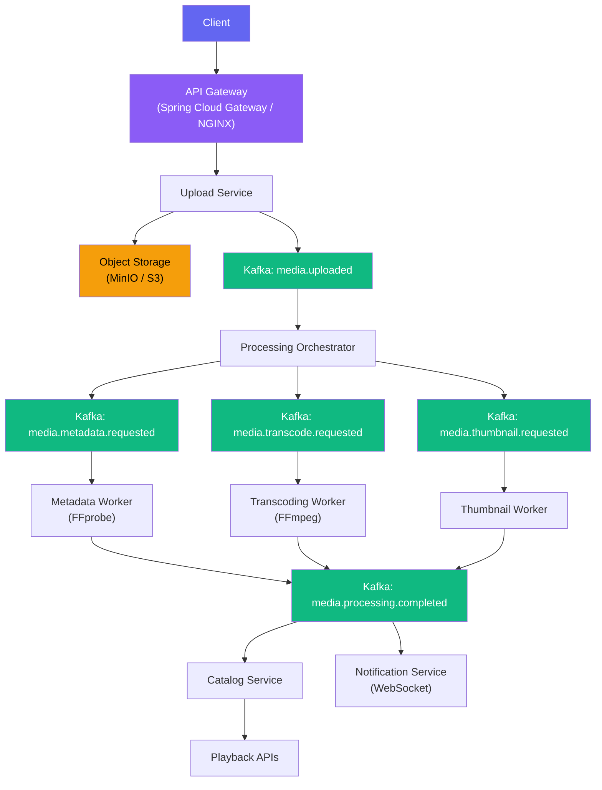
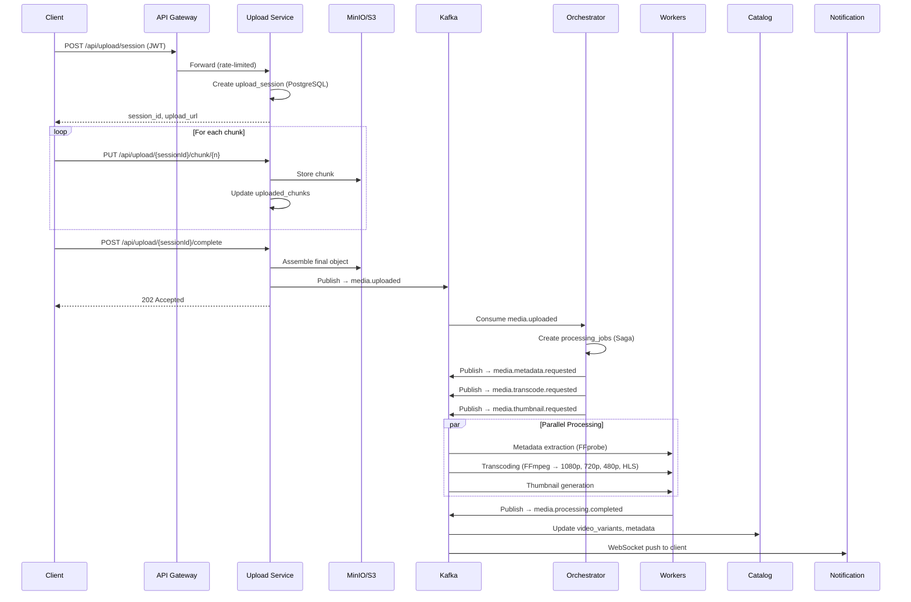
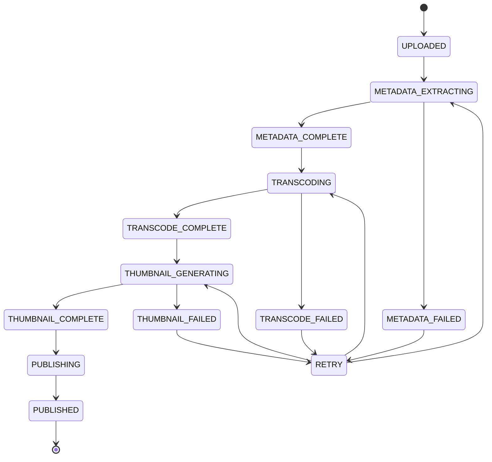
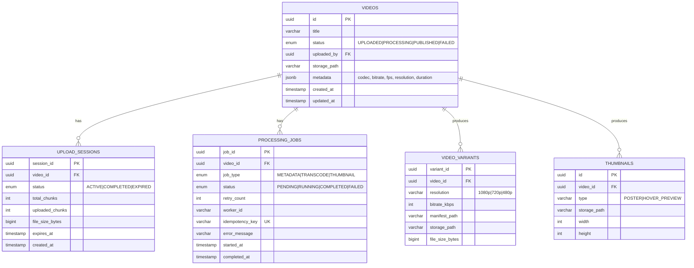
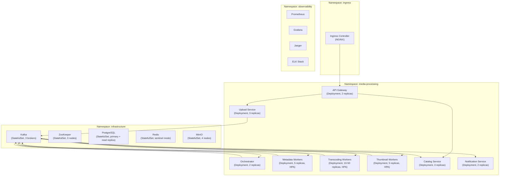
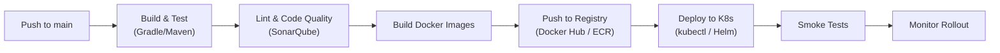
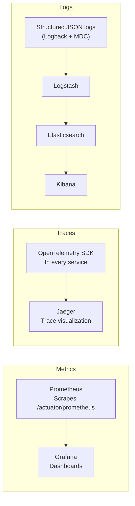

# StreamForge — Refined Project Walkthrough & Implementation Plan

> A distributed, cloud-native video processing and streaming infrastructure platform.

---

## 1. Executive Summary

StreamForge is a **backend systems engineering** project — not a video-sharing clone. It simulates the internal media infrastructure used by companies like Netflix, YouTube, and Twitch. The platform enables users to upload videos, process them asynchronously (transcode, generate thumbnails, extract metadata), produce adaptive bitrate streaming formats (HLS/DASH), and serve optimized media — all within a horizontally scalable, event-driven, Kubernetes-native architecture.

The project follows an **evolutionary architecture** approach: start as a monolith, decompose into microservices, then harden for production. This mirrors how real engineering organizations build systems.

### What This Project Demonstrates

| Domain | Skills |
|---|---|
| Distributed Systems | Saga pattern, eventual consistency, idempotency, distributed locking |
| Event-Driven Architecture | Kafka producers/consumers, DLQs, partitioning, consumer groups |
| Cloud-Native Infrastructure | Kubernetes deployments, StatefulSets, HPA, Ingress, namespaces |
| Reliability Engineering | Circuit breakers, retries, graceful shutdown, health checks |
| Observability | Prometheus, Grafana, Jaeger, ELK stack, OpenTelemetry |
| Performance Engineering | Autoscaling, caching, backpressure handling, load testing |

---

## 2. Architecture Overview

### 2.1 High-Level Data Flow



### 2.2 Upload Workflow (Step-by-Step)



---

## 3. Core Services — Detailed Design

### 3.1 API Gateway

| Aspect | Detail |
|---|---|
| **Purpose** | Single entry point for all client requests |
| **Tech** | Spring Cloud Gateway (Phase 1–3), NGINX/Kong (Phase 4+) |
| **Responsibilities** | JWT validation, request routing, rate limiting (Redis-backed), request tracing (OpenTelemetry), CORS |
| **Key Config** | Route predicates, filter chains, rate-limit policies per endpoint |

### 3.2 Upload Service

| Aspect | Detail |
|---|---|
| **Purpose** | Handle multipart/resumable video uploads |
| **Tech** | Spring Boot, PostgreSQL, MinIO SDK |
| **Responsibilities** | Session management, chunk assembly, validation (file type, size limits), Kafka event publishing |
| **Database** | `upload_sessions` table |
| **Key API Endpoints** | `POST /upload/session` · `PUT /upload/{id}/chunk/{n}` · `POST /upload/{id}/complete` |

**Resumable Upload Protocol:**
1. Client requests a new upload session → receives `session_id`
2. Client uploads chunks with sequential numbering
3. On network failure, client queries session status and resumes from last successful chunk
4. On completion, Upload Service assembles chunks and publishes `media.uploaded` event

### 3.3 Processing Orchestrator

| Aspect | Detail |
|---|---|
| **Purpose** | Coordinate the multi-step processing pipeline as a Saga |
| **Tech** | Spring Boot, Kafka, PostgreSQL |
| **Responsibilities** | Saga state machine, retry orchestration, idempotency enforcement, failure compensation |
| **Key Design** | Choreography-based saga with orchestrator tracking overall state |

**Saga State Machine:**



### 3.4 Worker Services

#### Metadata Worker
- **Input:** `media.metadata.requested` event
- **Processing:** Run FFprobe on raw video → extract codec, bitrate, FPS, resolution, duration, audio channels
- **Output:** Publish metadata to `media.metadata.extracted`, write to `videos` table

#### Transcoding Worker
- **Input:** `media.transcode.requested` event
- **Processing:** Run FFmpeg to produce:
  - **Renditions:** 1080p (5 Mbps), 720p (2.5 Mbps), 480p (1 Mbps)
  - **Formats:** HLS (`.m3u8` + `.ts` segments), optionally DASH (`.mpd` + `.m4s`)
- **Output:** Upload processed files to processed bucket → publish `media.transcode.completed`
- **Scaling:** Most CPU-intensive worker, primary autoscaling target

#### Thumbnail Worker
- **Input:** `media.thumbnail.requested` event
- **Processing:** Extract frames at key timestamps, generate poster image + hover preview strip
- **Output:** Upload thumbnails to processed bucket → publish `media.thumbnail.completed`

#### Notification Service
- **Input:** `media.processing.completed` / `media.processing.failed` events
- **Output:** WebSocket push to connected clients with processing status/progress

### 3.5 Catalog Service

| Aspect | Detail |
|---|---|
| **Purpose** | Serve video metadata and playback information |
| **Tech** | Spring Boot, PostgreSQL (read replicas), Redis cache |
| **Responsibilities** | Video listing, search, status tracking, playback URL generation (signed URLs) |
| **Caching** | Redis for hot manifests, playback metadata, video listings |

---

## 4. Kafka Event Architecture

### 4.1 Topic Design

| Topic | Producer | Consumer(s) | Partition Key | Purpose |
|---|---|---|---|---|
| `media.uploaded` | Upload Service | Orchestrator | `videoId` | Trigger processing pipeline |
| `media.metadata.requested` | Orchestrator | Metadata Workers | `videoId` | Start metadata extraction |
| `media.transcode.requested` | Orchestrator | Transcoding Workers | `videoId` | Start transcoding |
| `media.thumbnail.requested` | Orchestrator | Thumbnail Workers | `videoId` | Start thumbnail generation |
| `media.processing.completed` | All Workers | Catalog, Notification | `videoId` | Signal completion |
| `media.processing.failed` | All Workers | Orchestrator, Notification | `videoId` | Signal failure (trigger retry/DLQ) |

### 4.2 Consumer Group Strategy

```text
Consumer Group: transcoding-workers
  └── Worker-1, Worker-2, ... Worker-N  (independently scalable)

Consumer Group: thumbnail-workers
  └── Worker-1, Worker-2, ... Worker-N

Consumer Group: metadata-workers
  └── Worker-1, Worker-2, ... Worker-N
```

Each worker type has its own consumer group, enabling **independent horizontal scaling**. More partitions → more parallel consumers.

### 4.3 Reliability Mechanisms

- **Idempotency:** Each event carries an `idempotencyKey` (e.g., `videoId + jobType + timestamp`). Workers check against `processing_jobs` table before starting.
- **Dead Letter Queues (DLQ):** After `maxRetries` exhausted → route to `media.*.dlq` topic for manual inspection.
- **At-Least-Once Delivery:** Kafka guarantees at-least-once; idempotency handles duplicates.
- **Backpressure:** Monitor consumer lag via Prometheus; autoscale consumers when lag exceeds threshold.

---

## 5. Database Schema (PostgreSQL)

### 5.1 Entity-Relationship Diagram



### 5.2 Key Indexes

```sql
-- Performance-critical indexes
CREATE INDEX idx_videos_status ON videos(status);
CREATE INDEX idx_videos_uploaded_by ON videos(uploaded_by);
CREATE INDEX idx_processing_jobs_video_status ON processing_jobs(video_id, status);
CREATE UNIQUE INDEX idx_processing_jobs_idempotency ON processing_jobs(idempotency_key);
CREATE INDEX idx_upload_sessions_expires ON upload_sessions(expires_at) WHERE status = 'ACTIVE';
```

---

## 6. Object Storage Design

### 6.1 Bucket Layout

```text
streamforge-raw/
  └── {userId}/{videoId}/
      └── original.{ext}          # Raw uploaded file

streamforge-processed/
  └── {videoId}/
      ├── metadata.json           # Extracted metadata
      ├── thumbnails/
      │   ├── poster.jpg          # Main poster image
      │   └── hover_preview.jpg   # Hover strip
      ├── hls/
      │   ├── master.m3u8         # Master manifest
      │   ├── 1080p/
      │   │   ├── playlist.m3u8
      │   │   └── segment_*.ts
      │   ├── 720p/
      │   │   ├── playlist.m3u8
      │   │   └── segment_*.ts
      │   └── 480p/
      │       ├── playlist.m3u8
      │       └── segment_*.ts
      └── dash/                   # (Optional future)
          ├── manifest.mpd
          └── ...
```

### 6.2 Storage Strategy

| Environment | Technology | Notes |
|---|---|---|
| Local Dev | MinIO (Docker container) | S3-compatible API, zero cost |
| Production | AWS S3 | Lifecycle policies, cross-region replication |
| CDN (Future) | CloudFront/Cloudflare | Edge caching for playback |

---

## 7. Redis Caching Strategy

| Cache Key Pattern | TTL | Purpose |
|---|---|---|
| `video:{id}:meta` | 1 hour | Playback metadata (avoid DB reads) |
| `video:{id}:manifest` | 30 min | Hot HLS manifest paths |
| `upload:session:{id}` | 24 hours | Active upload session state |
| `ratelimit:{ip}:{endpoint}` | 1 min | API rate limiting counters |
| `lock:processing:{videoId}` | 10 min | Distributed lock to prevent duplicate processing |

---

## 8. Infrastructure & DevOps

### 8.1 Kubernetes Architecture



### 8.2 Autoscaling Rules (HPA)

| Service | Metric | Target | Min | Max |
|---|---|---|---|---|
| Transcoding Workers | CPU utilization | 70% | 5 | 50 |
| Thumbnail Workers | CPU utilization | 75% | 2 | 20 |
| Metadata Workers | CPU utilization | 60% | 2 | 10 |
| Upload Service | Request rate | 80% capacity | 2 | 10 |
| Catalog Service | Request rate | 80% capacity | 2 | 8 |

## 4. Phase 4: React Frontend Integration & Testing

We built and integrated a premium, high-fidelity dark-themed React frontend using Vite and Tailwind CSS v4. The frontend runs on `http://localhost:5173` and communicates with the backend via proxying through the API Gateway (`http://localhost:8080`).

### Features:
1. **Interactive Upload Dropzone**: Supports drag-and-drop, valid mime-type validation, and tracks upload progress with an XHR-based progress bar.
2. **Real-time Status Updates**: Subscribes to SockJS + STOMP WebSocket channels on `/ws/topic/video-status` to display live transcoding progression (`PENDING` $\rightarrow$ `UPLOADED` $\rightarrow$ `PROCESSING` $\rightarrow$ `PROCESSED`) without refreshing.
3. **Advanced Playback (HLS.js)**: Integrates `hls.js` inside a custom HTML5 video player component that automatically parses the master playlist (`master.m3u8`) and streams appropriate quality variants dynamically.
4. **Rich Metadata & Actions**: Provides catalog video details (fps, duration, resolution, codecs, file size), caching hits visual markers, and deletion functionality (automatically wiping DB metadata, S3 storage, and Redis cache).

### E2E Testing Steps:
1. **Frontend Server**: Accessible at `http://localhost:5173`.
2. **Eureka Registry**: Access the Eureka Dashboard at `http://localhost:8761` to verify all 5 microservices (`API-GATEWAY`, `UPLOAD-SERVICE`, `CATALOG-SERVICE`, `WORKER-SERVICE`, `NOTIFICATION-SERVICE`) are registered.
3. **Upload & Transcode**:
   - Go to `http://localhost:5173/upload` and upload a video file.
   - You will be redirected to the processing view, which will show real-time progress as the worker processes HLS segments.
4. **Stream & Play**:
   - Once processed, click the video to play it using HLS.js adaptive streaming.

### 8.3 CI/CD Pipeline (GitHub Actions)



---

## 9. Security Architecture

| Layer | Mechanism | Detail |
|---|---|---|
| Authentication | JWT (OAuth2) | Issued by identity provider, validated at API Gateway |
| Media Access | Pre-signed URLs | Time-limited, per-user signed URLs for video playback |
| Rate Limiting | Redis-backed | Per-IP + per-user quotas, sliding window algorithm |
| Authorization | RBAC | Roles: `uploader`, `viewer`, `admin` |
| Secrets | K8s Secrets + Vault (future) | DB passwords, API keys, signing keys |
| Transport | TLS everywhere | Ingress terminates TLS; internal mTLS (future) |

---

## 10. Observability Stack

### 10.1 Three Pillars



### 10.2 Key Metrics to Track

| Category | Metrics |
|---|---|
| Upload | Upload throughput (req/s), upload latency (p50/p95/p99), chunk failure rate |
| Transcoding | Transcode duration per resolution, FFmpeg CPU usage, output bitrate accuracy |
| Kafka | Consumer lag per group, message throughput, partition skew |
| Workers | Active jobs, failure rate, retry count, queue wait time |
| Infrastructure | Pod CPU/memory, disk I/O, network throughput |
| Business | Videos processed/hour, end-to-end processing latency, user wait time |

### 10.3 Key Grafana Dashboards

1. **Platform Overview** — Upload throughput, processing backlog, end-to-end latency
2. **Kafka Health** — Consumer lag, partition balance, broker health
3. **Worker Fleet** — CPU utilization, active jobs, failure rates per worker type
4. **Infrastructure** — Pod health, node resources, persistent volume usage

---

## 11. Phased Implementation Plan

> [!IMPORTANT]
> **Do NOT start with microservices.** Begin with a monolith, understand the domain, then decompose. This mirrors real-world engineering evolution.

---

### PHASE 1 — Foundation Monolith (Weeks 1–3)

**Goal:** Understand the domain and build a working end-to-end flow in a single application.

#### Deliverables
- [x] Project scaffolding (Spring Boot + Maven)
- [x] Upload API (`POST /api/uploads/sessions` + `POST /api/uploads/{sessionId}/file`)
- [x] PostgreSQL schema (`videos`, `upload_sessions`, `video_variants`)
- [x] MinIO integration (raw & processed bucket storage)
- [x] Asynchronous video processing orchestrator:
  - [x] FFprobe metadata extraction
  - [x] FFmpeg transcoding (adaptive bitrate HLS: 480p, 720p, 1080p)
  - [x] Thumbnail generation (poster image keyframe extraction)
- [x] REST APIs for video detail, listing, playback HLS URLs, deletion, and status checking
- [x] Docker Compose running full stack (app + PostgreSQL + MinIO + MinIO bucket setup)
- [x] Verification testing (manual E2E verification guide)

#### Directory Structure (Phase 1)

```text
streamforge/
├── src/main/java/com/streamforge/
│   ├── StreamForgeApplication.java
│   ├── config/
│   │   ├── MinioConfig.java
│   │   └── AsyncConfig.java
│   ├── controller/
│   │   ├── UploadController.java
│   │   └── VideoController.java
│   ├── service/
│   │   ├── UploadService.java
│   │   ├── ProcessingService.java
│   │   ├── MetadataService.java
│   │   ├── TranscodeService.java
│   │   ├── ThumbnailService.java
│   │   └── StorageService.java
│   ├── model/
│   │   ├── Video.java
│   │   └── UploadSession.java
│   └── repository/
│       ├── VideoRepository.java
│       └── UploadSessionRepository.java
├── src/main/resources/
│   ├── application.yml
│   └── db/migration/    # Flyway migrations
├── docker-compose.yml
├── Dockerfile
└── build.gradle / pom.xml
```

#### Key Learnings
- Spring Boot REST API patterns
- File I/O and multipart handling
- PostgreSQL with JPA/Hibernate
- MinIO S3-compatible SDK
- FFmpeg/FFprobe command-line wrappers
- Docker containerization basics

---

### PHASE 2 — Introduce Kafka & Async Processing (Weeks 4–6)

**Goal:** Decouple upload from processing using event-driven architecture.

#### Deliverables
- [ ] Add Kafka to Docker Compose (Kafka + ZooKeeper)
- [ ] Split monolith into 2 services:
  - **Upload Service** — handles uploads, publishes `media.uploaded`
  - **Worker Service** — consumes events, processes video
- [ ] Kafka producer/consumer with Spring Kafka
- [ ] Implement all 6 Kafka topics
- [ ] Processing status tracking (`processing_jobs` table)
- [ ] Retry mechanism with exponential backoff
- [ ] Dead Letter Queue for failed events
- [ ] Idempotency keys to prevent duplicate processing
- [ ] Basic notification (polling-based status endpoint)

#### Directory Structure (Phase 2)

```text
streamforge/
├── upload-service/
│   ├── src/main/java/com/streamforge/upload/
│   │   ├── UploadServiceApplication.java
│   │   ├── controller/UploadController.java
│   │   ├── service/UploadService.java
│   │   ├── kafka/UploadEventProducer.java
│   │   └── ...
│   └── Dockerfile
├── worker-service/
│   ├── src/main/java/com/streamforge/worker/
│   │   ├── WorkerServiceApplication.java
│   │   ├── kafka/
│   │   │   ├── MediaEventConsumer.java
│   │   │   └── DLQConsumer.java
│   │   ├── processor/
│   │   │   ├── MetadataProcessor.java
│   │   │   ├── TranscodeProcessor.java
│   │   │   └── ThumbnailProcessor.java
│   │   └── ...
│   └── Dockerfile
├── common/                # Shared DTOs, events, configs
├── docker-compose.yml     # Now includes Kafka + ZooKeeper
└── ...
```

#### Key Learnings
- Kafka producer/consumer patterns
- Event serialization (Avro/JSON Schema)
- Consumer groups and partition assignment
- Retry strategies and DLQ handling
- Service decomposition principles
- Inter-service communication patterns

---

### PHASE 3 — Microservice Decomposition (Weeks 7–10)

**Goal:** Full microservice architecture with independent, bounded-context services.

#### Deliverables
- [ ] **API Gateway** — Spring Cloud Gateway with route config
- [ ] **Upload Service** — Refined with resumable upload protocol
- [ ] **Processing Orchestrator** — Saga state machine
- [ ] **Metadata Worker** — Independent service
- [ ] **Transcoding Worker** — Independent service, multiple renditions (1080p/720p/480p)
- [ ] **Thumbnail Worker** — Poster + hover preview
- [ ] **Catalog Service** — Video listing, search, playback URLs
- [ ] **Notification Service** — WebSocket real-time updates
- [ ] Redis integration (caching + distributed locks)
- [ ] Multi-resolution HLS output with master manifest
- [ ] Service discovery and health endpoints
- [ ] Distributed tracing (OpenTelemetry) across all services
- [ ] Integration tests for full pipeline

#### Directory Structure (Phase 3)

```text
streamforge/
├── api-gateway/
├── upload-service/
├── processing-orchestrator/
├── metadata-worker/
├── transcoding-worker/
├── thumbnail-worker/
├── catalog-service/
├── notification-service/
├── common-lib/              # Shared event schemas, DTOs
├── docker-compose.yml       # All services + infra
└── ...
```

#### Key Learnings
- Bounded context and domain-driven design
- API Gateway patterns (routing, rate limiting, auth)
- Saga pattern for distributed workflows
- Redis as distributed cache and lock manager
- WebSocket integration with Spring
- Distributed tracing across microservices

---

### PHASE 4 — Kubernetes Deployment (Weeks 11–14)

**Goal:** Deploy the full platform onto Kubernetes with production-like infrastructure.

#### Deliverables
- [ ] Kubernetes manifests for all services:
  - Deployments (stateless services)
  - StatefulSets (Kafka, PostgreSQL, Redis, MinIO)
  - Services, ConfigMaps, Secrets
- [ ] Namespace strategy (`media-processing`, `infrastructure`, `observability`)
- [ ] Ingress Controller (NGINX) with TLS
- [ ] Horizontal Pod Autoscaler for workers
- [ ] Resource requests/limits for all pods
- [ ] Liveness and readiness probes
- [ ] Persistent Volume Claims for stateful workloads
- [ ] Helm charts (optional but recommended)
- [ ] Local testing with Minikube/Kind
- [ ] Rolling update deployment strategy

#### Directory Structure (Phase 4)

```text
streamforge/
├── k8s/
│   ├── namespaces/
│   │   ├── media-processing.yaml
│   │   ├── infrastructure.yaml
│   │   └── observability.yaml
│   ├── media-processing/
│   │   ├── api-gateway-deployment.yaml
│   │   ├── upload-service-deployment.yaml
│   │   ├── orchestrator-deployment.yaml
│   │   ├── transcoding-worker-deployment.yaml
│   │   ├── thumbnail-worker-deployment.yaml
│   │   ├── metadata-worker-deployment.yaml
│   │   ├── catalog-service-deployment.yaml
│   │   ├── notification-service-deployment.yaml
│   │   └── hpa/
│   │       ├── transcoding-worker-hpa.yaml
│   │       └── ...
│   ├── infrastructure/
│   │   ├── kafka-statefulset.yaml
│   │   ├── zookeeper-statefulset.yaml
│   │   ├── postgresql-statefulset.yaml
│   │   ├── redis-statefulset.yaml
│   │   └── minio-statefulset.yaml
│   ├── ingress/
│   │   └── ingress.yaml
│   └── configmaps/
│       └── ...
├── helm/                    # (Optional) Helm chart
└── ...
```

#### Key Learnings
- Kubernetes resource types and when to use each
- StatefulSet vs Deployment
- Autoscaling with HPA and custom metrics
- Ingress configuration and TLS termination
- Config and secret management in K8s
- Rolling updates and zero-downtime deployments

---

### PHASE 5 — Production Engineering (Weeks 15–18)

**Goal:** Achieve operational maturity with full observability, resilience, and load testing.

#### Deliverables
- [ ] **Observability:**
  - Prometheus metrics endpoint on all services (`/actuator/prometheus`)
  - Grafana dashboards (4 dashboards as defined in §10.3)
  - Jaeger distributed tracing
  - ELK stack for centralized logging
- [ ] **Resilience:**
  - Circuit breakers (Resilience4j) on external calls
  - Distributed locking (Redis) for worker exclusivity
  - Graceful shutdown with `preStop` hooks
  - Advanced retry policies with jitter
- [ ] **Load Testing:**
  - k6 scripts for concurrent upload simulation
  - JMeter test plans for sustained traffic
  - Measure: throughput, p95/p99 latency, Kafka lag, worker utilization
- [ ] **CI/CD:**
  - GitHub Actions pipeline (build → test → Docker → push → deploy → smoke test)
  - Automated rollback on failed health checks
- [ ] **Security Hardening:**
  - JWT authentication flow
  - Pre-signed URLs for media access
  - Rate limiting per IP and per user
  - RBAC enforcement

#### Key Learnings
- Prometheus PromQL and alerting rules
- Grafana dashboard design
- Circuit breaker patterns (open/half-open/closed states)
- Load testing methodology
- CI/CD pipeline design
- Production security best practices

---

## 12. Failure Scenarios & Recovery

| # | Scenario | Detection | Recovery Strategy |
|---|---|---|---|
| 1 | Worker crash mid-transcode | K8s restart + Kafka redelivery | Idempotent restart, checkpoint recovery, clean up partial output |
| 2 | Duplicate Kafka message | Idempotency key lookup in `processing_jobs` | Skip if `COMPLETED` or `RUNNING` with valid lock |
| 3 | Upload interrupted | Client detects disconnect | Query session status, resume from last chunk |
| 4 | Kafka consumer backpressure | Consumer lag metric > threshold | HPA scales consumers, alert on sustained lag |
| 5 | Object storage unavailable | Health check / connection timeout | Exponential backoff retry, circuit breaker trips after N failures |
| 6 | Database unreachable | Connection pool exhaustion | Circuit breaker, fallback to Redis cache for reads |
| 7 | Orchestrator crash | K8s restart, Kafka offset tracking | Saga state reconstructed from `processing_jobs` table |

---

## 13. Performance Targets

| Metric | Target | How to Achieve |
|---|---|---|
| Upload throughput | 100 concurrent uploads | Multipart chunking, horizontal pod scaling |
| Transcode latency (1 min video) | < 3 minutes end-to-end | Parallel multi-resolution FFmpeg, worker autoscaling |
| API response time (catalog) | p95 < 100ms | Redis caching, read replicas, connection pooling |
| Kafka consumer lag | < 1000 messages sustained | Adequate partitions + consumers, HPA |
| System availability | 99.9% | Health checks, rolling updates, circuit breakers |

---

## 14. Interview-Ready Talking Points

### Architecture & Design Decisions

| Question | Answer Framework |
|---|---|
| Why Kafka over RabbitMQ? | High throughput, log-based retention for replay, partition-based parallelism, consumer group model fits worker scaling |
| Why event-driven? | Loose coupling enables independent scaling; fault isolation prevents cascading failures; async processing keeps upload API fast |
| Why not start with microservices? | Domain understanding first; premature decomposition leads to wrong service boundaries; monolith-first is industry best practice (Martin Fowler) |
| How do you prevent duplicate processing? | Idempotency keys stored in DB with unique constraint; workers check before starting; Redis distributed lock prevents concurrent execution |
| How does autoscaling work? | HPA monitors CPU/custom metrics; Kafka consumer lag drives worker scaling; each worker type scales independently |
| How do you handle partial failures? | Saga pattern with compensation; per-stage retries with exponential backoff + jitter; DLQ for exhausted retries; operational alerting |
| Why object storage for videos? | Immutable binary blobs → object storage is purpose-built; S3-compatible API for portability; lifecycle policies for cost management |

### System Design Deep Dives
- **Trace a request end-to-end:** Client → Gateway (JWT) → Upload Service (chunks → MinIO) → Kafka → Orchestrator (Saga) → Workers (parallel) → Catalog → WebSocket notification
- **Explain consistency model:** Eventual consistency; writes go through Kafka; reads may be stale by seconds; Redis cache with TTL; acceptable for media platform
- **How would you add a new processing step?** Create new worker, new Kafka topic, add stage to Saga state machine — zero changes to existing workers (Open/Closed Principle)

---

## 15. Future Enhancements (Beyond Phase 5)

| Enhancement | Complexity | Value |
|---|---|---|
| GPU-based transcoding (NVENC) | High | 10x faster encoding, cost-effective at scale |
| Multi-region processing | High | Geographic distribution, reduced latency |
| CDN integration (CloudFront) | Medium | Edge caching, global low-latency playback |
| DRM support (Widevine/FairPlay) | High | Content protection, enterprise requirement |
| AI subtitle generation (Whisper) | Medium | Auto-generated subtitles, accessibility |
| Adaptive encoding optimization | Medium | Per-video bitrate ladders, bandwidth savings |
| Canary deployments (Istio) | Medium | Safer releases, traffic splitting |
| Multi-tenant isolation | High | SaaS readiness, per-tenant resource quotas |

---

## 16. Technology Stack Summary

| Layer | Technology | Purpose |
|---|---|---|
| **Language** | Java 17+ | Primary backend language |
| **Framework** | Spring Boot 3.x | REST APIs, dependency injection, configuration |
| **Gateway** | Spring Cloud Gateway | Routing, rate limiting, auth |
| **Messaging** | Apache Kafka | Event backbone, async communication |
| **Database** | PostgreSQL 15+ | Metadata, sessions, workflow state |
| **Cache** | Redis 7+ | Caching, rate limiting, distributed locks |
| **Object Storage** | MinIO (dev) / S3 (prod) | Video file storage |
| **Media Processing** | FFmpeg / FFprobe | Transcoding, metadata extraction, thumbnails |
| **Containers** | Docker | Service packaging |
| **Orchestration** | Kubernetes | Deployment, scaling, scheduling |
| **Monitoring** | Prometheus + Grafana | Metrics collection and visualization |
| **Tracing** | OpenTelemetry + Jaeger | Distributed request tracing |
| **Logging** | ELK Stack | Centralized log aggregation |
| **Resilience** | Resilience4j | Circuit breakers, retries, rate limiters |
| **CI/CD** | GitHub Actions | Build, test, deploy pipeline |
| **Load Testing** | k6 / JMeter | Performance validation |
| **DB Migrations** | Flyway | Schema version control |

---

> [!TIP]
> **Recommended starting point:** Set up the Phase 1 monolith with `docker-compose.yml` containing PostgreSQL + MinIO, scaffold the Spring Boot app, and implement the upload → FFmpeg transcode → store flow end-to-end before adding any complexity.
