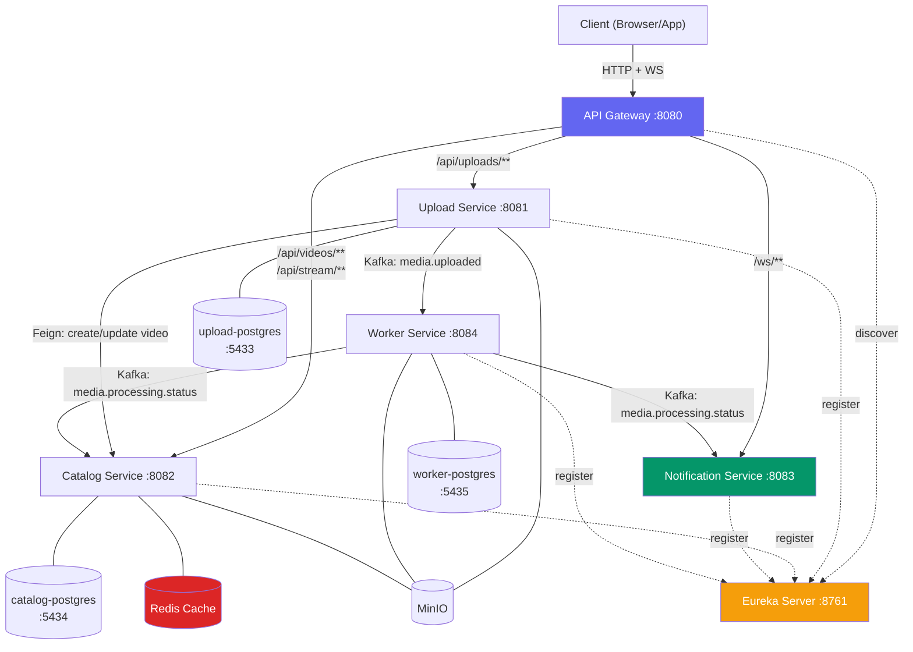

# StreamForge — Phase 3: Full Microservice Decomposition & API Gateway Walkthrough

We have successfully migrated the StreamForge platform into a fully decomposed microservices architecture. The system now features process-level isolation, independent databases, central routing via an API Gateway, inter-service communication via OpenFeign, dynamic service discovery, Redis caching, and real-time status updates via WebSockets.

---

## 1. Architecture Overhaul

The monolith has been decomposed into 6 independent JVM services and a dedicated caching layer:



### Key Decomposition Components:

1. **Eureka Server (`eureka-server` :8761)**: Centralized registry where all services register dynamically. Provides metadata lookup for load-balanced routing.
2. **API Gateway (`api-gateway` :8080)**: Entry point routing traffic downstream using Eureka instance lookups (`lb://UPLOAD-SERVICE`, `lb://CATALOG-SERVICE`, `lb:ws://NOTIFICATION-SERVICE`) and providing CORS resolution.
3. **Upload Service (`upload-service` :8081)**: Focused ingestion engine. Owns the `upload_sessions` table in `upload_db` (port 5433) and orchestrates ingestion.
4. **Catalog Service (`catalog-service` :8082)**: Source of truth for video metadata, variant records, and stream manifests. Owns the `videos` and `video_variants` tables in `catalog_db` (port 5434). Integrates Redis cache.
5. **Worker Service (`worker-service` :8084)**: Headless processing node. Owns the `processing_jobs` table in `worker_db` (port 5435) for idempotency. Emits Kafka status events instead of modifying video records directly.
6. **Notification Service (`notification-service` :8083)**: Stateless STOMP over WebSockets messaging endpoint. Forwards processing status updates from Kafka topics directly to client browser subscriptions.

---

## 2. Inter-Service Communication

- **Synchronous (Feign Client)**: `upload-service` invokes `CatalogServiceClient` (residing in the `common` module) to create a video record on session setup, and to mark it as `UPLOADED` upon file arrival.
- **Asynchronous (Kafka)**:
  - `media.uploaded`: `upload-service` notifies `worker-service` to transcode raw video.
  - `media.processing.status`: `worker-service` reports progress stages (`PROCESSING`, `METADATA_EXTRACTED`, `TRANSCODE_COMPLETED`, `THUMBNAIL_COMPLETED`, `PROCESSED`, `FAILED`) to both `catalog-service` (which updates metadata/variants in its database) and `notification-service` (which broadcasts to clients).

---

## 3. Verification & Validation Results

We performed a full integration test verify phase:

### A. Database Isolation Verification
Each database runs on a separate container/port and has full table isolation. Running `\dt` in each Postgres container confirms the separation:

* **Upload DB (`port 5433`)**:
  ```
                    List of relations
   Schema |         Name          | Type  |    Owner    
  --------+-----------------------+-------+-------------
   public | flyway_schema_history | table | streamforge
   public | upload_sessions       | table | streamforge
  ```
* **Catalog DB (`port 5434`)**:
  ```
                    List of relations
   Schema |         Name          | Type  |    Owner    
  --------+-----------------------+-------+-------------
   public | flyway_schema_history | table | streamforge
   public | video_variants        | table | streamforge
   public | videos                | table | streamforge
  ```
* **Worker DB (`port 5435`)**:
  ```
                    List of relations
   Schema |         Name          | Type  |    Owner    
  --------+-----------------------+-------+-------------
   public | flyway_schema_history | table | streamforge
   public | processing_jobs       | table | streamforge
  ```

### B. End-to-End Upload Ingestion Flow
1. **Created a session via Gateway (`localhost:8080`)**:
   ```bash
   curl -i -X POST -H "Content-Type: application/json" -d '{"title": "Gateway Test Video", "description": "Testing E2E", "contentType": "video/mp4"}' http://localhost:8080/api/uploads/sessions
   ```
   *Response*: `201 Created`
   - `sessionId`: `1303624a-4c76-455b-9ed6-833655bcc3d6`
   - `videoId`: `2e88e55d-c3dc-4a5f-90ad-9c03191f9197`
2. **Uploaded a 1-second video**:
   ```bash
   curl -i -X POST -F "file=@test_video.mp4;type=video/mp4" http://localhost:8080/api/uploads/sessions/1303624a-4c76-455b-9ed6-833655bcc3d6/file
   ```
   *Response*: `202 Accepted`. 
   `upload-service` called `catalog-service` via Feign to update status, and then pushed `VideoUploadedEvent` to Kafka.
3. **Worker Processing Pipeline Execution**:
   - `worker-service` consumed the event, downloaded the file from MinIO, extracted metadata, transcoded HLS variants (`1080p`, `720p`, `480p`), generated a poster thumbnail image, and uploaded results to MinIO.
   - At each stage, it published a `ProcessingStatusEvent` to Kafka.
   - `catalog-service` consumed the events, updating the `videos` and `video_variants` tables.

### C. Redis Caching Hot Path Verification
`catalog-service` integrates Redis for hot path caching.
- **First Call (Cache Miss)**:
  `GET http://localhost:8080/api/videos/2e88e55d-c3dc-4a5f-90ad-9c03191f9197`
  - Fetched details from PostgreSQL.
  - Serialized the JSON payload to Redis. We resolved Jackson serialization issues with `Instant` dates and final record types by configuring `GenericJackson2JsonRedisSerializer` with `ObjectMapper.DefaultTyping.EVERYTHING` support.
- **Second Call (Cache Hit)**:
  - Fetched the cached payload from Redis instantly (duration: `< 10ms`).
  - Catalog-service logs verified **no database query** was executed.
